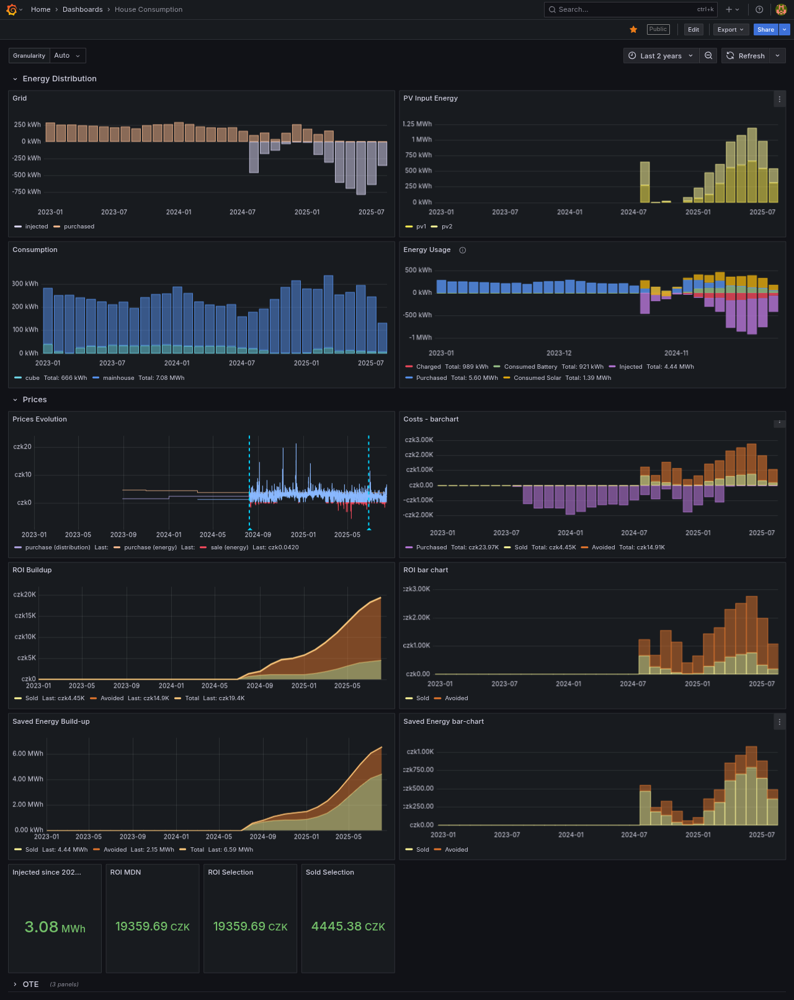

## Preface
This series of articles explores effective methods for storing and visualizing long-term data. While Home Assistant is referenced as a data source and some sections address HA-specific topics, the primary focus is on sharing practical experience with TimescaleDB.

1. [Collecting Energy and its Visualization](./ha-energy.md)
1. [Spot Prices for Energy Visualization](./ha-energy-spot-short.md)

