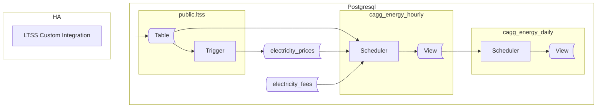

## Preface

The previous section explained how to work with static or relatively slow-changing energy prices. However, if you work with spot prices - which typically change hourly - a slightly different approach is required.

> This new approach is also suitable for slow-changing prices. It may be a smart choice to start with it regardless.

Here is a walk-through for users working with spot prices.

Let’s create all objects in a dedicated schema: `ltss_energy_ote`. This way, both methods of collecting data can coexist while remaining physically separated. OTE refers to the spot prices operator in the Czech Republic, but you can choose any suffix that works for you.

Here is an diagram showing involved components and created objects, and dataflow between them.




The overall idea is very similar to what has been presented in the previous article. This introduces three key-changes:

**Introducing handling fees**\
Handling fees is something common while trading on spot with help of 3rd party (the operator). Two most common ways of billing are: fixed price for a energy unit (ie 250CZK for every 1MWh) and percentual value calculated from energy unit (ie 15% off sold energy price). These two are reflected in solution proposed below. Other scenarios might require respecive adjustements or different approach.

> Please note, that hadling fees records have to be created manually, in advance to comming energy data. I assume they are contract-specific, making existence of some API to pull them highly unlikely.

**CAGGs will calculate and store energy costs alongside energy values.**\
Having costs already materialized in CAGGs improves performance. For example, rendering graphs no longer requires lookups to the prices table. This is especially helpful when running them on a performance-limited hardware like a Raspberry Pi.\
My approach is to store net prices as well as gross ones (reduced by a handling fee). This leaves open door for potentially analytical tasks run on those data later.

**change to time range datatype**
Because spot prices change hourly, it's needed to use TSTZRANGE for storing validity period for each price. This datatype handles a timestamps with time zone.


## Prices

Let's start with the new tables handling prices and fees:

```sql
CREATE SCHEMA ltss_energy_ote;
GRANT USAGE ON SCHEMA ltss_energy_ote TO public;

CREATE TABLE IF NOT EXISTS ltss_energy_ote.electricity_prices
(
    price_type TEXT NOT NULL,
    price_kind TEXT NOT NULL,
    price_range TSTZRANGE NOT NULL,
    price_value NUMERIC NOT NULL,
    price_unit TEXT NOT NULL,
    CONSTRAINT pk_electricitycost PRIMARY KEY (price_type, price_kind, price_range),
    CONSTRAINT xc_electricitycost_costrange EXCLUDE USING gist (price_type WITH =, price_kind WITH =, price_range WITH &&)
);

CREATE TABLE IF NOT EXISTS ltss_energy_ote.electricity_fees
(
    price_type TEXT NOT NULL,
    price_kind TEXT NOT NULL,
    fee_range TSTZRANGE NOT NULL,
    fee_value NUMERIC NOT NULL,
    fee_unit TEXT NOT NULL,
    CONSTRAINT pk_electricityfees PRIMARY KEY (price_type, price_kind, fee_range),
    CONSTRAINT xc_electricityfees_feerange EXCLUDE USING gist (price_type WITH =, price_kind WITH =, fee_range WITH &&)
);
```

The next step is to fill the tables with data.
Because the new CAGGs will add costs to each aggregation, the prices and fees for a period must already be available in the respective table at the moment of CAGG execution. As mentioned before fees are to be set manually.

How you approach feeding prices depends on how they are collected by your system. It might be custom HA integration, Node-RED, an external script or even manually provided prices with SQL queries (for rarelly changing prices). The key is to ensure the prices land in the `electricity_prices` table.

The simplest option could be a sensor carrying the current price. Then, publishing it via LTSS to the database. It has however as serious flaw: any - even short - outage of HA might result in missing prices and then zero costs for the period. In my opinion such an approach is not acceptable.

What works is storing prices in advace. The exact solution will vary from system to system, depending on prices provider API, and method of data processing. Even if processing is done by HA, the result will be diffrent from integration to integation. The common goal is to store this data in the prices table.

Assume we have a `sensor.tomorrow_spot_electricity_prices` sensor, containing next day's prices stored as a JSON array in the entity's `attributes`:
```json
"data": [
    {"time": "time1", "price": value1},
    {"time": "time2", "price": value2},
    {"time": "time3", "price": value3}
    ...
]
```

Here is an example of a trigger that populates prices from such a sensor sensor published in the `ltss` table in out prices table.:

```sql
CREATE OR REPLACE FUNCTION ltss_energy_ote.tr_ltss_oteprices()
    RETURNS trigger
    LANGUAGE 'plpgsql'
    SECURITY DEFINER
AS $BODY$

DECLARE
    err_msg   TEXT;
    err_code  TEXT;
    ENTITYID CONSTANT TEXT = 'sensor.tomorrow_spot_electricity_prices';
BEGIN
    -- THIS TRIGGER FUNCTION IS USED on public.ltss table

    IF NEW.entity_id <> ENTITYID
    THEN
        RETURN NEW;
    END IF;

    INSERT INTO ltss_energy_ote.electricity_prices
    (
        price_type,
        price_kind,
        price_range,
        price_value,
        price_unit
    )
    SELECT 
        'sale',
        'energy',
        tstzrange((j->>'time')::TIMESTAMPTZ, (j->>'time')::TIMESTAMPTZ + '1h'::INTERVAL, '[)'),
        (j->'price')::NUMERIC,
        'kWh'
    FROM jsonb_array_elements(NEW.attributes->'data') AS j
    ON CONFLICT DO NOTHING;

    RETURN NEW;

EXCEPTION WHEN others THEN
    GET STACKED DIAGNOSTICS err_msg = MESSAGE_TEXT,
                            err_code = RETURNED_SQLSTATE;
    RAISE WARNING '[%], %', err_code, err_msg;
    RETURN NEW;
END;
$BODY$;

CREATE OR REPLACE TRIGGER tr_ltss_oteprices
AFTER INSERT
ON public.ltss
FOR EACH ROW
EXECUTE FUNCTION ltss_energy_ote.tr_ltss_oteprices();
```

Notice error handling. By default every error rolls back the transation. In our case having complete data in `ltss` table is prioritized. When error is suppressed, its details are forwarded to the log as warnings.

<details>
<summary>For users of the Czech Energy Spot Prices custom integration</summary>
The `Czech Energy Spot Prices` integration provides a `sensor.tomorrow_spot_electricity_hour_order` sensor with a significant flaw: when prices are set in its attributes, the state is set to `none`. This causes LTSS to ignore it. Below is a template sensor that resolves this problem and organizes data in a way that matches the rest of this article.

```yaml
template:
  - triggers:
      - trigger: time_pattern
        # This will update every hour
        minutes: 0
    sensor:
      - name: "Tomorrow Spot Electricity Prices"
        state: "{{ now() }}"
        attributes:
          data: >
            
            
              
                
                
               
            
            {{ data.prices }}
```
</details>

## Prices Visualization

Once we have prices in the table, we can visualize them.


The query provided in the previous article, which creates a series of daily data points for visualization, is not suitable for our hourly prices. Unfortunately, adjusting the period to 1 hour makes the query very slow.

Let's modify the query to generate time points only for slow-changing prices, such as distribution or purchase prices. Sale prices will be displayed without artificially generating data points, since we expect them to have a periodic character. The result will be the UNION of two subqueries, which you can use in Grafana:

```sql
SELECT time, price_type, price_kind, price_value
FROM ltss_energy_ote.electricity_prices AS ec
JOIN generate_series(to_timestamp($__from/1000)::DATE::TIMESTAMPTZ, to_timestamp($__to/1000)::TIMESTAMPTZ, '1 day'::INTERVAL) AS x(time) ON TRUE
WHERE x.time <@ price_range
  AND price_type <> 'sale'

UNION

SELECT LOWER(price_range) AS time, price_type, price_kind, price_value
FROM ltss_energy_ote.electricity_prices AS ec
WHERE LOWER(price_range) BETWEEN to_timestamp($__from/1000)::TIMESTAMPTZ AND to_timestamp($__to/1000)::TIMESTAMPTZ
  AND price_type = 'sale'
```

To illustrate the improvement: with the previous approach, the query would take about 1.5 seconds on a Raspberry Pi for 1 year of data. After this change, execution takes about 30 ms.

## Aggregates for Energy

With prices ready, we can start with CAGGs. As mentioned at the beginning of the article, we won't aggregate only the energy, but also calculate the partial prices for those aggregated energy periods.

Before we create CAGGs, let’s create a `calculate_costs_arr()` function that calculates the price of energy at a given time. The function returns two values: net cost of energy and the cost reduced by handling fee(s). Both will be later materialized in CAGG.
The function uses an ARRAY to return these two values to workaround limitations of CAGGs which disalow using subselects or CTEs within their definitions (at time this article is written). 

The first-level CAGG will also use the `get_entities_for_cagg_energy()` helper function, which enables calculation for selected entities only.

```sql
CREATE OR REPLACE FUNCTION ltss_energy_ote.calculate_costs_arr
(
	_price_type TEXT,
	_time       TIMESTAMPTZ,
	_value      NUMERIC
)
RETURNS NUMERIC[]
LANGUAGE 'sql'
STABLE
AS $BODY$

    SELECT Array[SUM(sub.cost), SUM(sub.cost_net)]
    FROM
    (
        SELECT
            SUM(_value * (price_value - COALESCE(fee_value, 1))) AS cost,
            SUM(price_value * _value)                            AS cost_net
        FROM ltss_energy_ote.electricity_prices     AS ep
        LEFT JOIN ltss_energy_ote.electricity_fees  AS ef
                    ON (ep.price_type, ep.price_kind) = (ef.price_type, ef.price_kind)
                    AND _time <@ ef.fee_range 
        WHERE _time <@ ep.price_range
          AND ep.price_type = _price_type
    ) AS sub

$BODY$;


CREATE OR REPLACE FUNCTION ltss_energy_ote.get_entities_for_cagg_energy()
RETURNS TEXT[]
LANGUAGE 'sql'
IMMUTABLE
AS $f$

   SELECT ARRAY
       [
            -- replace sensor names with your own.
           'sensor.pg_mainhouse_total_energy_energy_hourly', -- consumption
           'sensor.pg_cube_total_energy_energy_hourly',      -- consumption
           'sensor.energy_injected_hourly',                  -- injected to grid
           'sensor.energy_purchased_hourly',                 -- purchased from grid
           'sensor.wattsonic_pv1_input_energy_2_hourly',     -- PV string 1 production
           'sensor.wattsonic_pv2_input_energy_2_hourly',     -- PV string 2 production
           'sensor.energy_discharged_from_battery_hourly',   -- Discharged from battery
           'sensor.energy_charged_to_battery_hourly'         -- Charged to battery
       ];
$f$;
```

Finally we are ready to create hierarchical CAGGs. The hourly one aggregates data from the `ltss` table, providing the hourly energy and its costs for that period. Calling `calculate_costs_arr()` function two times with the same arguments seems suboptimal, but there is no other way due to CAGGs limitations.

The second-level CAGG just sums the hourly values into daily results. 

All CAGGs are set up as real-time ones, and get updating policy is set.

```sql
CREATE MATERIALIZED VIEW ltss_energy_ote.cagg_energy_hourly
WITH (timescaledb.continuous) AS
SELECT
    time_bucket('1h'::INTERVAL, "time", 'Europe/Prague') AS bucket,
    entity_id,
    delta(counter_agg("time", state::DOUBLE PRECISION))::NUMERIC AS value,
    (ltss_energy_ote.calculate_costs_arr('purchase', time_bucket('1h'::INTERVAL, "time", 'Europe/Prague'), delta(counter_agg("time", state::DOUBLE PRECISION))::NUMERIC))[1] AS cost_purchase,
	(ltss_energy_ote.calculate_costs_arr('purchase', time_bucket('1h'::INTERVAL, "time", 'Europe/Prague'), delta(counter_agg("time", state::DOUBLE PRECISION))::NUMERIC))[2] AS cost_purchase_net,
	(ltss_energy_ote.calculate_costs_arr('sale',     time_bucket('1h'::INTERVAL, "time", 'Europe/Prague'), delta(counter_agg("time", state::DOUBLE PRECISION))::NUMERIC))[1] AS cost_sale,
	(ltss_energy_ote.calculate_costs_arr('sale',     time_bucket('1h'::INTERVAL, "time", 'Europe/Prague'), delta(counter_agg("time", state::DOUBLE PRECISION))::NUMERIC))[2] AS cost_sale_net
FROM ltss
WHERE entity_id = ANY (ltss_energy_ote.get_entities_for_cagg_energy())
  AND state NOT IN ('unavailable', 'unknown')
GROUP BY 1, 2
WITH NO DATA;

-- create daily CAGG based on hourly one
CREATE MATERIALIZED VIEW ltss_energy_ote.cagg_energy_daily
WITH (timescaledb.continuous) AS
SELECT
   time_bucket('1d'::INTERVAL, bucket, 'Europe/Prague') AS bucket,
   entity_id,
   SUM(value)               AS value,
   SUM(cost_purchase)       AS cost_purchase,
   SUM(cost_purchase_net)   AS cost_purchase_net,
   SUM(cost_sale)           AS cost_sale
   SUM(cost_sale_net)       AS cost_sale_net,
FROM ltss_energy_ote.cagg_energy_hourly
GROUP BY 1, 2
WITH NO DATA;

-- make both CAGGs real-time
ALTER MATERIALIZED VIEW ltss_energy_ote.cagg_energy_hourly
SET (timescaledb.materialized_only = FALSE);

ALTER MATERIALIZED VIEW ltss_energy_ote.cagg_energy_daily
SET (timescaledb.materialized_only = FALSE);

-- start CAGGs refreshing automatically
SELECT add_continuous_aggregate_policy
(
   'ltss_energy_ote.cagg_energy_hourly', '4h'::INTERVAL, '5m'::INTERVAL, '15m'::INTERVAL
);
SELECT add_continuous_aggregate_policy
(
   'ltss_energy_ote.cagg_energy_daily', '3d'::INTERVAL, '4h'::INTERVAL, '12h'::INTERVAL
);
```

As explained in the previous part, `WITH NO DATA` means that CAGGs are not filled with data at creation. Once aggregate policies are created, they fill CAGGs with data coming into `ltss`.

If you want to populate CAGGs with historical data available in the `ltss` table, execute the refresh procedures - hourly CAGG first, then daily. Try to avoid ovelaping requested update time range with schedulled update interval. For example if the interval is `4h to 5m before NOW`, upper time boundary for the refresh should not exceed the NOW()-4h.

```sql
CALL refresh_continuous_aggregate('ltss_energy_ote.cagg_energy_hourly', '2025-01-01 0:0', NOW()-'5h'::INTERVAL, TRUE);
CALL refresh_continuous_aggregate('ltss_energy_ote.cagg_energy_daily', '2025-01-01 0:0', NOW()-'4d'::INTERVAL, TRUE);
```

> :exclamation: **Be aware** not to run `refresh_continuous_aggregate()` on missing data if their aggregated form already exists in CAGGs. Doing so would irreversibly wipe them out!

## Presentation SQL Queries

The SQL queries remain basically the same, except they no longer use the `calculate_cost()` function. Instead, they use the ready-to-use prices from the `cost_sale` and `cost_purchase` columns.

The simplest example is the ROI value. Below is an SQL query returning Return On Investment (ROI).
ROI is equal to the sum of savings and sold energy. Savings come from the price of consumed but not purchased energy, i.e., from consumed energy reduced by purchased energy. For savings, we use the purchase price.

```sql
SELECT 
    SUM
    (
        CASE
            WHEN entity_id ~ 'injected'         THEN cost_sale
            WHEN entity_id ~ 'purchased'        THEN -1 * cost_purchase
            WHEN entity_id ~ 'cube|mainhouse'   THEN cost_purchase
        END
    ) AS value
FROM ltss_energy_ote_cagg_energy_daily
WHERE bucket >= '2024-08-08' -- FVE installation date
  AND $__timeFilter("bucket")
  AND entity_id  IN (
                        'sensor.energy_injected_hourly', 
                        'sensor.energy_purchased_hourly',
                        'sensor.pg_mainhouse_total_energy_energy_hourly',
                        'sensor.pg_cube_total_energy_energy_hourly'
                    )
```

This use of partial costs will be repeated in the rest of the cost presentation graphs. 
It's worth mentioning that we can do the math in PostgreSQL or in Grafana. The performance difference measured on the database side is negligible. Because of that, this time I chose to fetch the least data by doing the math in the database.

The query below returns two values: Sold and Avoided. I use Transformations to get an additional series representing the sum of both.

```sql
WITH 
src AS
(
    SELECT 
    time_bucket_gapfill
    (
        '$query_granularity'::INTERVAL,      
        "bucket", 'Europe/Prague'
    ) AS time,
    CASE WHEN entity_id ~ 'injected'        THEN 'Sold'
         WHEN entity_id ~ 'purchased'       THEN 'Avoided'
         WHEN entity_id ~ 'cube|mainhouse'  THEN 'Avoided'
         ELSE entity_id
    END AS entityid,
    SUM(CASE
            WHEN bucket < '2024-08-08' THEN 0 -- FVE installation date
            ELSE CASE 
                    WHEN entity_id ~ 'injected'       THEN cost_sale
                    WHEN entity_id ~ 'purchased'      THEN -1 * cost_purchase
                    WHEN entity_id ~ 'cube|mainhouse' THEN cost_purchase
                 END
        END) AS value
    FROM ltss_energy_ote.cagg_energy_${cagg_suffix}
    WHERE entity_id IN (
                            'sensor.energy_injected_hourly', 
                            'sensor.energy_purchased_hourly',
                            'sensor.pg_mainhouse_total_energy_energy_hourly',
                            'sensor.pg_cube_total_energy_energy_hourly'
                        )
    AND $__timeFilter("bucket")
    GROUP BY 1, 2
)
SELECT
    time,
    entityid,
    SUM(value) OVER (PARTITION BY entityid ORDER BY time) AS value
FROM src;
```


