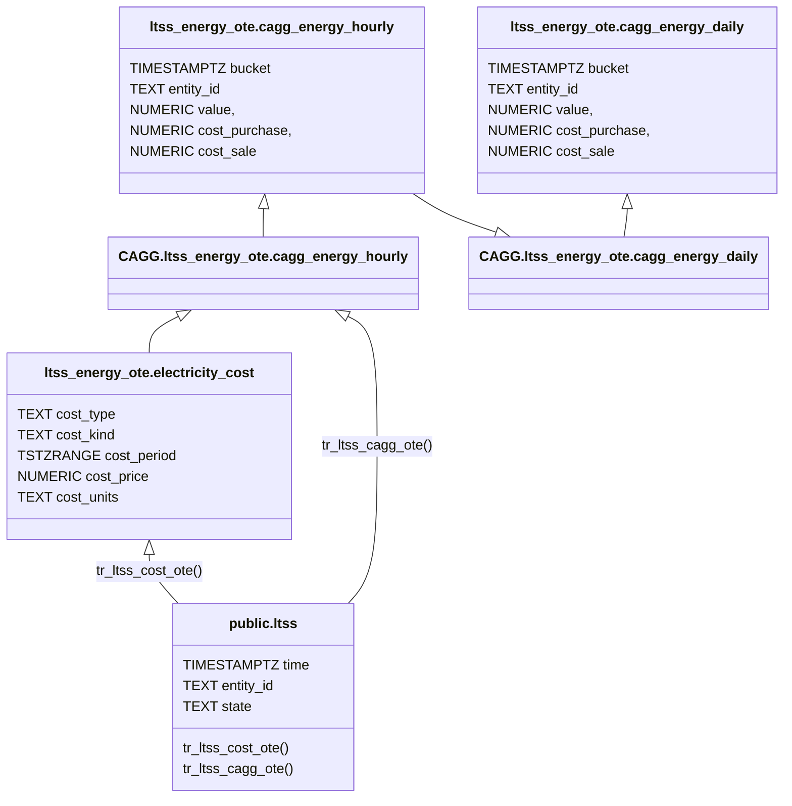

# Preface
The previous part presents how to work with static or relatively slow-changing energy prices. At the same time, it mentions, if you work with spot prices, which usually change on hourly basis, a slightly another approach is needed.
Here is a walk-through for users operating on spot.

Let’s show what the data structure should look like for this task.

<image showing prices table, and caggs, possibly helper functions>

Let’s create all objects in new schema: `ltss_energy_ote`. The OTE refers to spot prices operator in Czech Republic. You can chose whatever suffix you want.



The idea looks pretty similar to one described in the previous article. There are two major differences:

* we will calculate and store a prices (purchase and sale) of the energy for each aggregated record
* we will adjust the datatype handling time range to range of timestamps with time zone (TSTZRANGE)

Having prices already materialized in CAGGs helps with performance. For instance, rendering graphs doesn't require lookups to prices table. It's helpful especially when running on performance-limited hardware like RaspberyPi. 

The cons is, that if you change prices in the table for past period, you need to recalculate CAGGs.

Let's start with with DDL of table for costs:

```sql
CREATE TABLE IF NOT EXISTS ltss_energy_ote.electricity_cost
(
    cost_type text NOT NULL,
    cost_kind text NOT NULL,
    cost_range tstzrange NOT NULL,
    cost_value numeric NOT NULL,
    cost_unit text NOT NULL,
    CONSTRAINT pk_electricitycost PRIMARY KEY (cost_type, cost_kind, cost_range),
    CONSTRAINT xc_electricitycost_costrange EXCLUDE USING gist (cost_type WITH =, cost_kind WITH =, cost_range WITH &&)
);
```

The next step is to fill this table with data.
Because new CAGGs will add prices to each aggregation, the source prices for a particular period must be already available at moment of CAGG execution.

How to achieve it will depend strictly on the way of how the prices are collected by your HA instance.

The simplest option is to have a sensor carrying the current price. Then publish this sensor via LTSS to the database, and then use a trigger to save its value to our table on every change. It will require the following trigger to create on ltss table:

```sql
CREATE OR REPLACE FUNCTION ltss_energy.tr_ltss_otaprices()
    RETURNS trigger
    LANGUAGE 'plpgsql'
    SECURITY DEFINER
AS $BODY$

DECLARE
    err_msg   TEXT;
    err_code  TEXT;
    EVENTTIME CONSTANT TIMESTAMPTZ = date_trunc('hour', NEW.time, 'Europe/Prague');
    ENTITYID  CONSTANT TEXT = 'sensor.tomorrow_spot_electricity_prices';
BEGIN
    -- THIS TRIGGER FUNCTION IS USED on public.ltss table

    IF NEW.entity_id <> ENTITYID
    THEN
        RETURN NEW;
    END IF;

    INSERT INTO ltss_energy_ote.electricity_cost
    (
        cost_type,
        cost_kind,
        cost_range,
        cost_value,
        cost_unit
    )
    VALUES
    (
        'sale',
        'energy',
        tstzrange(EVENTTIME, EVENTTIME + '1h'::INTERVAL, '[)'),
        state::NUMERIC,
        'kWh'
    )
    ON CONFLICT DO NOTHING;

    RETURN NULL;

EXCEPTION WHEN others THEN
    GET STACKED DIAGNOSTICS err_msg = MESSAGE_TEXT,
                            err_code = RETURNED_SQLSTATE;
    RAISE WARNING '[%], %', err_code, err_msg;
    RETURN NULL;
END;
$BODY$;

CREATE OR REPLACE TRIGGER tr_ltss_otaprices
AFTER INSERT
ON public.ltss
FOR EACH ROW
EXECUTE FUNCTION ltss_energy.tr_ltss_otaprices();

```

The trigger makes a range out of "time" column. It assumes the change is reported a fraction of second after every hour beginning.
Notice the implementation of error handling. It's important to ignore any error raised by this trigger, otherwise it would roll the transaction inserting data back.

This approach above has one shortcoming: there is no guarantee that a price is reported early enough, to be picked by CAGG. If it happens,the calculated price for energy would be NULL. There are ways how to workaround that, but instead I would focus on solution based on prices reported in advance. Knowing prices for future periods should be something common when operating with the spot proces.

Note that exact solution strongly depends on how prices data are collected by HA. Different integrations might provide them in different way. But the common goal is to store those data into prices table.

Let assume we have a `sensor.tomorrow_spot_electricity_prices` sensor, containing next day prices stored as json array in the entity `attributes`:
```json
"data": [
    {"time": "itotime1", "price": value1},
    {"time": "itotime2", "price": value2},
    {"time": "itotime3", "price": value3}
    ...
]
```

Here is an example of a trigger populating prices from sensor recorded in `ltss` table.

```sql
CREATE OR REPLACE FUNCTION ltss_energy_ota.tr_ltss_otaprices()
    RETURNS trigger
    LANGUAGE 'plpgsql'
    SECURITY DEFINER
AS $BODY$

DECLARE
    err_msg   TEXT;
    err_code  TEXT;
    ENTITYID CONSTANT TEXT = 'sensor.tomorrow_spot_electricity_prices';
BEGIN
    -- THIS TRIGGER FUNCTION IS USED on public.ltss table

    IF NEW.entity_id <> ENTITYID
    THEN
        RETURN NEW;
    END IF;

    INSERT INTO ltss_energy_ote.electricity_cost
    (
        cost_type,
        cost_kind,
        cost_range,
        cost_value,
        cost_unit
    )
    SELECT 
        'sale',
        'energy',
        tstzrange((j->>'time')::TIMESTAMPTZ, (j->>'time')::TIMESTAMPTZ + '1h'::INTERVAL, '[)'),
        (j->'price')::NUMERIC,
        'kWh'
    FROM jsonb_array_elements(NEW.attributes->'data') AS j
    ON CONFLICT DO NOTHING;

    RETURN NEW;

EXCEPTION WHEN others THEN
    GET STACKED DIAGNOSTICS err_msg = MESSAGE_TEXT,
                            err_code = RETURNED_SQLSTATE;
    RAISE WARNING '[%], %', err_code, err_msg;
    RETURN NEW;
END;
$BODY$;

CREATE OR REPLACE TRIGGER tr_ltss_otaprices
AFTER INSERT
ON public.ltss
FOR EACH ROW
EXECUTE FUNCTION ltss_energy.tr_ltss_otaprices();
```


<details>
<summary>For users of Czech Energy Spot Prices custom integration</summary>
The `Czech Energy Spot Prices` provides a `sensor.tomorrow_spot_electricity_hour_order` sensor that has serious flaw: when prices are set to its attributes, the state is set to `none`. This makes LTSS ignoring it. Below, there is a template sensor, resolving this problem. Also it organizes data in more valid way, corresponding with the further part of the article.

```yaml
template:
  - triggers:
      - trigger: time_pattern
        # This will update every hour
        minutes: 0
    sensor:
      - name: "Tomorrow Spot Electricity Prices"
        state: "{{ now() }}"
        attributes:
          data: >
            
            
              
                
                
               
            
            {{ data.prices }}
```
</details>


Having prices available in the databe, we can write new CAGGs. As mentioned above, they will not only aggregate the energy, but also calculate the partial prices for those energy chunks. 

First, let’s create a function providing the price for a given amount of energy and cost type. CAGGS will also make use of `get_entities_for_cagg_energy()` helper function, which is used to pass only energy entitites to CAGGS


```sql
CREATE OR REPLACE FUNCTION ltss_energy_ote.calculate_cost
(
	_cost_type  TEXT,
	_time       TIMESTAMPTZ,
	_value      NUMERIC
)
RETURNS NUMERIC
LANGUAGE 'sql'
STABLE
AS $f$

   SELECT SUM(cost_value * _value)
   FROM ltss_energy_ote.electricity_cost
   WHERE _time <@ cost_range
     AND cost_type = _cost_type

$f$;

CREATE OR REPLACE FUNCTION ltss_energy_ote.get_entities_for_cagg_energy()
RETURNS TEXT[]
LANGUAGE 'sql'
IMMUTABLE
AS $f$

   SELECT ARRAY
       [
            -- replace sensor names with your ones.
           'sensor.pg_mainhouse_total_energy_energy_hourly',
           'sensor.pg_cube_total_energy_energy_hourly',
           'sensor.energy_injected_hourly',
           'sensor.energy_purchased_hourly',
           'sensor.wattsonic_pv1_input_energy_2_hourly',
           'sensor.wattsonic_pv2_input_energy_2_hourly',
           'sensor.energy_discharged_from_battery_hourly',
           'sensor.energy_charged_to_battery_hourly'
       ];
$f$;
```

Now we are ready to create hierarchical CAGGs. The houlry one aggregates data from ltss, calculates prices for each period. The second one just sums the hourly values into daily results:

```sql
CREATE MATERIALIZED VIEW ltss_energy_ote.cagg_energy_hourly
WITH (timescaledb.continuous) AS
SELECT
    time_bucket('1h'::INTERVAL, "time", 'Europe/Prague') AS bucket,
    entity_id,
    delta(counter_agg("time", state::DOUBLE PRECISION)) AS value,
    ltss_energy_ote.calculate_cost('purchase', time_bucket('1h'::INTERVAL, "time", 'Europe/Prague'), delta(counter_agg("time", state::DOUBLE PRECISION))::NUMERIC) AS cost_purchase,
    ltss_energy_ote.calculate_cost('sale',     time_bucket('1h'::INTERVAL, "time", 'Europe/Prague'), delta(counter_agg("time", state::DOUBLE PRECISION))::NUMERIC) AS cost_sale
FROM ltss
WHERE entity_id = ANY (ltss_energy_ote.get_entities_for_cagg_energy())
  AND state NOT IN ('unavailable', 'unknown')
GROUP BY 1,2
WITH NO DATA;


CREATE MATERIALIZED VIEW ltss_energy_ote.cagg_energy_daily
WITH (timescaledb.continuous) AS
SELECT
   time_bucket('1d'::INTERVAL, bucket, 'Europe/Prague') AS bucket,
   entity_id,
   SUM(value)           AS value,
   SUM(cost_purchase)   AS cost_purchase,
   SUM(cost_sale)       AS cost_sale
FROM ltss_energy_ote.cagg_energy_hourly
GROUP BY 1, 2
WITH NO DATA;


ALTER MATERIALIZED VIEW ltss_energy_ote.cagg_energy_hourly
SET (timescaledb.materialized_only = FALSE);

ALTER MATERIALIZED VIEW ltss_energy_ote.cagg_energy_daily
SET (timescaledb.materialized_only = FALSE);

SELECT add_continuous_aggregate_policy
(
   'ltss_energy_ote.cagg_energy_hourly', '4h'::INTERVAL, '5m'::INTERVAL, '15m'::INTERVAL
);
SELECT add_continuous_aggregate_policy
(
   'ltss_energy_ote.cagg_energy_daily', '3d'::INTERVAL, '4h'::INTERVAL, '12h'::INTERVAL
);
```


As described previously, WITH NO DATA means that CAGGs are not filled with data at the moment of their creation. Once aggregate policies are created, they will start to be filled with data coming to ltss (with frequency given by aggregate policy).

If you want to populate CAGGs with historical data available in ltss table, execute refresh procedures. Obviously hourly CAGG first, then daily one.

```sql
CALL refresh_continuous_aggregate('ltss_energy_ote.cagg_energy_hourly', window_start, window_end, TRUE);
CALL refresh_continuous_aggregate('ltss_energy_ote.cagg_energy_daily', window_start, window_end, TRUE);
```

