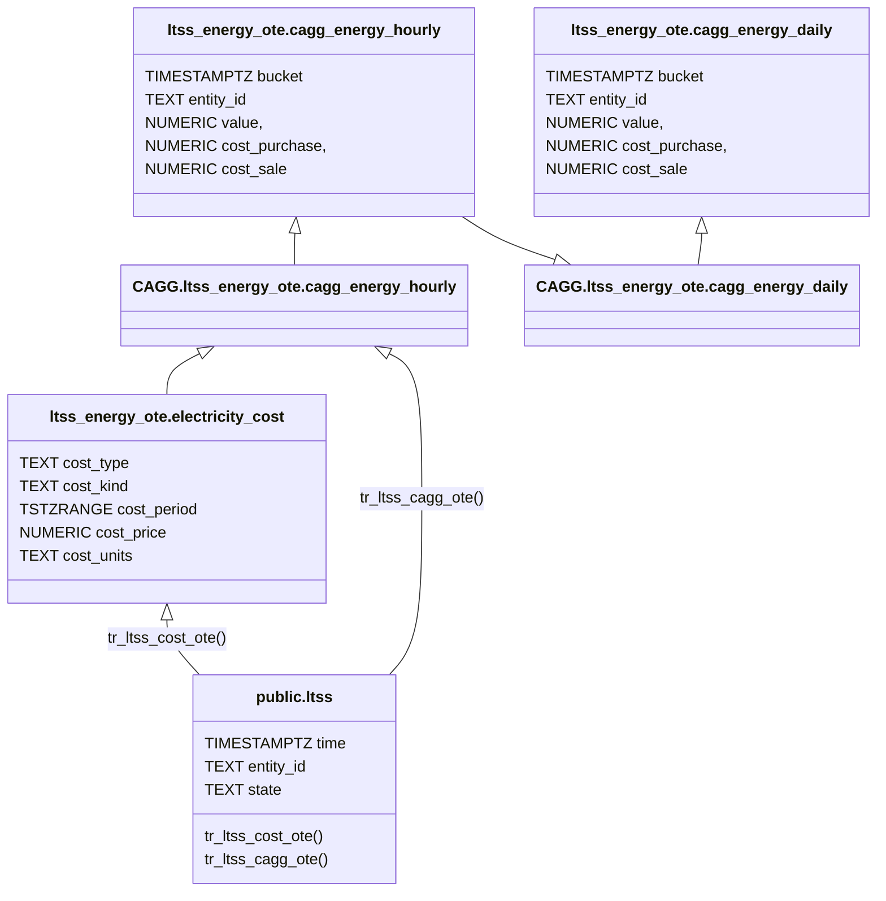

## Preface
The previous part presents how to work with static or relatively slow-changing energy prices. At the same time, it mentions, if you work with spot prices, which usually change on hourly basis, a slightly another approach is needed.
Here is a walk-through for users operating on spot.

Let’s create all objects in dedicated schema: `ltss_energy_ote`. This way both methods of collecting data may exists being physically separated from each other.
The OTE refers to spot prices operator in Czech Republic. You can chose whatever suffix you work for you. Here is an overview of objects to be created. 




The idea looks pretty similar to the one described in the previous article. There are two major differences:

* we will calculate and store a prices (purchase and sale) together with energy
* we will adjust the datatype that handles time range to one suitable for timestamps with time zone (TSTZRANGE)

Having prices already materialized in CAGGs helps with performance. For instance, rendering graphs doesn't require lookups to prices table. It's helpful especially when running on performance-limited hardware like RaspberyPi. 

The cons is, that changing prices for past period requires recalculation of CAGGs. No problem when having source data. Otherwise update must be performed directly to CAGGs data.

## Prices

Let's start with with new costs table:

```sql
CREATE TABLE IF NOT EXISTS ltss_energy_ote.electricity_cost
(
    cost_type TEXT NOT NULL,
    cost_kind TEXT NOT NULL,
    cost_range TSTZRANGE NOT NULL,
    cost_value NUMERIC NOT NULL,
    cost_unit TEXT NOT NULL,
    CONSTRAINT pk_electricitycost PRIMARY KEY (cost_type, cost_kind, cost_range),
    CONSTRAINT xc_electricitycost_costrange EXCLUDE USING gist (cost_type WITH =, cost_kind WITH =, cost_range WITH &&)
);
```

The next step is to fill this table with data.
Because new CAGGs will add prices to each aggregation, the source prices for a particular period must be already available in prices table at moment of CAGG execution.

How to achieve it will depend strictly on the way of how the prices are collected by your HA instance. You can use HA custom integration is available, you can use NodeRed or even own script. The point is to make the prices land in the `electricity_cost` table.

The simplest option is to have a sensor carrying the current price. Then publish this sensor via LTSS to the database, and then use a trigger to save its value to our table on every change. It will require the following trigger to create on ltss table:

```sql
CREATE OR REPLACE FUNCTION ltss_energy.tr_ltss_otaprices()
    RETURNS trigger
    LANGUAGE 'plpgsql'
    SECURITY DEFINER
AS $BODY$

DECLARE
    err_msg   TEXT;
    err_code  TEXT;
    EVENTTIME CONSTANT TIMESTAMPTZ = date_trunc('hour', NEW.time, 'Europe/Prague');
    ENTITYID  CONSTANT TEXT = 'sensor.tomorrow_spot_electricity_prices';
BEGIN
    -- THIS TRIGGER FUNCTION IS USED on public.ltss table

    IF NEW.entity_id <> ENTITYID THEN
        RETURN NULL;
    END IF;

    INSERT INTO ltss_energy_ote.electricity_cost
    (cost_type, cost_kind, cost_range, cost_value, cost_unit)
    VALUES
    ('sale', 'energy', tstzrange(EVENTTIME, EVENTTIME + '1h'::INTERVAL, '[)'), state::NUMERIC, 'kWh')
    ON CONFLICT DO NOTHING;

    RETURN NULL;

EXCEPTION WHEN others THEN
    GET STACKED DIAGNOSTICS err_msg = MESSAGE_TEXT,
                            err_code = RETURNED_SQLSTATE;
    RAISE WARNING '[%], %', err_code, err_msg;
    RETURN NULL;
END;
$BODY$;

CREATE OR REPLACE TRIGGER tr_ltss_otaprices
AFTER INSERT
ON public.ltss
FOR EACH ROW
EXECUTE FUNCTION ltss_energy.tr_ltss_otaprices();
```

Notice the implementation of error handling. It's important to ignore any error raised by this trigger, otherwise it would roll the transaction inserting data back.

The trigger makes a range out of the "time" column. It assumes that the value is reported within a time period the value is valid for. This is a shortcoming: the import as to be reliable all the time, otherwise you might lost entries price (ie because of HA restart).

So let's try another approach. SPOT prices should be available in advance. I assume there ways how to get them to HA. Note, that exact solution strongly depends on how prices data are collected by HA. Different integrations might provide them in different way. But the common goal is to store those data into prices table.

Let assume we have a `sensor.tomorrow_spot_electricity_prices` sensor, containing next day prices stored as json array in the entity `attributes`:
```json
"data": [
    {"time": "time1", "price": value1},
    {"time": "time2", "price": value2},
    {"time": "time3", "price": value3}
    ...
]
```

Here is an example of a trigger populating prices from sensor recorded in `ltss` table.

```sql
CREATE OR REPLACE FUNCTION ltss_energy_ota.tr_ltss_otaprices()
    RETURNS trigger
    LANGUAGE 'plpgsql'
    SECURITY DEFINER
AS $BODY$

DECLARE
    err_msg   TEXT;
    err_code  TEXT;
    ENTITYID CONSTANT TEXT = 'sensor.tomorrow_spot_electricity_prices';
BEGIN
    -- THIS TRIGGER FUNCTION IS USED on public.ltss table

    IF NEW.entity_id <> ENTITYID
    THEN
        RETURN NEW;
    END IF;

    INSERT INTO ltss_energy_ote.electricity_cost
    (
        cost_type,
        cost_kind,
        cost_range,
        cost_value,
        cost_unit
    )
    SELECT 
        'sale',
        'energy',
        tstzrange((j->>'time')::TIMESTAMPTZ, (j->>'time')::TIMESTAMPTZ + '1h'::INTERVAL, '[)'),
        (j->'price')::NUMERIC,
        'kWh'
    FROM jsonb_array_elements(NEW.attributes->'data') AS j
    ON CONFLICT DO NOTHING;

    RETURN NEW;

EXCEPTION WHEN others THEN
    GET STACKED DIAGNOSTICS err_msg = MESSAGE_TEXT,
                            err_code = RETURNED_SQLSTATE;
    RAISE WARNING '[%], %', err_code, err_msg;
    RETURN NEW;
END;
$BODY$;

CREATE OR REPLACE TRIGGER tr_ltss_otaprices
AFTER INSERT
ON public.ltss
FOR EACH ROW
EXECUTE FUNCTION ltss_energy.tr_ltss_otaprices();
```


<details>
<summary>For users of Czech Energy Spot Prices custom integration</summary>
The `Czech Energy Spot Prices` provides a `sensor.tomorrow_spot_electricity_hour_order` sensor that has serious flaw: when prices are set to its attributes, the state is set to `none`. This makes LTSS ignoring it. Below, there is a template sensor, resolving this problem. Also it organizes data in more valid way, corresponding with the further part of the article.

```yaml
template:
  - triggers:
      - trigger: time_pattern
        # This will update every hour
        minutes: 0
    sensor:
      - name: "Tomorrow Spot Electricity Prices"
        state: "{{ now() }}"
        attributes:
          data: >
            
            
              
                
                
               
            
            {{ data.prices }}
```
</details>

## Prices visualization
Once we have a prices in the table we can visualize them.


The query provided in previous article makes points fixed to 1-day period, which is not suitable for our new hourly prices. On the other hand chaning this period to 1-hour makes the query very slow (about 1.5s on rPi for 1 year of data).

Let's modify the query by generating time points only for slowly changing prices. It might be distribution and/or purchase prices. 
Sale prices will be displayed without artificially generating data points since we expect that those data has periodic character anyway. 
The result will be the UNION of two subqueries you have to put into Grafana:

```sql
SELECT time, cost_type, cost_kind, cost_value
FROM electricity_cost AS ec
JOIN generate_series(to_timestamp($__from/1000)::DATE::TIMESTAMPTZ, to_timestamp($__to/1000)::TIMESTAMPTZ, '1 day'::interval) AS x(time) ON TRUE
WHERE x.time::DATE <@ cost_range
AND cost_type <> 'sale'

UNION

SELECT LOWER(cost_range) AS time, cost_type, cost_kind, cost_value
FROM ltss_energy.electricity_cost_ote AS ec
WHERE LOWER(cost_range) BETWEEN to_timestamp($__from/1000)::DATE::TIMESTAMPTZ AND to_timestamp($__to/1000)::TIMESTAMPTZ
AND cost_type = 'sale'

ORDER BY time, cost_type, cost_kind
```

## Aggregates for Energy

With prices ready to use, we can start with CAGGs. As mentioned at the article begining, we won't aggregate the energy only, but also calculate the partial prices for those aggregated energy periods. 

Before we jump into CAGGs, let’s create a `calculate_cost()` function that calculates a price of energy at given time. CAGGs will also make use of `get_entities_for_cagg_energy()` helper function, that enables calculation for selected entitites only.


```sql
CREATE OR REPLACE FUNCTION ltss_energy_ote.calculate_cost
(
	_cost_type  TEXT,
	_time       TIMESTAMPTZ,
	_value      NUMERIC
)
RETURNS NUMERIC
LANGUAGE 'sql'
STABLE
AS $f$

   SELECT SUM(cost_value * _value)
   FROM ltss_energy_ote.electricity_cost
   WHERE _time <@ cost_range
     AND cost_type = _cost_type

$f$;

CREATE OR REPLACE FUNCTION ltss_energy_ote.get_entities_for_cagg_energy()
RETURNS TEXT[]
LANGUAGE 'sql'
IMMUTABLE
AS $f$

   SELECT ARRAY
       [
            -- replace sensor names with your ones.
           'sensor.pg_mainhouse_total_energy_energy_hourly',
           'sensor.pg_cube_total_energy_energy_hourly',
           'sensor.energy_injected_hourly',
           'sensor.energy_purchased_hourly',
           'sensor.wattsonic_pv1_input_energy_2_hourly',
           'sensor.wattsonic_pv2_input_energy_2_hourly',
           'sensor.energy_discharged_from_battery_hourly',
           'sensor.energy_charged_to_battery_hourly'
       ];
$f$;
```

Now we are ready to create hierarchical CAGGs. The hourly one aggregates data from the `ltss` table, providing sum of energy and its prices for the period. The second one just sums the hourly values into daily results:

```sql
-- create hourly CAGG based on ltss table
CREATE MATERIALIZED VIEW ltss_energy_ote.cagg_energy_hourly
WITH (timescaledb.continuous) AS
SELECT
    time_bucket('1h'::INTERVAL, "time", 'Europe/Prague') AS bucket,
    entity_id,
    delta(counter_agg("time", state::DOUBLE PRECISION)) AS value,
    ltss_energy_ote.calculate_cost('purchase', time_bucket('1h'::INTERVAL, "time", 'Europe/Prague'), delta(counter_agg("time", state::DOUBLE PRECISION))::NUMERIC) AS cost_purchase,
    ltss_energy_ote.calculate_cost('sale',     time_bucket('1h'::INTERVAL, "time", 'Europe/Prague'), delta(counter_agg("time", state::DOUBLE PRECISION))::NUMERIC) AS cost_sale
FROM ltss
WHERE entity_id = ANY (ltss_energy_ote.get_entities_for_cagg_energy())
  AND state NOT IN ('unavailable', 'unknown')
GROUP BY 1, 2
WITH NO DATA;

-- create daily CAGG based on hourly one
CREATE MATERIALIZED VIEW ltss_energy_ote.cagg_energy_daily
WITH (timescaledb.continuous) AS
SELECT
   time_bucket('1d'::INTERVAL, bucket, 'Europe/Prague') AS bucket,
   entity_id,
   SUM(value)           AS value,
   SUM(cost_purchase)   AS cost_purchase,
   SUM(cost_sale)       AS cost_sale
FROM ltss_energy_ote.cagg_energy_hourly
GROUP BY 1, 2
WITH NO DATA;

-- make both CAGGs real-time
ALTER MATERIALIZED VIEW ltss_energy_ote.cagg_energy_hourly
SET (timescaledb.materialized_only = FALSE);

ALTER MATERIALIZED VIEW ltss_energy_ote.cagg_energy_daily
SET (timescaledb.materialized_only = FALSE);

-- start CAGGs refreshing automatically
SELECT add_continuous_aggregate_policy
(
   'ltss_energy_ote.cagg_energy_hourly', '4h'::INTERVAL, '5m'::INTERVAL, '15m'::INTERVAL
);
SELECT add_continuous_aggregate_policy
(
   'ltss_energy_ote.cagg_energy_daily', '3d'::INTERVAL, '4h'::INTERVAL, '12h'::INTERVAL
);
```

As learnt in the previous part, `WITH NO DATA` indicates that CAGGs are not filled with data at the moment of their creation. Once aggregate policies are created, they fills CAGGs with data coming to ltss.

If you want to populate CAGGs with historical data available in ltss table, execute refresh procedures. Obviously hourly CAGG first, then daily one.

```sql
CALL refresh_continuous_aggregate('ltss_energy_ote.cagg_energy_hourly', '2025-01-01 0:0', NOW()-'5h'::INTERVAL, TRUE);
CALL refresh_continuous_aggregate('ltss_energy_ote.cagg_energy_daily', '2025-01-01 0:0', NOW()-'4d'::INTERVAL, TRUE);
```

> :exclamation: **Be aware** to not run `resfresh_continuous_aggregate()` on missing data while their aggregated form does exist in CAGGs. It would wipe them irreversibly out!