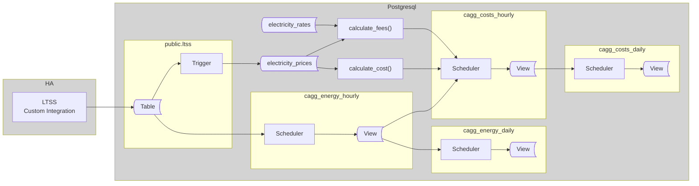

## Preface

Originally intended as a simple extension to the previous article to support spot prices, the update revealed additional challenges and required more significant changes than expected. As a result, it turned into more advanced database project rather than tool for every-day Home Assistant user, especially if every move supported by respective description.

After a month or so of struggling to create easy-to-read short guide, I I decided to provide  "how-to-use" guide instead of "how to build" one. If you want to dig more, you are welcome to read full size text. At the same time, all technical aspects described in previous article applies to this one too.
If you already using a model inspired by previous part, you will find useful the migration path presented at the end of this text.

Let's start with overview of the solution, through examples of pricing data. The whole source code to be installeed is avaialble at the end of article.

## The overview

The diagram below illustrates involved components and objects to be created. Related tables and views are grouped within rectangles, and arrows indicate the direction of data flow.




The overall approach remains similar to the previous article, rendering a few hierarchical CAGGs, based on provided prices. Despite of it, it introduces two important changes:

**1. Separate CAGGs for Energy and Costs**  
While both energy and costs can be materialized by the single CAGG, separating them offers several advantages:

1. You can adjust prices retroactively and regenerate cost CAGGs, even if the original data is no longer present in the `ltss` table.
2. Additional energy-related CAGGs can be created later, leveraging the precalculated energy aggregates.
3. The energy CAGG can aggregate all energy sensors, while the cost CAGG can focus on a subset of sensors.
4. The codebase remains cleaner and easier to maintain.

**2. Net values and fees (ie Taxes)**

When trading on the spot market, prices are provided in net value. Depending on contract and other regulations some additional costs add added over the top of net price:
* a fixed price per energy unit (e.g., 250 CZK per 1 MWh). It might be handling fee for a trading company, costs of distribution or other ones defined by goverment 
* a percentage of the energy price (e.g., 15% of the sold energy price). It might be taxes or another way of calculating the handling fee for a trading copany

To achieve that we will store all volume-based prices (ie 250CZK/MWh) in prices table, while percentage-based prices (ie 21% VAT) into rate table.

### Pricing tables

Becuase some names will apear in the source code, we need to estabilish some conventions:
1. All names starts with uppercase character. They might be all uppercase too. It's rather for eastetics and consiscy. It will influence visualizaiton in Grafana too.
1. `Purchase` and `Sale` are the only allowed values for `trade_type`
1. `Energy` is reserved name for price of power electricity alone.

Here is an example of my price setting. It represents purchasing and saling for fixed prices untill November, 11th. Since this time sale trading is changing to spot-based

| trade_type | price_name    | price_period                                      | price_value |dir|volume_unit |
|------------|---------------|---------------------------------------------------|-------------|---|------------|
|Purchase    |CEPS           |["2023-08-29 00:00:00+02","2024-01-01 00:00:00+01")|      0.11353|  1|kWh         |
|Purchase    |CEPS           |["2024-01-01 00:00:00+01","2025-01-01 00:00:00+01")|      0.21282|  1|kWh         |
|Purchase    |CEPS           |["2025-01-01 00:00:00+01",infinity)                |      0.31178|  1|kWh         |
|Purchase    |Dan Z Elektriny|["2023-08-29 00:00:00+02",infinity)                |       0.0283|  1|kWh         |
|Purchase    |Distribution   |["2023-08-29 00:00:00+02","2024-01-01 00:00:00+01")|        1.611|  1|kWh         |
|Purchase    |Distribution   |["2024-01-01 00:00:00+01","2024-08-06 00:00:00+02")|      2.01566|  1|kWh         |
|Purchase    |Distribution   |["2024-08-06 00:00:00+02","2025-01-01 00:00:00+01")|      2.01566|  1|kWh         |
|Purchase    |Distribution   |["2025-01-01 00:00:00+01",infinity)                |      2.09963|  1|kWh         |
|Purchase    |Energy         |["2023-08-29 00:00:00+02","2023-11-01 00:00:00+01")|      4.69834|  1|kWh         |
|Purchase    |Energy         |["2023-11-01 00:00:00+01","2024-03-20 00:00:00+01")|      4.28925|  1|kWh         |
|Purchase    |Energy         |["2024-03-20 00:00:00+01","2024-08-01 00:00:00+02")|      3.75537|  1|kWh         |
|Purchase    |Energy         |["2024-08-01 00:00:00+02","2026-01-01 00:00:00+01")|      2.99008|  1|kWh         |
|Purchase    |POZE           |["2023-12-31 23:00:00+01",infinity)                |        0.495|  1|kWh         |
|Sale        |Energy         |["2024-08-08 00:00:00+02","2025-04-01 00:00:00+02")|          1.4|  1|kWh         |
|Sale        |Energy         |["2025-04-01 00:00:00+02","2025-06-29 00:00:00+02")|            1|  1|kWh         |
|Sale        |Energy         |["2025-06-29 00:00:00+02","2025-11-01 00:00:00+02")|          0.5|  1|kWh         |
|Sale        |EnerSpot       |["2025-11-01 00:00:00+02",infinity)                |         0.25| -1|kWh         |
|Sale        |Energy         |["2025-11-01 00:00:00+02","2025-11-01 01:00:00+02")| ...         |  1|kWh         |
|Sale        |Energy         |["2025-11-01 00:01:00+02","2025-11-01 02:00:00+02")| ...         |  1|kWh         |
|Sale        |Energy         |["2025-11-01 00:02:00+02","2025-11-01 03:00:00+02")| ...         |  1|kWh         |
| ...        | ...           | ...                                               | ...         |...|kWh         |

You might notice a record named EnerSpot. It correlates with a breaking point when I started to to sell for spot prices. For ths operation, the operator will charge me 250CZK / 1MWh. To be able to cover calculation of both: purchasing cost and income with use of a single formula, I estabilished the `dir` attribute. The math is as easy as it seems: `dir=1` adds value to, while `dir=-1` deducts values from the sum. The income is sold energy minus operator handling fee, this dir equal to -1. You get the point, right?

If you surf on the Spot, meaning you are purchasing and saling with spot prices, the prices have to be recorded into the table for sale and purchase. Which could look like this:

| trade_type | price_name    | price_period                                      | price_value |dir|volume_unit |
|------------|---------------|---------------------------------------------------|-------------|---|------------|
|Purchase    |Energy         |["2025-11-01 00:00:00+02","2025-11-01 01:00:00+02")| ...         |  1|kWh         |
|Sale        |Energy         |["2025-11-01 00:00:00+02","2025-11-01 01:00:00+02")| ...         |  1|kWh         |
|Purchase    |Energy         |["2025-11-01 00:01:00+02","2025-11-01 02:00:00+02")| ...         |  1|kWh         |
|Sale        |Energy         |["2025-11-01 00:01:00+02","2025-11-01 02:00:00+02")| ...         |  1|kWh         |
|Purchase    |Energy         |["2025-11-01 00:02:00+02","2025-11-01 03:00:00+02")| ...         |  1|kWh         |
|Sale        |Energy         |["2025-11-01 00:02:00+02","2025-11-01 03:00:00+02")| ...         |  1|kWh         |
| ...        | ...           | ...                                               | ...         |...|kWh         |

Despite it creates redundant records, is more flexible and future-proof. It supports a wider range of trading scenarios, including changes in energy trading practices over time, while keeping the source code straightforward.

Which operations spot prices are recorded for is determined by content of `trades_import`. 
The trigger uses this table to determine which trade type should receive the spot price, based on the current settings.

For example:

| trade_type | trade_period                                 |
|------------|----------------------------------------------|
| Sale       | ["2025-11-01 00:00:00+01", infinity)         |
| Purchase   | ["2026-06-01 00:00:00+02", infinity)         |

This example above means that incoming spot prices will be stored in `electricity_prices` as Sale starting November 1st, and as Purchase beginning in June of the following year. Note that both Sale and Purchase records will continue to be stored from June onward, allowing you to track both trading directions simultaneously.

If the table is empty, or if the price time does not match any entry, the price will not be added to the prices table. Be careful when entering timestamps, as time offsets can be error-prone - especially in regions with daylight saving time. It is recommended to use named time zones instead of fixed offsets when entering data.

#### Rates table

This table makes possible to deduct percentual fees from initial energy price. It might be taxes such as VAT). Notably, there is relationship between (trade_type, price_name) pair to prices table. This relationship is not enforced by a foreign key constraint. It's intentional, to make the independent maintaince of prices and fees possible; Without need of making the data model overly complex and less intuitive.

As for example it's possible to use infinity values to setup VAT for forever using `(-infinity, infinity)` time range. 

The ony drawback is, that a user has to take care about validity of names.

The following example demonstrates a configuration of the VAT applicable to price entries.

|trade_type  |price_name     |fee_name|fee_period          |fee_value|dir|
|------------|---------------|--------|--------------------|---------|---|
|Purchase    |CEPS           |VAT     |(-infinity,infinity)|     0.21|  1|
|Purchase    |Dan Z Elektriny|VAT     |(-infinity,infinity)|     0.21|  1|
|Purchase    |Distribution   |VAT     |(-infinity,infinity)|     0.21|  1|
|Purchase    |Energy         |VAT     |(-infinity,infinity)|     0.21|  1|
|Purchase    |POZE           |VAT     |(-infinity,infinity)|     0.21|  1|

It's possible to set many fees for single price item. These data are used to calculate final income or cost. For this purpose the order of operations does not matter. But it does when calculating an absolute value of single fee - it's something it has to be taken into account when extending this system.

## Populating prices

> This part is tricky because it strongly depends on how you collect spot prices. Use it as a source of inspiration and adapt the approach to match your data provider, integration method, and automation tools.

When working with static energy prices, you typically update records only when contracts change. However, spot pricing requires frequent updates, as new price records must be entered continuously. The method you use to feed prices into your database depends on your data source and available tools. Options include custom Home Assistant (HA) integrations, Node-RED automations, external scripts, or even manual SQL queries for infrequently changing prices. The essential requirement is that prices are inserted into the `electricity_prices` table before energy data is aggregated into CAGGs.

If HA is your data source, the simplest solution would be to publish a sensor that provides the current price via LTSS to the database. However, this method has a significant drawback: any HA outage can result in missing price data, leading to zero calculated costs for those periods. This is generally unacceptable for cost tracking.

A more robust approach is to store prices in advance, especially since spot prices are often available ahead of time. The exact solution will depend on your price provider’s API and your data processing workflow. While there is no universal method, the following example illustrates a practical approach.

Suppose you have an entity in HA, which provides the next day's prices as a JSON array in its attributes:

```json
"data": [
    {"time": "time1", "price": 1.0},
    {"time": "time2", "price": 2.0},
    {"time": "time3", "price": 3.0}
    ...
]
```

To integrate such entity with TimescaleDB, you must publish it using the LTSS component. It will require adding this entity to the `LTSS` config and restarting the HA.

To automatically insert price data from the JSON structure, a database trigger is required. Below is an example trigger that processes the JSON data from the example above. The name of entity is hardcoded in `ENTITYID` constant.

Note the error handling: by default, any error causes the transaction to roll back. However, since it is critical not to lose any data from the `ltss` table, the trigger function suppresses errors. Instead, any error encountered is logged as a warning, ensuring that data ingestion continues uninterrupted.

## Presentation in Grafana

### Price Visualization

Once prices are in the table, you can visualize them.

When working with a mix of partial prices and spot prices, visualizing all price components in a single graph can quickly become cluttered and hard to interpret. For clearer insights, consider creating separate graphs for components and for final trade price.

We are going to tacle with two categories of price records:
* **Irregular, infrequently changing prices**: For visualization it's required to generate a continuous time series out of original price points
* **Spot prices**: These are recorded as regular, ready to visualize, time series.

For improved performance, code clarity, and reusability, construct individual queries for each  category and combine their results using `UNION`. By grouping the data by trade type, you will generate distinct series for sales and purchases, resulting in a chart similar to the example above.


```sql
SELECT time as time, 1000 * price_value * COALESCE(1+fee_value,1) AS price, format('%s (%s)', ec.trade_type, ec.price_name) as type
FROM ltss_energy_ote.electricity_prices AS ec
JOIN generate_series(to_timestamp($__from/1000)::DATE::TIMESTAMPTZ, to_timestamp($__to/1000)::TIMESTAMPTZ, '1 d'::INTERVAL) AS x(time) ON TRUE
LEFT JOIN ltss_energy_ote.electricity_rates AS efr ON efr.trade_type = ec.trade_type AND efr.price_name = ec.price_name AND ec.price_period <@ efr.fee_period
WHERE x.time <@ price_period
  AND NOT ((ec.trade_type, ec.price_name) IN (('Sale', 'Energy')) AND LOWER(ec.price_period) >= '2025-11-01 0:0'::TIMESTAMPTZ)

UNION

SELECT LOWER(price_period) AS time, SUM(1000 * price_value * COALESCE(1+fee_value,1)) AS price, format('%s (%s)', ec.trade_type, ec.price_name) AS type
FROM ltss_energy_ote.electricity_prices AS ec
LEFT JOIN ltss_energy_ote.electricity_rates AS efr ON efr.trade_type = ec.trade_type AND efr.price_name = ec.price_name AND ec.price_period <@ efr.fee_period
WHERE LOWER(price_period) BETWEEN to_timestamp($__from/1000)::DATE::TIMESTAMPTZ AND to_timestamp($__to/1000)::TIMESTAMPTZ
AND (ec.trade_type, ec.price_name) IN (('Sale', 'Energy')) AND LOWER(ec.price_period) >= '2025-11-01 0:0'::TIMESTAMPTZ
GROUP BY 1, 3

ORDER BY type DESC, time
```
The first query, with use of generate_series() function, generates a time points with daily frequency for given time period with values reflecting prices that change infrequently. It excludes energy sale prices since we expect them to be recorded hourly.

The second subquery specifically returns sale energy prices since November, 1st. These data assumed to be periodic (hourly) records.

Both subqueries join with price-related fees to present the final prices, rather than just the net values.

If you buy and sell energy on the spot market, you might consider including the `('Purchase', 'Energy')` pair to both query conditions.

If you do not use periodically recorded prices, you can omit the second subquery and remove the related condition from the first one. In this scenario, it might be reasonable to display all prices - including their individual components - within a single graph.


```sql
SELECT x.time, 1000 * price_value * COALESCE(1+fee_value,1) AS price, format('%s (%s)', ec.trade_type, ec.price_name) AS type
FROM ltss_energy_ote.electricity_prices AS ec
JOIN generate_series(to_timestamp($__from/1000)::DATE::TIMESTAMPTZ, to_timestamp($__to/1000)::TIMESTAMPTZ, '1d'::INTERVAL) AS x(time) ON TRUE
LEFT JOIN ltss_energy_ote.electricity_rates AS efr ON efr.trade_type = ec.trade_type AND efr.price_name = ec.price_name AND ec.price_period <@ efr.fee_period
WHERE x.time <@ price_period
ORDER BY type DESC
```
In both examples, values are multiplied by 1000 to convert units to MWh. This scaling aligns the data with standard price sheets, making comparisons clearer and more intuitive.


## SQL code


<details>
<summary>SQL script creating pricing tables and functions</summary>

```sql
DROP SCHEMA IF EXISTS ltss_energy_ote CASCADE;
CREATE SCHEMA ltss_energy_ote;

CREATE TABLE IF NOT EXISTS ltss_energy_ote.electricity_prices
(
    trade_type  TEXT NOT NULL,
    price_name  TEXT NOT NULL,
    price_period TSTZRANGE NOT NULL,
    price_value NUMERIC NOT NULL,
    dir INTEGER NOT NULL
    volume_unit  TEXT NOT NULL,
    CONSTRAINT pk_electricityprices PRIMARY KEY (trade_type, price_name, price_period),
    CONSTRAINT xc_electricityprices_unique EXCLUDE USING gist (trade_type WITH =, price_name WITH =, price_period WITH &&),
    CONSTRAINT ck_electricityprices_tradetype CHECK (trade_type IN ('Sale', 'Purchase')),
    CONSTRAINT ck_electricityprices_dir CHECK (dir IN (-1, 1))
);


CREATE TABLE IF NOT EXISTS ltss_energy_ote.electricity_rates
(
    trade_type  TEXT NOT NULL,
    price_name  TEXT NOT NULL,
    fee_name    TEXT NOT NULL,
    fee_period  TSTZRANGE NOT NULL,
    fee_value   NUMERIC NOT NULL,
    dir         INTEGER NOT NULL
    CONSTRAINT pk_electricityfeespricerel PRIMARY KEY (trade_type, price_name, fee_name, fee_period),
    CONSTRAINT xc_electricityfeespricerel_unique EXCLUDE USING gist (trade_type WITH =, price_name WITH =, fee_period WITH &&),
    CONSTRAINT ck_electricityfeespricerel_tradetype CHECK (trade_type IN ('Sale', 'Purchase')),
    CONSTRAINT ck_electricityfeespricerel_dir CHECK (dir IN (-1, 1))
);

COMMENT ON TABLE ltss_energy_ote.electricity_prices IS 'Net prices for an energy volume';

COMMENT ON TABLE ltss_energy_ote.electricity_rates IS 'Fees to be calculated from the net value of energy volume';

GRANT USAGE ON SCHEMA ltss_energy_ote TO public;
GRANT SELECT ON TABLE ltss_energy_ote.electricity_rates, ltss_energy_ote.electricity_prices TO public;

CREATE OR REPLACE AGGREGATE public.nmul(numeric) (
	SFUNC = numeric_mul,
	STYPE = numeric
);

CREATE OR REPLACE FUNCTION ltss_energy_ote.calculate_cost
(
    _trade_type TEXT,
    _time       TIMESTAMPTZ,
    _value      NUMERIC,
    _incl_pname TEXT[] DEFAULT NULL,
    _excl_pname TEXT[] DEFAULT NULL
)
RETURNS NUMERIC
LANGUAGE sql
STABLE
AS $f$

    SELECT
        trim_scale(SUM(_value * price_value * dir)) AS val_total
    FROM ltss_energy_ote.electricity_prices AS p
    WHERE _time <@ price_period
      AND trade_type       = _trade_type
      AND p.price_name     = ANY(COALESCE(_incl_pname, Array[price_name]))
	  AND NOT p.price_name = ANY(COALESCE(_excl_pname, ARRAY[]::text[]))

$f$;


CREATE OR REPLACE FUNCTION ltss_energy_ote.calculate_fee
(
	_trade_type TEXT,
	_time       TIMESTAMPTZ,
	_value      NUMERIC,
	_incl_pname TEXT[] DEFAULT NULL,
	_excl_pname TEXT[] DEFAULT NULL,
	_incl_fname TEXT[] DEFAULT NULL,
	_excl_fname TEXT[] DEFAULT NULL
)
RETURNS NUMERIC
LANGUAGE sql
STABLE
AS $f$

    SELECT COALESCE(trim_scale(_value * SUM(value)), 0) AS value
    FROM
    (
        SELECT p.price_value * COALESCE((1 - public.nmul(1 - f.fee_value)), 1) AS value
        FROM ltss_Energy_ote.electricity_prices AS p
        JOIN ltss_Energy_ote.electricity_fees   AS f ON (p.trade_type, p.price_name) = (f.trade_type, f.price_name)
        WHERE _time <@ p.price_period
          AND _time <@ f.fee_period
          AND p.trade_type      = _trade_type
          AND p.price_name      = ANY(COALESCE(_incl_pname, ARRAY[p.price_name]))
          AND NOT p.price_name  = ANY(COALESCE(_excl_pname, ARRAY[]::TEXT[]))
          AND f.fee_name        = ANY(COALESCE(_incl_fname, ARRAY[f.fee_name]))
          AND NOT f.fee_name    = ANY(COALESCE(_excl_fname, ARRAY[]::TEXT[]))
        GROUP BY p.trade_type, p.price_name, p.price_period, p.price_value
    ) AS sub

$f$;
```
</details>


<details>
<summary>Example of trigger processing SPOT prices</summary>

```sql
CREATE TABLE IF NOT EXISTS ltss_energy_ote.trades_import
(
    trade_type  TEXT NOT NULL,
    trade_period TSTZRANGE NOT NULL,
    CONSTRAINT pk_electricityprices PRIMARY KEY (trade_type, price_period),
    CONSTRAINT xc_electricityprices_unique EXCLUDE USING gist (trade_type WITH =, price_period WITH &&),
    CONSTRAINT ck_electricityprices_tradetype CHECK (trade_type IN ('Sale', 'Purchase'))
);

GRANT SELECT ON TABLE ltss_energy_ote.trades_import TO public;

CREATE OR REPLACE FUNCTION ltss_energy_ote.tr_ltss_oteprices()
    RETURNS trigger
    LANGUAGE 'plpgsql'
    SECURITY DEFINER
AS $BODY$

DECLARE
    err_msg   TEXT;
    err_code  TEXT;
    ENTITYID CONSTANT TEXT = 'sensor.tomorrow_spot_electricity_prices';
BEGIN
    -- THIS TRIGGER FUNCTION IS USED on public.ltss table

    IF NEW.entity_id <> ENTITYID THEN
        RETURN NULL;
    END IF;

    INSERT INTO ltss_energy_ote.electricity_prices AS ep
    (
        trade_type,
        price_name, 
        price_period,
        price_value,
        volume_unit
    )
    SELECT 
        t.trade_type,
        'Energy',
        tstzrange((j->>'time')::TIMESTAMPTZ, (j->>'time')::TIMESTAMPTZ + '1h'::INTERVAL, '[)'),
        (j->'price')::NUMERIC,
        'kWh'
    FROM jsonb_array_elements(NEW.attributes->'data') AS j,
         ltss_energy_ote.trade_import AS t
    WHERE (j->>'time')::TIMESTAMPTZ <@ trade_period
    ON CONFLICT ON CONSTRAINT pk_electricityprices 
    DO UPDATE
    SET price_value = EXCLUDED.price_value
    WHERE ep.price_value <> EXCLUDED.price_value;

    RETURN NULL;

EXCEPTION WHEN others THEN
    GET STACKED DIAGNOSTICS err_msg  = MESSAGE_TEXT,
                            err_code = RETURNED_SQLSTATE;
    RAISE WARNING 'ERROR: [%], %', err_code, err_msg;
    RETURN NULL;
END;
$BODY$;

CREATE OR REPLACE TRIGGER tr_ltss_oteprices
AFTER INSERT
ON public.ltss
FOR EACH ROW
EXECUTE FUNCTION ltss_energy_ote.tr_ltss_oteprices();
```
</details>


<details>
<summary>CAGGS code</summary>

```sql
CREATE OR REPLACE FUNCTION ltss_energy_ote.get_entities_for_cagg_energy()
RETURNS TEXT[]
LANGUAGE 'sql'
IMMUTABLE
AS $f$

   SELECT ARRAY
       [
            -- replace sensor names with your own.
           'sensor.pg_mainhouse_total_energy_energy_hourly', -- consumption
           'sensor.pg_cube_total_energy_energy_hourly',      -- consumption
           'sensor.energy_injected_hourly',                  -- injected to grid
           'sensor.energy_purchased_hourly',                 -- purchased from grid
           'sensor.wattsonic_pv1_input_energy_2_hourly',     -- PV string 1 production
           'sensor.wattsonic_pv2_input_energy_2_hourly',     -- PV string 2 production
           'sensor.energy_discharged_from_battery_hourly',   -- Discharged from battery
           'sensor.energy_charged_to_battery_hourly'         -- Charged to battery
           -- Other energy sensors you want to aggregate
       ];
$f$;

CREATE OR REPLACE FUNCTION ltss_energy_ote.get_entities_for_cagg_costs()
RETURNS TEXT[]
LANGUAGE 'sql'
IMMUTABLE
AS $f$

   SELECT ARRAY
       [
            -- replace sensor names with your own.
           'sensor.pg_mainhouse_total_energy_energy_hourly', -- consumption
           'sensor.pg_cube_total_energy_energy_hourly',      -- consumption
           'sensor.energy_injected_hourly',                  -- injected to grid
           'sensor.energy_purchased_hourly'                  -- purchased from grid
       ];
$f$;

CREATE MATERIALIZED VIEW ltss_energy_ote.cagg_energy_hourly
WITH (timescaledb.continuous) AS
SELECT
    time_bucket('1h'::INTERVAL, "time", 'Europe/Prague') AS bucket,
    entity_id,
    delta(counter_agg("time", state::DOUBLE PRECISION))::NUMERIC AS energy   
FROM ltss
WHERE entity_id = ANY (ltss_energy_ote.get_entities_for_cagg_energy())
  AND state NOT IN ('unavailable', 'unknown')
GROUP BY 1, 2
WITH NO DATA;

-- create daily CAGG based on hourly one
CREATE MATERIALIZED VIEW ltss_energy_ote.cagg_energy_daily
WITH (timescaledb.continuous) AS
SELECT
   time_bucket('1d'::INTERVAL, bucket, 'Europe/Prague') AS bucket,
   entity_id,
   SUM(energy) AS energy
FROM ltss_energy_ote.cagg_energy_hourly
GROUP BY 1, 2
WITH NO DATA;

CREATE MATERIALIZED VIEW ltss_energy_ote.cagg_costs_hourly
WITH (timescaledb.continuous) AS
SELECT
    time_bucket('1h'::INTERVAL, bucket, 'Europe/Prague') AS bucket,
    entity_id,
    ltss_energy_ote.calculate_cost('Purchase', MAX(bucket), SUM(energy)) + ltss_energy_ote.calculate_fee('Purchase', MAX(bucket), SUM(energy))
    AS purchase_cost,
    
    ltss_energy_ote.calculate_cost('Purchase', MAX(bucket), SUM(energy), _excl_pname => Array['Energy']) + ltss_energy_ote.calculate_fee('Purchase', MAX(bucket), SUM(energy), _excl_pname => Array['Energy'])
    AS purchase_trading_cost,
    
    ltss_energy_ote.calculate_cost('Purchase', MAX(bucket), SUM(energy), _incl_pname => Array['Energy'])
    AS purchase_energy_cost,
    
    ltss_energy_ote.calculate_cost('Sale', MAX(bucket), SUM(energy)) - ltss_energy_ote.calculate_fee('Sale', MAX(bucket), SUM(energy))
    AS sale_income, -- net income
    
    ltss_energy_ote.calculate_cost('Sale', MAX(bucket), SUM(energy), _excl_pname => Array['Energy']) + ltss_energy_ote.calculate_fee('Sale', MAX(bucket), SUM(energy), _excl_pname => Array['Energy'])
    AS sale_trading_cost, -- trading costs
    
    ltss_energy_ote.calculate_cost('Sale', MAX(bucket), SUM(energy), _incl_pname => Array['Energy']) 
    AS sale_energy_cost -- net cost of sold energy
    
FROM ltss_energy_ote.cagg_energy_hourly
WHERE entity_id = ANY (ltss_energy_ote.get_entities_for_cagg_costs())
GROUP BY 1, 2
WITH NO DATA;

CREATE MATERIALIZED VIEW ltss_energy_ote.cagg_costs_daily
WITH (timescaledb.continuous) AS
SELECT
   time_bucket('1d'::INTERVAL, bucket, 'Europe/Prague') AS bucket,
   entity_id,
   SUM(purchase_cost)           AS purchase_cost,          -- total cost = spot+fee+tax
   SUM(purchase_trading_cost)   AS purchase_trading_cost,  -- totalcost-(energy*tax)
   SUM(purchase_energy_cost)    AS purchase_energy_cost,   -- net cost (ie spot)
   SUM(sale_income)             AS sale_income,            -- total cost = spot-fee (- potential taxes)
   SUM(sale_trading_cost)       AS sale_trading_cost,      -- totalcost-(energy*tax)
   SUM(sale_energy_cost)        AS sale_energy_cost        -- net cost (ie spot)
FROM ltss_energy_ote.cagg_energy_hourly
GROUP BY 1, 2
WITH NO DATA;

-- Grant read access to everyone connected
GRANT SELECT ON TABLE
    ltss_energy_ote.cagg_energy_hourly,
    ltss_energy_ote.cagg_energy_daily,
    ltss_energy_ote.cagg_costs_hourly,
    ltss_energy_ote.cagg_costs_daily
    TO public;

-- make both CAGGs real-time
ALTER MATERIALIZED VIEW ltss_energy_ote.cagg_energy_hourly
SET (timescaledb.materialized_only = FALSE);

ALTER MATERIALIZED VIEW ltss_energy_ote.cagg_energy_daily
SET (timescaledb.materialized_only = FALSE);

ALTER MATERIALIZED VIEW ltss_energy_ote.cagg_costs_hourly
SET (timescaledb.materialized_only = FALSE);

ALTER MATERIALIZED VIEW ltss_energy_ote.cagg_costs_daily
SET (timescaledb.materialized_only = FALSE);

-- start CAGGs refreshing automatically
SELECT add_continuous_aggregate_policy
(
   'ltss_energy_ote.cagg_energy_hourly', '4h'::INTERVAL, '5m'::INTERVAL, '15m'::INTERVAL
);
SELECT add_continuous_aggregate_policy
(
   'ltss_energy_ote.cagg_energy_daily', '3d'::INTERVAL, '4h'::INTERVAL, '12h'::INTERVAL
);

-- start CAGGs refreshing automatically
SELECT add_continuous_aggregate_policy
(
   'ltss_energy_ote.cagg_costs_hourly', '4h'::INTERVAL, '5m'::INTERVAL, '15m'::INTERVAL
);
SELECT add_continuous_aggregate_policy
(
   'ltss_energy_ote.cagg_costs_daily', '3d'::INTERVAL, '4h'::INTERVAL, '12h'::INTERVAL
);
```
</details>

# Migration Path

1. Copy prices

Keep in mind, that newly prices has to be stored as net value. If previously they were gross ones, values have to be reduced and possibly rates have to be reflected in rates table.

```sql
SELECT
	initcap(cost_type) AS trade_type,
	initcap(cost_kind) AS price_name,
	tstzrange(lower(cost_range), upper(cost_range), (CASE WHEN lower_inc(cost_range) THEN '[' ELSE '(' END) || (CASE WHEN upper_inc(cost_range) THEN ']' ELSE ')' END)) AS price_period
FROM ltss_energy.electricity_cost
```

2. Create price fees entries

If applicable, fill `electricity_rates` with data reflectin taxes and handling fees based on percent of the cost

3. Copy aggegared energy to new CAGG

If ltss table doesn't contain source energy data (because of active retention policy), you can use already precalculated hourly and daily values, copying them into new CAGGs directly.

```sql
INSERT INTO ltss_energy_ote.cagg_energy_hourly (bucket, entity_id, energy)
SELECT bucket, entity_id, value FROM ltss_energy.cagg_energy_hourly;

INSERT INTO ltss_energy_ote.cagg_energy_daily (bucket, entity_id, energy)
SELECT bucket, entity_id, value FROM ltss_energy.cagg_energy_daily;
```

4. Generate costs data

To generate costs of of this energy, call refresh method method.

```sql
CALL refresh_continuous_aggregate('ltss_energy_ote.cagg_costs_hourly', NULL, NULL, TRUE);
CALL refresh_continuous_aggregate('ltss_energy_ote.cagg_costs_daily', NULL, NULL, TRUE);
```