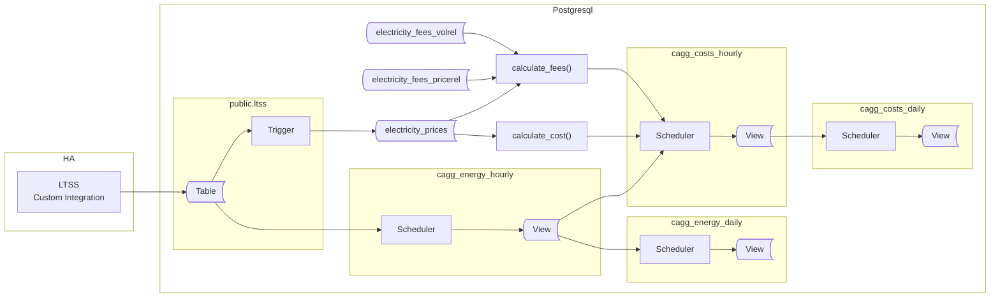
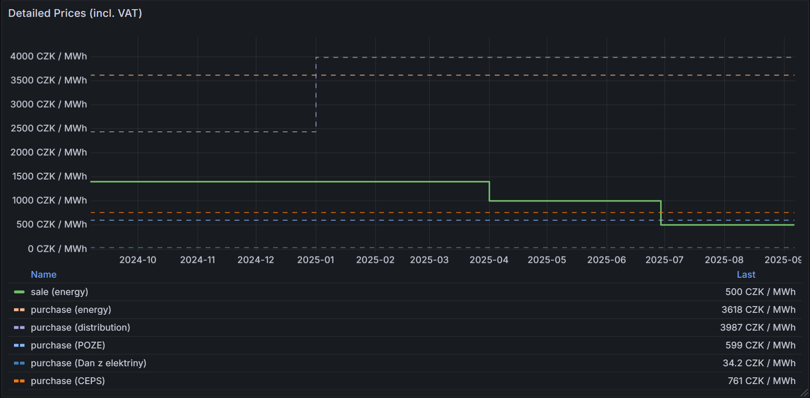

## Preface

This guide explains how to create the necessary database objects for tracking energy usage and its associated costs. It introduces tables for storing prices, fees, and taxes, along with methods for collecting long-term energy and cost data.

Originally intended as a simple extension to the previous article to support spot prices, this update revealed additional challenges and required more significant changes than expected. As a result, new price tables and continuous aggregates (CAGGs) are introduced, along with improved naming conventions to better reflect their purpose.

A future update will merge both articles into a comprehensive guide, incorporating the latest TimescaleDB syntax.

> The new approach is well-suited for environments with infrequently changing prices and is recommended for new deployments.

All objects are created in a dedicated schema, named `ltss_energy_ote`. If you have existing objects from the previous version, this allows both setups to coexist without conflict.

The `ote` suffix refers to the spot price operator in the Czech Republic, but you may use any suffix that fits your context.

The diagram below illustrates involved components and objects to be created. Related tables and views are grouped within rectangles, and arrows indicate the direction of data flow.



The overall approach remains similar to the previous article, but introduces two important changes:

**1. Fees and Taxes Handling**  
When trading on the spot market via a third-party operator, fees are typically billed in one of two ways:
* a fixed price per energy unit (e.g., 250 CZK per 1 MWh)
* a percentage of the energy price (e.g., 15% of the sold energy price, commonly used for taxes)

This guide supports both billing methods. Since spot pricing involves a single net price, fees and taxes are applied based on the trade type (sale or purchase). Therefore, energy prices should be stored as net values.

> Note: Price and fee entries must be created in the database in advance of incoming energy data. While spot prices can be delivered automatically, many fees and static prices require manual entry, as automated retrieval via API is uncommon.

**2. Separate CAGGs for Energy and Costs**  
Materializing costs in dedicated Continuous Aggregates (CAGGs) improves query performance, especially on resource-constrained hardware like Raspberry Pi. Separating energy and cost CAGGs offers several advantages:

1. You can adjust prices retroactively and regenerate cost CAGGs, even if the original data is no longer present in the `ltss` table.
2. Additional energy-related CAGGs can be created later, leveraging the precalculated energy aggregates.
3. The energy CAGG can aggregate all energy sensors, while the cost CAGG can focus on a subset of sensors.
4. The codebase remains cleaner and easier to maintain.

Cost CAGGs will provide sale and purchase metrics for each measured energy source, along with net and uplifting values to support future analysis.

## Prices

Tax application depends on local regulations; for example, VAT may be added to purchased energy but not deducted from sold energy. As a result, the `electricity_prices` table should contain only net energy prices, while taxes and fees are managed in separate tables.

### Data Structures

Start by creating the schema and tables for prices and fees. The following script also sets basic privileges, granting read access to all connected clients.


```sql
DROP SCHEMA IF EXISTS ltss_energy_ote CASCADE;
CREATE SCHEMA ltss_energy_ote;

CREATE TABLE IF NOT EXISTS ltss_energy_ote.electricity_prices
(
    trade_type  TEXT NOT NULL,
    price_name  TEXT NOT NULL,
    price_period TSTZRANGE NOT NULL,
    price_value NUMERIC NOT NULL,
    dir INTEGER NOT NULL
    volume_unit  TEXT NOT NULL,
    CONSTRAINT pk_electricityprices PRIMARY KEY (trade_type, price_name, price_period),
    CONSTRAINT xc_electricityprices_unique EXCLUDE USING gist (trade_type WITH =, price_name WITH =, price_period WITH &&),
    CONSTRAINT ck_electricityprices_tradetype CHECK (trade_type IN ('Sale', 'Purchase')),
    CONSTRAINT ck_electricityprices_dir CHECK (dir IN (-1, 1))
);


CREATE TABLE IF NOT EXISTS ltss_energy_ote.electricity_fees_pricerel
(
    trade_type  TEXT NOT NULL CHECK (trade_type IN ('Sale', 'Purchase')),
    price_name  TEXT NOT NULL,
    fee_name    TEXT NOT NULL,
    fee_period  TSTZRANGE NOT NULL,
    fee_value   NUMERIC NOT NULL,
    dir         INTEGER NOT NULL
    CONSTRAINT pk_electricityfeespricerel PRIMARY KEY (trade_type, price_name, fee_name, fee_period),
    CONSTRAINT xc_electricityfeespricerel_unique EXCLUDE USING gist (trade_type WITH =, price_name WITH =, fee_period WITH &&),
    CONSTRAINT ck_electricityfeespricerel_tradetype CHECK (trade_type IN ('Sale', 'Purchase')),
    CONSTRAINT ck_electricityfeespricerel_dir CHECK (dir IN (-1, 1))
);

COMMENT ON TABLE ltss_energy_ote.electricity_prices IS 'Net prices for an energy volume';

COMMENT ON TABLE ltss_energy_ote.electricity_fees_pricerel IS 'Fees to be calculated from the net value of energy volume';

GRANT USAGE ON SCHEMA ltss_energy_ote2 TO public;
GRANT SELECT ON TABLE ltss_energy_ote.electricity_fees_pricerel, ltss_energy_ote.electricity_prices TO public;
```
The structure of the `electricity_prices` table was described earlier. The key change is that it now stores only net prices. Additionally, the `trade_type` column (formerly `price_type`) is restricted to two values: `Purchase` and `Sale`. This is enforced using a check constraint, which is also applied to another table.

Also it's recommended to reserve the `Energy` name appearing in `price_name` column to represent the pure electricity price (i.e., the spot price). 

Names of entries are proposed as started with an uppercase first letter, to easthetically match other names like 'VAT' and ensuring visualization consistency in Graphana.

This naming convention is used throughout the code.

Fees table require further explanation, as two types are supported:

- **Volume-based fee**: This is a fixed price per unit of energy (e.g., 250 CZK per 1 MWh). The total fee is calculated as `fee_value * energy`, independent of other factors.

- **Price-relative fee**: This fee is a percentage of the net price (commonly used for taxes such as VAT). The calculation is `energy * (1+fee_value) * price_value`, where `price_value` is taken from the `electricity_prices` table. The `electricity_fees_pricerel` table links to the prices table via the `trade_type` and `price_name` columns. Notably, this relationship is not enforced by a foreign key constraint, allowing fee/tax periods to be defined independently from price ranges, including open-ended periods like `(-infinity, infinity)`.

The following example demonstrates a configuration for buying and selling at spot prices, with additional distribution costs and VAT for purchased energy, and a fixed fee for exported energy.

**price table**

| trade_type | price_name    | price_period                                      | price_value |dir|volume_unit |
|------------|---------------|---------------------------------------------------|-------------|---|------------|
|Purchase    |Ceps           |["2023-08-29 00:00:00+02","2024-01-01 00:00:00+01")|      0.11353|  1|kWh         |
|Purchase    |Ceps           |["2024-01-01 00:00:00+01","2025-01-01 00:00:00+01")|      0.21282|  1|kWh         |
|Purchase    |Ceps           |["2025-01-01 00:00:00+01",infinity)                |      0.31178|  1|kWh         |
|Purchase    |Dan Z Elektriny|["2023-08-29 00:00:00+02",infinity)                |       0.0283|  1|kWh         |
|Purchase    |Distribution   |["2023-08-29 00:00:00+02","2024-01-01 00:00:00+01")|        1.611|  1|kWh         |
|Purchase    |Distribution   |["2024-01-01 00:00:00+01","2024-08-06 00:00:00+02")|      2.01566|  1|kWh         |
|Purchase    |Distribution   |["2024-08-06 00:00:00+02","2025-01-01 00:00:00+01")|      2.01566|  1|kWh         |
|Purchase    |Distribution   |["2025-01-01 00:00:00+01",infinity)                |      2.09963|  1|kWh         |
|Purchase    |Energy         |["2023-08-29 00:00:00+02","2023-11-01 00:00:00+01")|      4.69834|  1|kWh         |
|Purchase    |Energy         |["2023-11-01 00:00:00+01","2024-03-20 00:00:00+01")|      4.28925|  1|kWh         |
|Purchase    |Energy         |["2024-03-20 00:00:00+01","2024-08-01 00:00:00+02")|      3.75537|  1|kWh         |
|Purchase    |Energy         |["2024-08-01 00:00:00+02","2026-01-01 00:00:00+01")|      2.99008|  1|kWh         |
|Purchase    |Poze           |["2023-12-31 23:00:00+01",infinity)                |        0.495|  1|kWh         |
|Sale        |Energy         |["2024-08-08 00:00:00+02","2025-04-01 00:00:00+02")|          1.4|  1|kWh         |
|Sale        |Energy         |["2025-04-01 00:00:00+02","2025-06-29 00:00:00+02")|            1|  1|kWh         |
|Sale        |Energy         |["2025-06-29 00:00:00+02","2025-11-01 00:00:00+02")|          0.5|  1|kWh         |
|Sale        |EnerSpot       |["2025-11-01 00:00:00+02",infinity)                |         0.25| -1|kWh         |
|Sale        |Energy         |["2025-11-01 00:00:00+02","2025-11-01 01:00:00+02")| ...         |  1|kWh         |
| ...        | ...           | ...                                               | ...         |...|kWh         |

**ToDo - describe Dir**
**ToDo - add example for both spot sale+purchase**

Notice how both sale and purchase prices for energy are recorded separately. Although the spot price itself is singular, the system must distinguish between purchase and sale transactions. This approach keeps the logic straightforward and avoids unnecessary complexity.

You can safely use `"infinity"` as a time boundary when the end date of a price period is not known. Open-ended periods can be defined with `-infinity` or `infinity`. When a price changes, update the entry to set the new time boundary. If you make this change before new data arrives, no further action is required. However, if you modify time boundaries for past periods, you must recalculate the cost CAGGs to update the data.

**price-relative fee table**

This table is great for handling taxes. Also, it's applicable to handle operator fees deducted as percentage of energy cost rather than amount.

**ToDo - describe Dir**

|trade_type  |price_name     |fee_name|fee_period          |fee_value|dir|
|------------|---------------|--------|--------------------|---------|---|
|Purchase    |Ceps           |VAT     |(-infinity,infinity)|     0.21|  1|
|Purchase    |Dan Z Elektriny|VAT     |(-infinity,infinity)|     0.21|  1|
|Purchase    |Distribution   |VAT     |(-infinity,infinity)|     0.21|  1|
|Purchase    |Energy         |VAT     |(-infinity,infinity)|     0.21|  1|
|Purchase    |Poze           |VAT     |(-infinity,infinity)|     0.21|  1|

In order to properly connect that fee with the price, `trade_type` and `price_name` have to reflect related entry from the price table.

> Fees stored in price-relative fee table are units independed

> Contracts very often list prices for MWh. Tables above list kWh, however it has only informative purpose. The code bellow doesn't implement recalculation between units (not that it's not possible).It expects that **all energy entries stored in ltss table are in kWh.**

### Feeding with data

> This part is tricky because it strongly depends on how you collect spot prices. Use it as a source of inspiration and adapt the approach to match your data provider, integration method, and automation tools.

When working with static energy prices, you typically update records only when contracts change. However, spot pricing requires frequent updates, as new price records must be entered continuously. The method you use to feed prices into your database depends on your data source and available tools. Options include custom Home Assistant (HA) integrations, Node-RED automations, external scripts, or even manual SQL queries for infrequently changing prices. The essential requirement is that prices are inserted into the `electricity_prices` table before energy data is aggregated into CAGGs.

If HA is your data source, the simplest solution is to publish a sensor that provides the current price via LTSS to the database. However, this method has a significant drawback: any HA outage can result in missing price data, leading to zero calculated costs for those periods. This is generally unacceptable for accurate cost tracking.

A more robust approach is to store prices in advance, especially since spot prices are often available ahead of time. The best solution will depend on your price provider’s API and your data processing workflow. While there is no universal method, the following example illustrates a practical approach.

Suppose you have a `sensor.tomorrow_spot_electricity_prices` entity in HA, which provides the next day's prices as a JSON array in its attributes:

```json
"data": [
    {"time": "time1", "price": 1.0},
    {"time": "time2", "price": 2.0},
    {"time": "time3", "price": 3.0}
    ...
]
```
To integrate such a sensor with TimescaleDB, you must publish it using the LTSS component. To automatically insert price data from the JSON structure, a database trigger is required. Below is an example trigger that processes the JSON data from the previous example.

Note two key constraints in the code:
- `ENTITYID` specifies the Home Assistant entity to process.
- `TRADES` is an array containing `'Sale'`, `'Purchase'`, or both. This controls which trade types are handled for spot pricing. If you only sell energy at spot prices, remove `'Purchase'` from the array.


```sql
CREATE OR REPLACE FUNCTION ltss_energy_ote.tr_ltss_oteprices()
    RETURNS trigger
    LANGUAGE 'plpgsql'
    SECURITY DEFINER
AS $BODY$

DECLARE
    err_msg   TEXT;
    err_code  TEXT;
    ENTITYID CONSTANT TEXT = 'sensor.tomorrow_spot_electricity_prices';
    TRADES   CONSTANT TEXT[] = Array['Sale','Purchase'];
BEGIN
    -- THIS TRIGGER FUNCTION IS USED on public.ltss table

    IF NEW.entity_id <> ENTITYID THEN
        RETURN NULL;
    END IF;

    INSERT INTO ltss_energy_ote.electricity_prices AS ep
    (
        trade_type,
        price_name, 
        price_period,
        price_value,
        volume_unit
    )
    SELECT 
        unnest(TRADES),
        'energy',
        tstzrange((j->>'time')::TIMESTAMPTZ, (j->>'time')::TIMESTAMPTZ + '1h'::INTERVAL, '[)'),
        (j->'price')::NUMERIC,
        'kWh'
    FROM jsonb_array_elements(NEW.attributes->'data') AS j
    ON CONFLICT ON CONSTRAINT pk_electricityprices 
    DO UPDATE
    SET price_value = EXCLUDED.price_value
    WHERE ep.price_value <> EXCLUDED.price_value;

    RETURN NULL;

EXCEPTION WHEN others THEN
    GET STACKED DIAGNOSTICS err_msg  = MESSAGE_TEXT,
                            err_code = RETURNED_SQLSTATE;
    RAISE WARNING 'ERROR: [%], %', err_code, err_msg;
    RETURN NULL;
END;
$BODY$;

CREATE OR REPLACE TRIGGER tr_ltss_oteprices
AFTER INSERT
ON public.ltss
FOR EACH ROW
EXECUTE FUNCTION ltss_energy_ote.tr_ltss_oteprices();
```

Note the error handling: by default, any error causes the transaction to roll back. However, since it is critical not to lose any data from the `ltss` table, the trigger function suppresses errors. Instead, any error encountered is logged as a warning, ensuring that data ingestion continues uninterrupted.

<details>
<summary>For users of the Czech Energy Spot Prices custom integration</summary>
The `Czech Energy Spot Prices` integration provides a `sensor.tomorrow_spot_electricity_hour_order` sensor which have a significant flaw: when prices are set in its attributes, the state is set to `none`, causing LTSS to ignore it. Below is a template sensor that creates new sensor which contains valid state. At the same time it reorganizes prices data into more logical form:

```yaml
template:
  - triggers:
      - trigger: time_pattern
        # This will update every hour
        minutes: 0
    sensor:
      - name: "Tomorrow Spot Electricity Prices"
        state: "{{ now() }}"
        attributes:
          data: >
            
            
              
                
                
               
            
            {{ data.prices }}
```
</details>

### Price Visualization

Once prices are in the table, you can visualize them.

When working with a mix of partial prices and spot prices, visualizing all price components in a single graph can quickly become cluttered and hard to interpret. For clearer insights, consider creating separate graphs for components and for final trade price.

We are going to tacle with two categories of price records:
* **Irregular, infrequently changing prices**: For visualization it's required to generate a continuous time series out of original price points
* **Spot prices**: These are recorded as regular, ready to visualize, time series.

For improved performance, code clarity, and reusability, construct individual queries for each  category and combine their results using `UNION`. By grouping the data by trade type, you will generate distinct series for sales and purchases, resulting in a chart similar to the example above.


```sql
SELECT time as time, 1000 * SUM(price_value * COALESCE(1+efr.fee_value,1) + COALESCE(evr.fee_value, 0)) AS price, ec.trade_type  as type
FROM ltss_energy_mnd.electricity_prices AS ec
JOIN generate_series(to_timestamp($__from/1000)::DATE::TIMESTAMPTZ, to_timestamp($__to/1000)::TIMESTAMPTZ, '1 d'::INTERVAL) AS x(time) ON TRUE
LEFT JOIN ltss_energy_mnd.electricity_fees_pricerel AS efr ON efr.trade_type = ec.trade_type AND efr.price_name = ec.price_name AND ec.price_period <@ efr.fee_period
WHERE x.time <@ price_period
group by 1, 3

UNION

SELECT LOWER(price_period) AS "Time", 1000 * SUM((price_value * COALESCE(1+efr.fee_value,1) - COALESCE(evr.fee_value, 0))) AS price, ec.trade_type as type
FROM ltss_energy_ote2.electricity_prices AS ec
LEFT JOIN ltss_energy_ote2.electricity_fees_pricerel AS efr ON efr.trade_type = ec.trade_type AND efr.price_name = ec.price_name AND ec.price_period <@ efr.fee_period
WHERE LOWER(price_period) BETWEEN to_timestamp($__from/1000)::DATE::TIMESTAMPTZ AND to_timestamp($__to/1000)::TIMESTAMPTZ
AND (ec.trade_type, ec.price_name) IN (('sale', 'energy'))
GROUP BY 1, 3
ORDER BY type DESC
```
The first query, with use of generate_series() function, generates a time points for given time period with values reflecting prices that change infrequently. It excludes energy sale prices since we expect them to be recorded hourly.

The second subquery specifically returns sale energy prices, which are assumed to be periodic (hourly) records.

Both subqueries join with price-related fees to present the final prices, rather than just the net values.

> Applying volume-related prices at this point is not possible. However, once energy data has been aggregated, you can combine the price with any applicable volume-based fees,

If you buy and sell energy on the spot market, you might consider including the `('Purchase', 'Energy')` pair to both query conditions.

If you switch between fixed and spot pricing, ensure your SQL query conditions accurately reflect the transition period. 

If you do not use periodically recorded prices, you can omit the second subquery and remove the related condition from the first one. In this scenario, it might be reasonable to display all prices - including their individual components - within a single graph.


```sql
SELECT x.time, 1000 * price_value * COALESCE(1+fee_value,1) AS price, format('%s (%s)', ec.trade_type, ec.price_name) AS type
FROM ltss_energy_ote.electricity_prices AS ec
JOIN generate_series(to_timestamp($__from/1000)::DATE::TIMESTAMPTZ, to_timestamp($__to/1000)::TIMESTAMPTZ, '1d'::INTERVAL) AS x(time) ON TRUE
LEFT JOIN ltss_energy_ote.electricity_fees_pricerel AS efr ON efr.trade_type = ec.trade_type AND efr.price_name = ec.price_name AND ec.price_period <@ efr.fee_period
WHERE x.time <@ price_period
ORDER BY type DESC
```
In both examples, values are multiplied by 1000 to convert units to MWh. This scaling aligns the data with standard price sheets, making comparisons clearer and more intuitive.

## Utility functions

With the price data in place, we can now define Continuous Aggregates (CAGGs) for both energy and costs. Due to current limitations in CAGG SQL support, direct aggregate queries are not feasible. Instead, we use helper functions - `calculate_cost()` and `calculate_fee()` - to compute net costs and fees. These functions will be called within the first-level costs CAGG.

Additionally, the utility functions `get_entities_for_cagg_energy()` and `get_entities_for_cagg_costs()` return lists of entities to process. Using these functions in CAGGs allows to update the entity list without dropping and recreating the aggregates.

> Note: If you are using TimescaleDB prior to v2.20, you must change the function declaration from STABLE to IMMUTABLE. Otherwise, PostgreSQL will reject the CAGG creation. This workaround is suitable for this scenario, but declaring non-immutable code as IMMUTABLE is generally discouraged and may cause unexpected behavior.

```sql
CREATE OR REPLACE FUNCTION ltss_energy_ote.calculate_cost
(
    _trade_type TEXT,
    _time       TIMESTAMPTZ,
    _value      NUMERIC,
    _incl_pname TEXT[] DEFAULT NULL,
    _excl_pname TEXT[] DEFAULT NULL
)
RETURNS NUMERIC
LANGUAGE sql
STABLE
AS $f$

    SELECT
        trim_scale(SUM(_value * price_value * dir)) AS val_total
    FROM ltss_energy_ote.electricity_prices AS p
    WHERE _time <@ price_period
      AND trade_type       = _trade_type
      AND p.price_name     = ANY(COALESCE(_incl_pname, Array[price_name]))
	  AND NOT p.price_name = ANY(COALESCE(_excl_pname, ARRAY[]::text[]))

$f$;

CREATE OR REPLACE FUNCTION ltss_energy_ote.calculate_fee
(
    _TRADE_TYPE TEXT,
    _TIME       TIMESTAMPTZ,
    _VALUE      NUMERIC,
    _INCL_PNAME TEXT[] DEFAULT NULL,
    _EXCL_PNAME TEXT[] DEFAULT NULL,
    _INCL_FNAME TEXT[] DEFAULT NULL,
    _EXCL_FNAME TEXT[] DEFAULT NULL
)
RETURNS NUMERIC
LANGUAGE sql
STABLE
AS $f$

    SELECT COALESCE(trim_scale(_value * SUM(value)), 0) AS value
    FROM
    (
        SELECT p.price_value * COALESCE((1 - public.nmul(1 - f.fee_value)), 1) AS value
        FROM ltss_Energy_ote.electricity_prices AS p
        JOIN ltss_Energy_ote.electricity_fees   AS f ON (p.trade_type, p.price_name) = (f.trade_type, f.price_name)
        WHERE _time <@ p.price_period
          AND _time <@ f.fee_period
          AND p.trade_type      = _trade_type
          AND p.price_name      = ANY(COALESCE(_incl_pname, Array[p.price_name]))
          AND NOT p.price_name  = ANY(COALESCE(_excl_pname, Array[]::TEXT[]))
          AND f.fee_name        = ANY(COALESCE(_incl_fname, Array[f.fee_name]))
          AND NOT f.fee_name    = ANY(COALESCE(_excl_fname, Array[]::TEXT[]))
        GROUP BY p.trade_type, p.price_name, p.price_period, p.price_value
    ) AS sub

$f$;


CREATE OR REPLACE FUNCTION ltss_energy_ote.get_entities_for_cagg_energy()
RETURNS TEXT[]
LANGUAGE 'sql'
IMMUTABLE
AS $f$

   SELECT ARRAY
       [
            -- replace sensor names with your own.
           'sensor.pg_mainhouse_total_energy_energy_hourly', -- consumption
           'sensor.pg_cube_total_energy_energy_hourly',      -- consumption
           'sensor.energy_injected_hourly',                  -- injected to grid
           'sensor.energy_purchased_hourly',                 -- purchased from grid
           'sensor.wattsonic_pv1_input_energy_2_hourly',     -- PV string 1 production
           'sensor.wattsonic_pv2_input_energy_2_hourly',     -- PV string 2 production
           'sensor.energy_discharged_from_battery_hourly',   -- Discharged from battery
           'sensor.energy_charged_to_battery_hourly'         -- Charged to battery
           -- Other energy sensors you want to aggregate
       ];
$f$;

CREATE OR REPLACE FUNCTION ltss_energy_ote.get_entities_for_cagg_costs()
RETURNS TEXT[]
LANGUAGE 'sql'
IMMUTABLE
AS $f$

   SELECT ARRAY
       [
            -- replace sensor names with your own.
           'sensor.pg_mainhouse_total_energy_energy_hourly', -- consumption
           'sensor.pg_cube_total_energy_energy_hourly',      -- consumption
           'sensor.energy_injected_hourly',                  -- injected to grid
           'sensor.energy_purchased_hourly',                 -- purchased from grid
       ];
$f$;
```

The `calculate_cost()` function is straightforward: for a given trade type, it multiplies the specified energy value by all applicable prices and returns their sum. The optional `_exclude` parameter allows you to omit a specific price item by name, while `_include` restricts the calculation to a particular price entry.

The `calculate_fee()` function is slightly more complex, as it computes the total cost of both types of fees for the given energy value. Like `calculate_cost()`, it supports excluding certain fee entries from the result.

By combining these functions, you can flexibly calculate a wide range of costs within CAGGs or use them directly for manual testing.

> If you change the function declaration from STABLE to IMMUTABLE, make sure to run `DISCARD PLANS` before each manual use (unless prices remain unchanged or you reconnect to the database).

## Aggregates for Energy
The first-level CAGG aggregates hourly energy data from the `ltss` table. All subsequent CAGGs build on these precalculated energy aggregates.

The specific outputs of the costs CAGGs should be tailored to your requirements. If you anticipate comparing alternative offers in the future, it is beneficial to store certain precalculated values. While these calculations can be performed on demand, doing so may place excessive load on the system, making real-time presentation impractical.

In most setups, tracking both purchase and sale costs is valuable. Storing the net price of energy is also recommended.

The final proposal includes the following metrics:

* **Purchase cost**: Total cost of purchased energy (net energy value plus fees)
* **Trading cost of purchased energy**: Fees and taxes associated with purchased energy
* **Net cost of purchased energy**: Net price of purchased energy (excluding fees)

* **Sale income**: Total income from sold energy (net energy value minus fees)
* **Trading cost of sold energy**: Fees and taxes deducted from sold energy
* **Net cost of sold energy**: Net price received for sold energy (excluding fees)


```sql
CREATE MATERIALIZED VIEW ltss_energy_ote.cagg_energy_hourly
WITH (timescaledb.continuous) AS
SELECT
    time_bucket('1h'::INTERVAL, "time", 'Europe/Prague') AS bucket,
    entity_id,
    delta(counter_agg("time", state::DOUBLE PRECISION))::NUMERIC AS energy,    
FROM ltss
WHERE entity_id = ANY (ltss_energy_ote.get_entities_for_cagg_energy())
  AND state NOT IN ('unavailable', 'unknown')
GROUP BY 1, 2
WITH NO DATA;


-- create daily CAGG based on hourly one
CREATE MATERIALIZED VIEW ltss_energy_ote.cagg_energy_daily
WITH (timescaledb.continuous) AS
SELECT
   time_bucket('1d'::INTERVAL, bucket, 'Europe/Prague') AS bucket,
   entity_id,
   SUM(energy) AS energy,
FROM ltss_energy_ote.cagg_energy_hourly
GROUP BY 1, 2
WITH NO DATA;


CREATE MATERIALIZED VIEW ltss_energy_ote.cagg_costs_hourly
WITH (timescaledb.continuous) AS
SELECT
    time_bucket('1h'::interval, bucket, 'Europe/Prague') AS bucket,
    entity_id,

    ltss_energy_ote.calculate_cost('Purchase', max(bucket), sum(energy)) + ltss_energy_ote.calculate_fee('Purchase', max(bucket), sum(energy))
    AS purchase_cost,

    ltss_energy_ote.calculate_cost('Purchase', max(bucket), sum(energy), _excl_pname => ARRAY['Energy']) + ltss_energy_ote.calculate_fee('Purchase', max(bucket), sum(energy), _excl_pname => ARRAY['Energy'])
    AS purchase_trading_cost,

    ltss_energy_ote.calculate_cost('Purchase', max(bucket), sum(energy), _incl_pname => ARRAY['Energy'])
    AS purchase_energy_cost,
    
    ltss_energy_ote.calculate_cost('Sale', max(bucket), sum(energy)) - ltss_energy_ote.calculate_fee('Sale', max(bucket), sum(energy))
    AS sale_income,
    
    ltss_energy_ote.calculate_cost('Sale', max(bucket), sum(energy), _excl_pname => ARRAY['Energy']) + ltss_energy_ote.calculate_fee('Sale', max(bucket), sum(energy), _excl_pname => ARRAY['Energy'])
    AS sale_trading_cost,

    ltss_energy_ote.calculate_cost('Sale', max(bucket), sum(energy), _incl_pname => ARRAY['Energy'])
    AS sale_energy_cost

FROM ltss_energy_ote.cagg_energy_hourly
WHERE entity_id = ANY (ltss_energy_ote.get_entities_for_cagg_costs())
GROUP BY 1, 2;

SELECT
    time_bucket('1h'::INTERVAL, bucket, 'Europe/Prague') AS bucket,
    entity_id,
    ltss_energy_ote.calculate_cost('Purchase', MAX(bucket), SUM(energy)) + ltss_energy_ote.calculate_fee('Purchase', MAX(bucket), SUM(energy))
    AS purchase_cost,
    
    ltss_energy_ote.calculate_cost('Purchase', MAX(bucket), SUM(energy), _exclude => 'Energy') + ltss_energy_ote.calculate_fee('Purchase', MAX(bucket), SUM(energy), _exclude => 'Energy')
    AS purchase_trading_cost,
    
    ltss_energy_ote.calculate_cost('Purchase', MAX(bucket), SUM(energy), _include => 'Energy')
    AS purchase_energy_cost,
    
    ltss_energy_ote.calculate_cost('Sale', MAX(bucket), SUM(energy)) - ltss_energy_ote.calculate_fee('Sale', MAX(bucket), SUM(energy))
    AS sale_income, -- net income
    
    ltss_energy_ote.calculate_cost('Sale', MAX(bucket), SUM(energy), _exclude => 'Energy') + ltss_energy_ote.calculate_fee('Sale', MAX(bucket), SUM(energy), _exclude => 'Energy')
    AS sale_trading_cost, -- trading costs
    
    ltss_energy_ote.calculate_cost('Sale', MAX(bucket), SUM(energy), _include => 'Energy') 
    AS sale_energy_cost -- net cost of sold energy
    
FROM ltss_energy_ote.cagg_energy_hourly as t
WHERE entity_id = ANY (ltss_energy_ote.get_entities_for_cagg_costs())
GROUP BY 1, 2
WITH NO DATA;

CREATE MATERIALIZED VIEW ltss_energy_ote.cagg_costs_daily
WITH (timescaledb.continuous) AS
SELECT
   time_bucket('1d'::INTERVAL, bucket, 'Europe/Prague') AS bucket,
   entity_id,
   SUM(purchase_cost)           AS purchase_cost,          -- total cost = spot+fee+tax
   SUM(purchase_trading_cost)   AS purchase_trading_cost,  -- totalcost-(energy*tax)
   SUM(purchase_energy_cost)    AS purchase_energy_cost,   -- net cost (ie spot)
   SUM(sale_income)             AS sale_income,            -- total cost = spot-fee (- potential taxes)
   SUM(sale_trading_cost)       AS sale_trading_cost,      -- totalcost-(energy*tax)
   SUM(sale_energy_cost)        AS sale_energy_cost        -- net cost (ie spot)
FROM ltss_energy_ote.cagg_energy_hourly
GROUP BY 1, 2
WITH NO DATA;

-- Grant read access to everyone connected
GRANT SELECT ON TABLE
    ltss_energy_ote.cagg_energy_hourly,
    ltss_energy_ote.cagg_energy_daily,
    ltss_energy_ote.cagg_costs_hourly,
    ltss_energy_ote.cagg_costs_daily
    TO public;

-- make both CAGGs real-time
ALTER MATERIALIZED VIEW ltss_energy_ote.cagg_energy_hourly
SET (timescaledb.materialized_only = FALSE);

ALTER MATERIALIZED VIEW ltss_energy_ote.cagg_energy_daily
SET (timescaledb.materialized_only = FALSE);

ALTER MATERIALIZED VIEW ltss_energy_ote.cagg_costs_hourly
SET (timescaledb.materialized_only = FALSE);

ALTER MATERIALIZED VIEW ltss_energy_ote.cagg_costs_daily
SET (timescaledb.materialized_only = FALSE);

-- start CAGGs refreshing automatically
SELECT add_continuous_aggregate_policy
(
   'ltss_energy_ote.cagg_energy_hourly', '4h'::INTERVAL, '5m'::INTERVAL, '15m'::INTERVAL
);
SELECT add_continuous_aggregate_policy
(
   'ltss_energy_ote.cagg_energy_daily', '3d'::INTERVAL, '4h'::INTERVAL, '12h'::INTERVAL
);

-- start CAGGs refreshing automatically
SELECT add_continuous_aggregate_policy
(
   'ltss_energy_ote.cagg_costs_hourly', '4h'::INTERVAL, '5m'::INTERVAL, '15m'::INTERVAL
);
SELECT add_continuous_aggregate_policy
(
   'ltss_energy_ote.cagg_costs_daily', '3d'::INTERVAL, '4h'::INTERVAL, '12h'::INTERVAL
);
```
At this point, all CAGGs are configured to provide real-time updates, automatic refresh policies are in place, and essential access privileges have been granted.

As explained previously, `WITH NO DATA` means CAGGs are not filled at creation. Once aggregate policies are set, they fill CAGGs with new data from `ltss` table.

To populate CAGGs with historical data from the `ltss` table, run the refresh procedures - hourly energy first, daily CAGGs last. Avoid overlapping the requested update time range with the scheduled update interval. For example, if the policy interval is `4h to 5m before NOW`, the upper time boundary for the refresh should not exceed NOW()-4h.

```sql
CALL refresh_continuous_aggregate('ltss_energy_ote.cagg_energy_hourly', '2025-01-01 0:0', NOW()-'5h'::INTERVAL, TRUE);
CALL refresh_continuous_aggregate('ltss_energy_ote.cagg_energy_daily', '2025-01-01 0:0', NOW()-'4d'::INTERVAL, TRUE);

CALL refresh_continuous_aggregate('ltss_energy_ote.cagg_costs_hourly', '2025-01-01 0:0', NOW()-'5h'::INTERVAL, TRUE);
CALL refresh_continuous_aggregate('ltss_energy_ote.cagg_costs_daily', '2025-01-01 0:0', NOW()-'4d'::INTERVAL, TRUE);
```

> :exclamation: **Important:** Do not run `refresh_continuous_aggregate()` for the first level CAGG (the one reading from ltss table) on missing data if their aggregated form already exists in CAGGs. Doing so will irreversibly delete them from the CAGG!

## Presentation SQL Queries

The SQL queries remain largely the same, but now use the precomputed `sale_income` and `purchase_cost` columns instead of the `calculate_cost()` function.

For example, the following SQL query returns a Return On Investment (ROI). The ROI is the sum of both: savings and income from sold energy. Savings are calculated as the price of consumed but not purchased energy (i.e., consumed energy minus purchased energy), using the purchase price.


```sql
SELECT 
    ROUND(SUM(sale_income)   FILTER (WHERE entity_id ~ 'injected'),2) AS cost_sold,
    ROUND(SUM(purchase_cost) FILTER (WHERE entity_id ~ 'purchased'),2) AS cost_purchased,
    ROUND(SUM(purchase_cost) FILTER (WHERE entity_id ~ 'cube|mainhouse'),2) AS cost_consumed,
    ROUND(SUM
    (
        CASE
            WHEN entity_id ~ 'injected'         THEN sale_income
            WHEN entity_id ~ 'purchased'        THEN -1 * purchase_cost
            WHEN entity_id ~ 'cube|mainhouse'   THEN purchase_cost
        END
    ), 2) AS roi
FROM ltss_energy_ote.cagg_costs_daily
WHERE bucket >= '2024-08-08' -- FVE installation date
  AND entity_id  IN (
                        'sensor.energy_injected_hourly', 
                        'sensor.energy_purchased_hourly',
                        'sensor.pg_mainhouse_total_energy_energy_hourly',
                        'sensor.pg_cube_total_energy_energy_hourly'
                    )
```

This approach is used throughout all cost presentation graphs.  
The query below returns evolution of an income and benefit from using self-produced energy. Then Grafana Transformations provides 3rd one, representing sum of both. Don't forget do disable stacking for this summing time series.

```sql
WITH 
src AS
(
    SELECT 
    time_bucket_gapfill
    (
        '$query_granularity'::INTERVAL,      
        "bucket", 'Europe/Prague'
    ) AS time,
    CASE WHEN entity_id ~ 'injected'        THEN 'Sold'
         WHEN entity_id ~ 'purchased'       THEN 'Avoided'
         WHEN entity_id ~ 'cube|mainhouse'  THEN 'Avoided'
         ELSE entity_id
    END AS entityid,
    SUM(CASE
            WHEN bucket < '2024-08-08' THEN 0 -- FVE installation date
            ELSE CASE 
                    WHEN entity_id ~ 'injected'       THEN sale_income
                    WHEN entity_id ~ 'purchased'      THEN -1 * purchase_cost
                    WHEN entity_id ~ 'cube|mainhouse' THEN purchase_cost
                 END
        END) AS cost
    FROM ltss_energy_ote.cagg_costs_${cagg_suffix}
    WHERE entity_id IN (
                            'sensor.energy_injected_hourly', 
                            'sensor.energy_purchased_hourly',
                            'sensor.pg_mainhouse_total_energy_energy_hourly',
                            'sensor.pg_cube_total_energy_energy_hourly'
                        )
    AND $__timeFilter("bucket")
    GROUP BY 1, 2
)
SELECT
    time,
    entityid,
    SUM(cost) OVER (PARTITION BY entityid ORDER BY time) AS roi
FROM src;
```


# Migration path


<details>
<summary>some examples</summary>
```
WITH
s0 AS MATERIALIZED
(
  SELECT bucket, value,  
    CASE WHEN entity_id = 'sensor.energy_injected_hourly' THEN 'Injected'
        WHEN entity_id = 'sensor.energy_purchased_hourly' THEN 'Purchased'
        WHEN entity_id IN ('sensor.pg_mainhouse_total_energy_energy_hourly',
                            'sensor.pg_cube_total_energy_energy_hourly') THEN 'Consumption'
        ELSE entity_id
    END as entity_id,
    CASE WHEN entity_id = 'sensor.energy_injected_hourly' THEN 'Sale'
        WHEN entity_id = 'sensor.energy_purchased_hourly' THEN 'Purchase'
        WHEN entity_id IN ('sensor.pg_mainhouse_total_energy_energy_hourly',
                            'sensor.pg_cube_total_energy_energy_hourly') THEN 'Purchase'
    END as calcmode
  FROM ltss_energy.cagg_energy_hourly AS ceh
  WHERE entity_id  IN (
                            'sensor.energy_injected_hourly', 
                            'sensor.energy_purchased_hourly',
                            'sensor.pg_mainhouse_total_energy_energy_hourly',
                            'sensor.pg_cube_total_energy_energy_hourly'
                        )
    AND bucket BETWEEN '2024-08-08' AND NOW()
    AND bucket>='2024-08-08'
),
s1 AS MATERIALIZED
(
    SELECT 
        bucket, 
        CASE entity_id WHEN 'Purchased' THEN ltss_energy_ote.calculate_cost('Purchase', bucket, value::NUMERIC) + ltss_energy_ote.calculate_fee('Purchase', bucket, value::NUMERIC) END AS purchase,
        CASE entity_id WHEN 'Consumption' THEN ltss_energy_ote.calculate_cost('Purchase', bucket, value::NUMERIC) + ltss_energy_ote.calculate_fee('Purchase', bucket, value::NUMERIC) END AS consumption,
        CASE entity_id WHEN 'Injected' THEN ltss_energy_ote.calculate_cost('Sale', bucket, value::NUMERIC) - ltss_energy_ote.calculate_fee('Sale', bucket, value::NUMERIC) END AS sale_250,
        CASE entity_id WHEN 'Injected' THEN ltss_energy_ote.calculate_cost('Sale', bucket, value::NUMERIC, _include=>'energy') - ltss_energy_ote.calculate_fee('Sale', bucket, value::NUMERIC, _include=>'energy') <= 0 END AS is_negative,
        CASE entity_id WHEN 'Purchased' THEN value::NUMERIC END AS energy_purchase,
        CASE entity_id WHEN 'Consumption' THEN value::NUMERIC END AS energy_cons,
        CASE entity_id WHEN 'Injected' THEN value::NUMERIC END AS energy_inj,
        entity_id
    FROM s0
)
SELECT
  --  date_bin('30 days', bucket, '2024-08-08'),
    SUM(COALESCE(consumption,0)) AS consumption,
    SUM(COALESCE(purchase,0)) AS purchase,
    SUM(COALESCE(consumption,0)-COALESCE(purchase,0)) AS savings,
    SUM(COALESCE(sale_250,0)) AS sale,
    SUM(COALESCE(CASE is_negative WHEN TRUE THEN 0 ELSE sale_250 END,0)) AS sale_pos,
    SUM(COALESCE(consumption,0)-COALESCE(purchase,0)+COALESCE(sale_250,0)) AS roi,
    SUM(COALESCE(consumption,0)-COALESCE(purchase,0)+COALESCE(CASE is_negative WHEN TRUE THEN 0 ELSE sale_250 END,0)) AS roi_pos,
    SUM(energy_purchase) AS energy_purchased,
    SUM(energy_cons) AS energy_cons,
    SUM(energy_inj) AS energy_inj,
    SUM(CASE is_negative WHEN TRUE THEN 0 ELSE energy_inj END) AS energy_inj
FROM s1
--GROUP BY 1
--ORDER BY 1
```
</details>