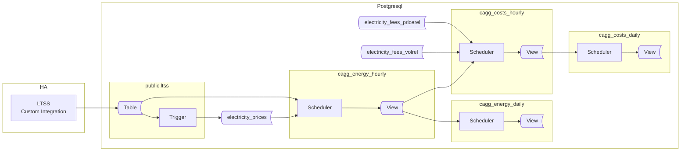
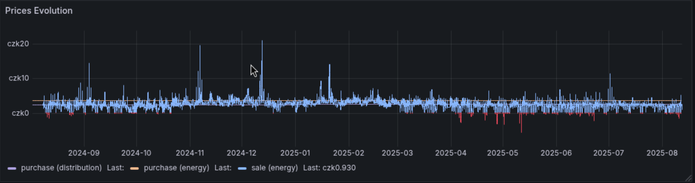
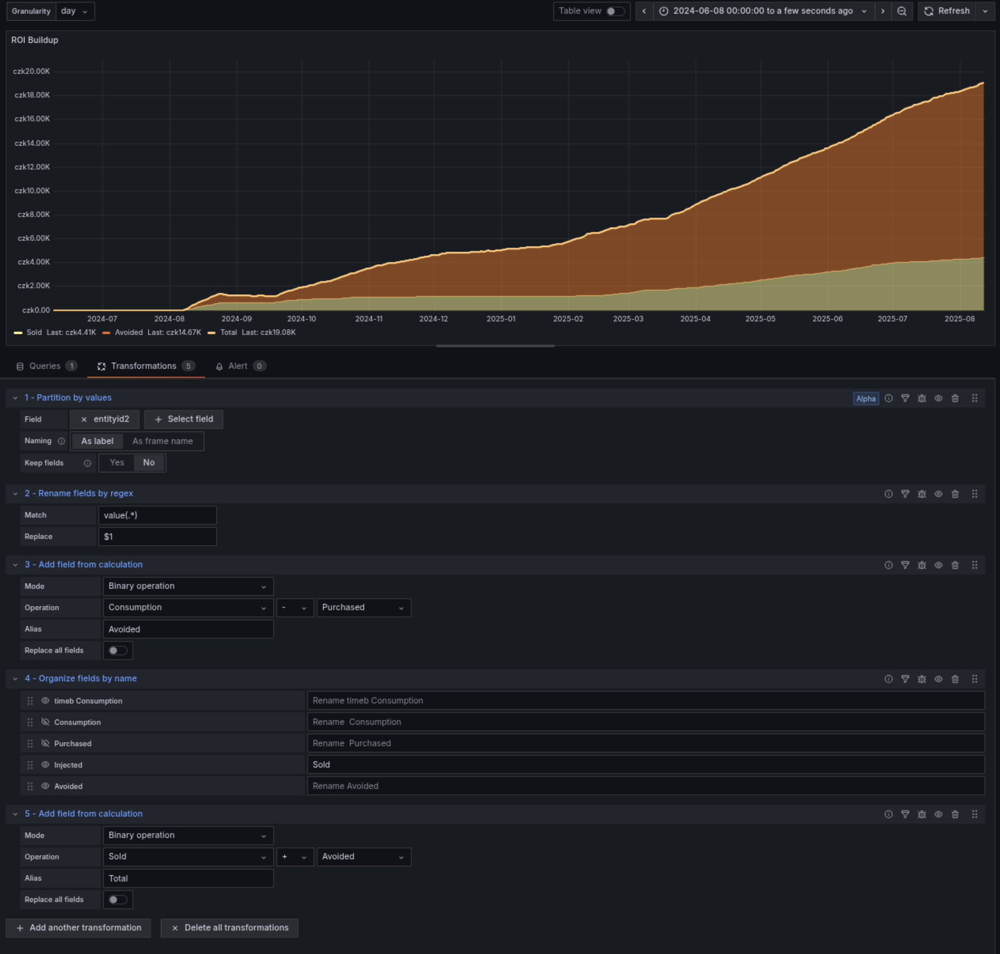

## Preface

This guide walks you through creation of database objects needed to maintain energy and its cost. For doing that it introduces tables for storing prices, fees and taxes as well as methods of collecting long term energy data and costs.

This article was planned as an addition to the previous part, just adding support for spot prices. Unexpectedly, it uncovered additional challanges, growing to be farer away from the original more than I expected. In fact it requires to create new price tables and new CAGGS. I took this as an opportunity propose new naming to better reflect their meaning.

In future I'm going to join both articles into final one, updating TimescaleDB syntax to most recent one.

> New proposal works well for slow-changing prices. It may be wise to use it from the start.

All objects will be created in dedicated schema, lets call it `ltss_energy_ote`.
If you have already object created based on previous version of the article, it will allow to leave them intact and let live both projects next to each other.

OTE suffix refers to the spot price operator in the Czech Republic, but you can use any suffix you prefer.

The diagram below shows involved components and objects to be created. If dable or view has related objects or components, they are grouped together using a rectangle named after the table

Arrows indicate a direction of the data flow.



The overall concept is similar to the one from the previous article, but with two key changes:

**1. Handling Fees and taxes**  
Handling fees are common when trading on the spot market via a third party (the operator). The two most common billing methods are:
* a fixed price per energy unit (e.g., 250 CZK per 1 MWh)
* a percentage of the energy price (e.g., 15% of the sold energy price). This one is also applied for deducting taxes.

The article presents solution that support both. If you operate on the spot, there is only one price (net), then it may be modified by fees and taxes depending on trade type (sale or purchase). Because of that the energy price should be stored as net value.

> Note: Prescription of prices and fees must be created in database manually, in advance of incoming energy data. Regardless spot prices, there are many of them which need to be entered manually, since an API for automatic retrieval is unlikely. Spot values will be delivered in automated way.

**2. Separate CAGGs for energy and costs**
Materializing costs in CAGGs improves performance when reading data. Rendering graphs no longer requires lookups to the price/fees tables, which is especially helpful on resource-constrained hardware like a Raspberry Pi. While energy and costs could be potentially maintained within single CAGG all together, it's practical to have them separated, for several reasons:

1. It makes possible adjusting prices retrospectively and then regenerate costs CAGGs, even when original data is not present in the `ltss` table anymore.
1. Simmilarily, you can create other energy-related CAGGs later on, having precalculated energy to your disposal
1. The energy CAGG can aggregate all energy sensors from your house, while costs CAGG can provide data for a selection of sensors.
1. It turns into cleaner code

Costs CAGGs will provide: sale and purchase for every measured energy. On top of that we add net and upshift values, this way enabling options for future analysis.

## Prices

Spot prices are always provided as net value. Deducting tax might or might not happen depending on local regulations. For instance the VAT might be added on top of bought energy cost, while not deducted from sold energy cost. It leads to conclusion that `electricity_prices` table should contain net energy price. I suggest to store prices as net ones. Taxes and fees are going to be put in `fees` tables.

### Data structures

Let's begin by creating the tables for prices and fees. The script below also sets basic privileges on the schema and tables, granting read access to all connected clients.


```sql
DROP SCHEMA IF EXISTS ltss_energy_ote2 CASCADE;
CREATE SCHEMA ltss_energy_ote2;

CREATE TABLE IF NOT EXISTS ltss_energy_ote.electricity_prices
(
    trade_type  TEXT NOT NULL,
    price_name  TEXT NOT NULL,
    price_period TSTZRANGE NOT NULL,
    price_value NUMERIC NOT NULL,
    volume_unit  TEXT NOT NULL,
    CONSTRAINT pk_electricityprices PRIMARY KEY (trade_type, price_name, price_period),
    CONSTRAINT xc_electricityprices_unique EXCLUDE USING gist (trade_type WITH =, price_name WITH =, price_period WITH &&),
    CONSTRAINT ck_electricityprices_tradetype CHECK (trade_type IN ('Sale', 'Purchase'))
);


CREATE TABLE IF NOT EXISTS ltss_energy_ote.electricity_fees_pricerel
(
    trade_type  TEXT NOT NULL CHECK (trade_type IN ('Sale', 'Purchase')),
    price_name  TEXT NOT NULL,
    fee_name    TEXT NOT NULL,
    fee_period  TSTZRANGE NOT NULL,
    fee_value   NUMERIC NOT NULL,
    CONSTRAINT pk_electricityfeespricerel PRIMARY KEY (trade_type, price_name, fee_name, fee_period),
    CONSTRAINT xc_electricityfeespricerel_unique EXCLUDE USING gist (trade_type WITH =, price_name WITH =, fee_period WITH &&),
    CONSTRAINT ck_electricityfeespricerel_tradetype CHECK (trade_type IN ('Sale', 'Purchase'))
--    CONSTRAINT fk_electricityfeespricerel_prices FOREIGN KEY (trade_type, price_name) REFERENCES ltss_energy_ote.electricity_prices (trade_type, price_name)
);

CREATE TABLE IF NOT EXISTS ltss_energy_ote.electricity_fees_volrel
(
    trade_type  TEXT NOT NULL,
    fee_name    TEXT NOT NULL,
    fee_period  TSTZRANGE NOT NULL,
    fee_value   NUMERIC NOT NULL,
    volume_unit    TEXT NOT NULL,
    CONSTRAINT pk_electricityfeesvolrel PRIMARY KEY (trade_type, fee_name, fee_period),
    CONSTRAINT xc_electricityfeesvolrel_unique EXCLUDE USING gist (trade_type WITH =, fee_name WITH =, fee_period WITH &&),
    CONSTRAINT ck_electricityfeesvolrel_tradetype CHECK (trade_type IN ('Sale', 'Purchase'))
);

COMMENT ON TABLE ltss_energy_ote.electricity_prices IS 'Net prices for an energy volume';

COMMENT ON TABLE ltss_energy_ote.electricity_fees_pricerel IS 'Fees to be calculated from the net value of energy volume';

COMMENT ON TABLE ltss_energy_ote.electricity_fees_volrel IS 'Fees to be calculated for volume of energy';

GRANT USAGE ON SCHEMA ltss_energy_ote2 TO public;
GRANT SELECT ON TABLE ltss_energy_ote.electricity_fees_volrel, ltss_energy_ote.electricity_fees_pricerel, ltss_energy_ote.electricity_prices TO public;
```

The structure of `electricity_prices` table has been discussed previously. The main change is, that now it will carry net prices ony. On top of that, trade_type (previously price_type) is locked to two possible values: 'Purchase' and 'Sale', It's because the rest of code depends on them. From various methods how to limit possible values I have chosen check constraint as most flexible in case of need to adjustment.
This constraint will be applied to other tables as well.

Also I suggest to allocate an `Energy` name to describe pure electric energy price (ie spot price). This name is also often used in the code presented later. I propose to make the first latter of those names upper case. It might be handy later on when presenting data in Grafana.

Fees deserve more detailed description. There are two kinds supported:

Volume-based fee is a price for a unit of energy (ie for 1kWh). For example if the fee is 250CZK per 1MWh you will pay 500CZK for 2MWh and so on. The fee value is equal to `fee_value * energy` without any further dependencies.

Price-relative fee relates to net price (could be taxes). For example to calculate a 21% of VAT, you need to know net price for particular amount of energy. This time the math is: `energy * fee_value * price_value`, where `price_value` comes from `electricity_prices` table. This is the reason why `electricity_fees_pricerel` consists relationship with prices table upon two columns: `trade_type` and `price_name`. The relationship is not secured by foreign key constraint with intention. It allows to define tax/fee time periods independently from price ranges, including all-time `(-infinity, infinity)` range.

Example below shows configuration of buying and selling for spot prices. On top of that there is a distribution cost and VAT, both for purchased energy. Then a constant fee for exported energy.


**price table**
| trade_type | price_name   | price_period                                                   | price_value |  volume_unit |
|------------|--------------|-------------------------------------------------------------|-------------|-----------|
| Purchase   | CEPS              | ["2024-08-06 00:00:00+02",infinity)                     | 0.629       | kWh        |
| Purchase   | Dan z elektriny   | ["2023-08-29 00:00:00+02",infinity)                     | 0.0283      | kWh        |
| Purchase   | POZE              | ["2023-12-31 23:00:00+01",infinity)                     | 0.495       | kWh        |
| Purchase   | Distribution      | ["2024-08-06 00:00:00+02","2025-01-01 00:00:00+01")     | 2.01566     | kWh        |
| Purchase   | Distribution      | ["2025-01-01 00:00:00+01",infinity)                     | 3.2954108   | kWh        |
| Sale       | Energy       | ["2025-01-01 00:00:00+01","2026-01-01 01:00:00+01")         | 2.855       | kWh       |
| Purchase   | Energy       | ["2025-01-01 00:00:00+01","2026-01-01 01:00:00+01")         | 2.855       | kWh       |
| Sale       | Energy       | ["2025-01-01 01:00:00+01","2025-01-01 02:00:00+01")         | 2.804       | kWh       |
| Purchase   | Energy       | ["2025-01-01 01:00:00+01","2025-01-01 02:00:00+01")         | 2.804       | kWh       |
| Sale       | Energy       | ["2025-01-01 02:00:00+01","2025-01-01 03:00:00+01")         | 2.598       | kWh       |
| Purchase   | Energy       | ["2025-01-01 02:00:00+01","2025-01-01 03:00:00+01")         | 2.598       | kWh       |
| ...        | ...       | ...         | ...          | kWh       |


Notice how energy sale and purchase prices are stored. Regardless spot price is only one, the system needs to distinguish purchase from sale. It Could be designed differently, but it would unnesesarily increase complexity.

Also don't afraid to use "infinity". If time boundaries are not known for the particular entry, you can make time periods with use of those -infinity and inifity values. If prace is changing changing, the infinity ranges can be closed with UPDATE statement, and new entries created.

**price-relative fee table**

This table will mostly contain taxes. It also happens that some operators are applying handling fees calculated from the cost.

| trade_type | price_name | fee_name |  fee_period                                            | fee_value |
|------------|------------|----------|--------------------------------------------------------|-----------|
| Purchase   | CEPS               | VAT      | (-infinity,infinity)  | 0.21      |
| Purchase   | Dan z elektriny    | VAT      | (-infinity,infinity)  | 0.21      |
| Purchase   | POZE               | VAT      | (-infinity,infinity)  | 0.21      |
| Purchase   | Distribution       | VAT      | (-infinity,infinity)  | 0.21      |
| Purchase   | Energy             | VAT      | (-infinity,infinity)  | 0.21      |

In order to properly connect the price-related fee with the price, `trade_type` and `price_name` have to reflect values from the price table.

> Fees stored in price-relative fee table are units independed

**volume-relative fee table**

| trade_type | fee_name   | fee_period                                             | fee_value | volume_unit |
|------------|------------|--------------------------------------------------------|-----------|----------|
| Sale       | Energy     | ["2025-01-01 00:00:00+01","2026-01-01 00:00:00+01")    | 0.25      | kWh      |


> Please note, that contracts often list prices for MWh. Tables above list kWh, however it has only informative purpose. The code proposed bellow doesn't implement recalculation between units (not that it's not possible). It expects that energy comes in kWh. All my HA energy sensors are ported in kWH. 

### Feeding with data

> This part is tricky because it strongly depends on how you collect spot prices, their format etc.

While static energy prices can be set once per contract change, operating on the spot requires entering new records continuosly. How you feed prices depends on source of this data and then on available solutions. It might be a custom HA integration, Node-RED, an external script, or even manual SQL queries for rarely changing prices. The key is to ensure prices are inserted into the `electricity_prices` table and available before energy is being aggregated into CAGGs.

Considering HA is the source, a simpliest option is to have a sensor that provides the current price. Such a sensor can be published via LTSS to the database. This approach suffers a major flaw: any outage in HA can result in missing prices resulting in zero costs for that period. I think it's not unacceptable.

A better approach is to store prices in advance, especially these are known way before they are applied. The exact solution will depend on your price provider's API and your data processing method. At this point it is hard to propose the one and only solution. Let me take you through the example.

Assume you have a `sensor.tomorrow_spot_electricity_prices` sensor, containing the next day's prices as a JSON array in the entity's `attributes`:

```json
"data": [
    {"time": "time1", "price": 1.0},
    {"time": "time2", "price": 2.0},
    {"time": "time3", "price": 3.0}
    ...
]
```

Such a sensor has to be published using LTSS component to timescale DB. In order to populate prices with data from JSON structure we need a trigger. Below there is a trigger proposal to process the json structure from above example.

Notice two constraints in the code:
ENTITYID - carries the name of HA entity to process
TRADES - contains array of strings containing `sale` or `purchase` or `bothtrade`. It allows to control which one is going to be operated on spot. If you only sale energy using spot prices, remove purchase from the array.


```sql
CREATE OR REPLACE FUNCTION ltss_energy_ote.tr_ltss_oteprices()
    RETURNS trigger
    LANGUAGE 'plpgsql'
    SECURITY DEFINER
AS $BODY$

DECLARE
    err_msg   TEXT;
    err_code  TEXT;
    ENTITYID CONSTANT TEXT = 'sensor.tomorrow_spot_electricity_prices';
    TRADES   CONSTANT TEXT[] = Array['Sale','Purchase'];
BEGIN
    -- THIS TRIGGER FUNCTION IS USED on public.ltss table

    IF NEW.entity_id <> ENTITYID THEN
        RETURN NULL;
    END IF;

    INSERT INTO ltss_energy_ote.electricity_prices AS ep
    (
        trade_type,
        price_name, 
        price_period,
        price_value,
        volume_unit
    )
    SELECT 
        unnest(TRADES),
        'energy',
        tstzrange((j->>'time')::TIMESTAMPTZ, (j->>'time')::TIMESTAMPTZ + '1h'::INTERVAL, '[)'),
        (j->'price')::NUMERIC,
        'kWh'
    FROM jsonb_array_elements(NEW.attributes->'data') AS j
    ON CONFLICT ON CONSTRAINT pk_electricityprices 
    DO UPDATE
    SET price_value = EXCLUDED.price_value
    WHERE ep.price_value <> EXCLUDED.price_value;

    RETURN NULL;

EXCEPTION WHEN others THEN
    GET STACKED DIAGNOSTICS err_msg  = MESSAGE_TEXT,
                            err_code = RETURNED_SQLSTATE;
    RAISE WARNING 'ERROR: [%], %', err_code, err_msg;
    RETURN NULL;
END;
$BODY$;

CREATE OR REPLACE TRIGGER tr_ltss_oteprices
AFTER INSERT
ON public.ltss
FOR EACH ROW
EXECUTE FUNCTION ltss_energy_ote.tr_ltss_oteprices();
```

Note the error handling: by default, any error rolls back the transaction. Here, we prioritize having complete data in the `ltss` table. Any error thrown by the trigger function will be suppressed and logged as warning.

<details>
<summary>For users of the Czech Energy Spot Prices custom integration</summary>
The `Czech Energy Spot Prices` integration provides a `sensor.tomorrow_spot_electricity_hour_order` sensor which have a significant flaw: when prices are set in its attributes, the state is set to `none`, causing LTSS to ignore it. Below is a template sensor that creates new sensor which contains valid state. At the same time it reorganizes prices data into more logical form:

```yaml
template:
  - triggers:
      - trigger: time_pattern
        # This will update every hour
        minutes: 0
    sensor:
      - name: "Tomorrow Spot Electricity Prices"
        state: "{{ now() }}"
        attributes:
          data: >
            
            
              
                
                
               
            
            {{ data.prices }}
```
</details>

### Price Visualization

Once prices are in the table, you can visualize them.



The query for visualization presented in the previous article artifically generates daily data points to satisfy Grafana requirements. The spot prices doesn't require that because they apear in a periodic anyway. Adding spot prices to query which generates time series generates huge performance hit. The solution I found working well is to have two separate queries joined together with UNION ALL operator.

Below, there is ready-to-use in Grafana query. Its first subquery excludes spot prices, while the second part returns only them.


**Query A**
```sql
SELECT time as time, price_value * COALESCE(1+fee_value,1) AS price, format('%s (%s)', ec.trade_type, ec.price_name) as type
FROM ltss_energy_ote.electricity_prices AS ec
JOIN generate_series(to_timestamp($__from/1000)::DATE::TIMESTAMPTZ, to_timestamp($__to/1000)::TIMESTAMPTZ, '1 d'::INTERVAL) AS x(time) ON TRUE
LEFT JOIN ltss_energy_ote.electricity_fees_pricerel AS efr ON efr.trade_type = ec.trade_type AND efr.price_name = ec.price_name AND ec.price_period <@ efr.fee_period
WHERE x.time <@ price_period
AND (ec.trade_type, ec.price_name) NOT IN (('Sale', 'Energy'))

UNION ALL

SELECT LOWER(price_period) AS "Time", price_value * COALESCE(fee_value,1) AS price, format('%s (%s)', ec.trade_type, ec.price_name) as type
FROM ltss_energy_ote.electricity_prices AS ec
LEFT JOIN ltss_energy_ote.electricity_fees_pricerel AS efr ON efr.trade_type = ec.trade_type AND efr.price_name = ec.price_name AND ec.price_period <@ efr.fee_period
WHERE LOWER(price_period) BETWEEN to_timestamp($__from/1000)::DATE::TIMESTAMPTZ AND to_timestamp($__to/1000)::TIMESTAMPTZ
AND (ec.trade_type, ec.price_name) IN (('Sale', 'Energy'))
```

The first suquery, generates timeseries for infrequent price points. It excludes energy sale prices since they are assumed to be hourly records anyway.

On the contrary the second subquery returns sale energy prices only.

Both subqueries consist of join to price-related fees to calculate final prices rather then present net ones.

If you are not using periodicly recorded prices (ie for spot) you may remove the second subquery at all. If you buying and selling energy on spot market, add `('Purchase', 'Energy')` pair to both conditions.

## Utility functions

With prices ready, we can finally start thinking about Continuous Aggregates. As mentioned earlier, we will aggregate both: energy and the corresponding costs.  With current limitations of CAGG contstruct, it's virtually impossible to write stright SQL query returning our aggregates. So to make it, we need a helper functions calculating net cost and fees: `calculate_cost()` and `calculate_fee()` functions respectively. Both will be called by the first-level CAGG. 

There two functions `get_entities_for_cagg_energy()`  and `get_entities_for_cagg_costs()` provide list of entities to process. Using them make changing this list possible without need of dropping the CAGG.


> If you are using TimescaleDB older than v2.20, you will need to change STABLE to IMMUTABLE. This workaround works under this specific scenario. Otherwise it's not adviced to declare the non-immutable code as IMMUTABLE.

```sql

CREATE OR REPLACE FUNCTION ltss_energy_ote.calculate_cost
(
    _trade_type TEXT,
    _time       TIMESTAMPTZ,
    _value      NUMERIC,
    _exclude    TEXT DEFAULT NULL,
    _include    TEXT DEFAULT NULL
)
RETURNS NUMERIC
LANGUAGE 'sql'
STABLE
AS $f$

    SELECT
        trim_scale(SUM(_value * price_value)) AS val_total
    FROM ltss_energy_ote.electricity_prices
    WHERE _time <@ price_period
      AND trade_type = _trade_type
      AND price_name IS DISTINCT FROM _exclude
      AND price_name = COALESCE(_include, price_name)

$f$;

CREATE OR REPLACE FUNCTION ltss_energy_ote.calculate_fee
(
    _trade_type TEXT,
    _time       TIMESTAMPTZ,
    _value      NUMERIC,
    _exclude    TEXT DEFAULT NULL
)
RETURNS NUMERIC
LANGUAGE 'sql'
STABLE
AS $f$

    WITH
    fee_abs AS
    (
        SELECT trim_scale(SUM(_value * fee_value)) AS val
        FROM ltss_energy_ote.electricity_fees_volrel
        WHERE _time <@ fee_period
          AND trade_type = _trade_type
          AND fee_name IS DISTINCT FROM _exclude
    ),
    fee_rel AS 
    (
        SELECT trim_scale(SUM(_value * price_value * fee_value)) AS val
        FROM ltss_energy_ote.electricity_prices   AS ep
        JOIN ltss_energy_ote.electricity_fees_pricerel AS ef ON (ep.trade_type, ep.price_name) = (ef.trade_type, ef.price_name)
        WHERE _time <@ ep.price_period
          AND _time <@ ef.fee_period
          AND ep.trade_type = _trade_type
          AND fee_name IS DISTINCT FROM _exclude
    )
    SELECT COALESCE(fee_abs.val, 0) + COALESCE(fee_rel.val, 0)
    FROM fee_abs, fee_rel;

$f$;


CREATE OR REPLACE FUNCTION ltss_energy_ote.get_entities_for_cagg_energy()
RETURNS TEXT[]
LANGUAGE 'sql'
IMMUTABLE
AS $f$

   SELECT ARRAY
       [
            -- replace sensor names with your own.
           'sensor.pg_mainhouse_total_energy_energy_hourly', -- consumption
           'sensor.pg_cube_total_energy_energy_hourly',      -- consumption
           'sensor.energy_injected_hourly',                  -- injected to grid
           'sensor.energy_purchased_hourly',                 -- purchased from grid
           'sensor.wattsonic_pv1_input_energy_2_hourly',     -- PV string 1 production
           'sensor.wattsonic_pv2_input_energy_2_hourly',     -- PV string 2 production
           'sensor.energy_discharged_from_battery_hourly',   -- Discharged from battery
           'sensor.energy_charged_to_battery_hourly'         -- Charged to battery
           -- Other energy sensors you want to aggregate
       ];
$f$;

CREATE OR REPLACE FUNCTION ltss_energy_ote.get_entities_for_cagg_costs()
RETURNS TEXT[]
LANGUAGE 'sql'
IMMUTABLE
AS $f$

   SELECT ARRAY
       [
            -- replace sensor names with your own.
           'sensor.pg_mainhouse_total_energy_energy_hourly', -- consumption
           'sensor.pg_cube_total_energy_energy_hourly',      -- consumption
           'sensor.energy_injected_hourly',                  -- injected to grid
           'sensor.energy_purchased_hourly',                 -- purchased from grid
       ];
$f$;
```

The `calculate_cost()` function is as easy as it can be. For given trade type, it multiplies energy by all prices found. Then returns the sum of them.
Its `_exclude` parameter allow to ignore requested price item. We will use it to ignore an *energy*. Similarily, `_include` parameter privide cost of given price entry.

The `calculate_fee` is a tiny bit more complex, calculating cost of both type of fees for given energy. Like previous function, it also allows to not include some price entries to the result.

Combining these functions allow to calculate wide range of different costs within CAGG. Obviosly you can use them manually ie for testing purposes.

Later on those function will be used within the CAGG to provide values.

* `calculate_cost('Purchase')` + `calculate_fee('Purchase')` = gross, total cost of energy
* `calculate_cost('Purchase' ... _include='energy')`         = net cost of bought energy (spot)
* `calculate_fee('Purchase' ... _exclude='energy)` = Trading related costs

Analogically for sale, but notice that fees reduces the price:

* `calculate_cost('Purchase')` - `calculate_fee('Purchase')` =  net income from energy sold
* `calculate_cost('Purchase' ... _include='energy')`         =  net cost of sold energy (spot)
* `calculate_fee(purchase ... _exclude=energy) - `calculate_fee(purchase ... _exclude=energy)`  = Trading related costs


## Aggregates for Energy

The first level CAGG is the hourly energy one, aggregating data from the `ltss` table. Other CAGGs uses those precalculated aggregates. 

What is provided by energy CAGGs is up to individual needs and decissions. Likely purchase and sale cost may be considered usefull in every setup.

If you plan to compare alternative offers in future, it's handy to have access to some precalculated values. While it can be done on-the-fly, it will be more taxing to the system. To the extend that will be unusable for presentation purposes.

My final proposal is:

* purchase cost (gross energy value + fees)
* trading cost of purchased energy
* net cost of purchased energy

* sale income (gross energy value - fees)
* trading cost of sold energy
* net cost of sold energy

Not all of them are useful for every measured energy. This is why `cagg_costs_hourly` limits processed entities using `get_entities_for_cagg_costs()` function.

```sql
CREATE MATERIALIZED VIEW ltss_energy_ote.cagg_energy_hourly
WITH (timescaledb.continuous) AS
SELECT
    time_bucket('1h'::INTERVAL, "time", 'Europe/Prague') AS bucket,
    entity_id,
    delta(counter_agg("time", state::DOUBLE PRECISION))::NUMERIC AS value,    
FROM ltss
WHERE entity_id = ANY (ltss_energy_ote.get_entities_for_cagg_energy())
  AND state NOT IN ('unavailable', 'unknown')
GROUP BY 1, 2
WITH NO DATA;


-- create daily CAGG based on hourly one
CREATE MATERIALIZED VIEW ltss_energy_ote.cagg_energy_daily
WITH (timescaledb.continuous) AS
SELECT
   time_bucket('1d'::INTERVAL, bucket, 'Europe/Prague') AS bucket,
   entity_id,
   SUM(value) AS value,
FROM ltss_energy_ote.cagg_energy_hourly
GROUP BY 1, 2
WITH NO DATA;


CREATE MATERIALIZED VIEW ltss_energy_ote.cagg_costs_hourly
WITH (timescaledb.continuous) AS
SELECT
    time_bucket('1h'::INTERVAL, bucket, 'Europe/Prague') AS bucket,
    entity_id,
    ltss_energy_ote.calculate_cost('Purchase', MAX(bucket), SUM(value)) + ltss_energy_ote.calculate_fee('Purchase', MAX(bucket), SUM(value))
    AS purchase_cost,
    
    ltss_energy_ote.calculate_cost('Purchase', MAX(bucket), SUM(value), _exclude => 'Energy') + ltss_energy_ote.calculate_fee('Purchase', MAX(bucket), SUM(value), _exclude => 'Energy')
    AS purchase_trading_cost,
    
    ltss_energy_ote.calculate_cost('Purchase', MAX(bucket), SUM(value), _include => 'Energy')
    AS purchase_energy_cost,
    
    ltss_energy_ote.calculate_cost('Sale', MAX(bucket), SUM(value)) - ltss_energy_ote.calculate_fee('Sale', MAX(bucket), SUM(value))
    AS sale_income, -- net income
    
    ltss_energy_ote.calculate_cost('Sale', MAX(bucket), SUM(value), _exclude => 'Energy') + ltss_energy_ote.calculate_fee('Sale', MAX(bucket), SUM(value), _exclude => 'Energy')
    AS sale_trading_cost, -- trading costs
    
    ltss_energy_ote.calculate_cost('Sale', MAX(bucket), SUM(value), _include => 'Energy') 
    AS sale_energy_cost -- net cost of sold energy
    
FROM ltss_energy_ote.cagg_energy_hourly as t
WHERE entity_id = ANY (ltss_energy_ote.get_entities_for_cagg_costs())
GROUP BY 1, 2
WITH NO DATA;

CREATE MATERIALIZED VIEW ltss_energy_ote.cagg_costs_daily
WITH (timescaledb.continuous) AS
SELECT
   time_bucket('1d'::INTERVAL, bucket, 'Europe/Prague') AS bucket,
   entity_id,
   SUM(purchase_cost)           AS purchase_cost,          -- total cost = spot+fee+tax
   SUM(purchase_trading_cost)   AS purchase_trading_cost,  -- totalcost-(energy*tax)
   SUM(purchase_energy_cost)    AS purchase_energy_cost,   -- net cost (ie spot)
   SUM(sale_income)             AS sale_income,            -- total cost = spot-fee (- potential taxes)
   SUM(sale_trading_cost)       AS sale_trading_cost,      -- totalcost-(energy*tax)
   SUM(sale_energy_cost)        AS sale_energy_cost        -- net cost (ie spot)
FROM ltss_energy_ote.cagg_energy_hourly
GROUP BY 1, 2
WITH NO DATA;

-- Grant read access to everyone connected
GRANT SELECT ON TABLE
    ltss_energy_ote.cagg_energy_hourly,
    ltss_energy_ote.cagg_energy_daily,
    ltss_energy_ote.cagg_costs_hourly,
    ltss_energy_ote.cagg_costs_daily
    TO public;

-- make both CAGGs real-time
ALTER MATERIALIZED VIEW ltss_energy_ote.cagg_energy_hourly
SET (timescaledb.materialized_only = FALSE);

ALTER MATERIALIZED VIEW ltss_energy_ote.cagg_energy_daily
SET (timescaledb.materialized_only = FALSE);

ALTER MATERIALIZED VIEW ltss_energy_ote.cagg_costs_hourly
SET (timescaledb.materialized_only = FALSE);

ALTER MATERIALIZED VIEW ltss_energy_ote.cagg_costs_daily
SET (timescaledb.materialized_only = FALSE);

-- start CAGGs refreshing automatically
SELECT add_continuous_aggregate_policy
(
   'ltss_energy_ote.cagg_energy_hourly', '4h'::INTERVAL, '5m'::INTERVAL, '15m'::INTERVAL
);
SELECT add_continuous_aggregate_policy
(
   'ltss_energy_ote.cagg_energy_daily', '3d'::INTERVAL, '4h'::INTERVAL, '12h'::INTERVAL
);

-- start CAGGs refreshing automatically
SELECT add_continuous_aggregate_policy
(
   'ltss_energy_ote.cagg_costs_hourly', '4h'::INTERVAL, '5m'::INTERVAL, '15m'::INTERVAL
);
SELECT add_continuous_aggregate_policy
(
   'ltss_energy_ote.cagg_costs_daily', '3d'::INTERVAL, '4h'::INTERVAL, '12h'::INTERVAL
);
```
At this point, all CAGGs are configured to provide real-time updates, automatic refresh policies are in place, and essential access privileges have been granted.

As explained previously, `WITH NO DATA` means CAGGs are not filled at creation. Once aggregate policies are set, they fill CAGGs with new data from `ltss` table.

To populate CAGGs with historical data from the `ltss` table, run the refresh procedures - hourly energy first, daily CAGGs last. Avoid overlapping the requested update time range with the scheduled update interval. For example, if the policy interval is `4h to 5m before NOW`, the upper time boundary for the refresh should not exceed NOW()-4h.

```sql
CALL refresh_continuous_aggregate('ltss_energy_ote.cagg_energy_hourly', '2025-01-01 0:0', NOW()-'5h'::INTERVAL, TRUE);
CALL refresh_continuous_aggregate('ltss_energy_ote.cagg_energy_daily', '2025-01-01 0:0', NOW()-'4d'::INTERVAL, TRUE);

CALL refresh_continuous_aggregate('ltss_energy_ote.cagg_costs_hourly', '2025-01-01 0:0', NOW()-'5h'::INTERVAL, TRUE);
CALL refresh_continuous_aggregate('ltss_energy_ote.cagg_costs_daily', '2025-01-01 0:0', NOW()-'4d'::INTERVAL, TRUE);
```

> :exclamation: **Important:** Do not run `refresh_continuous_aggregate()` for the first level CAGG (the one reading from ltss table) on missing data if their aggregated form already exists in CAGGs. Doing so will irreversibly delete them from the CAGG!

## Presentation SQL Queries

The SQL queries remain largely the same, but now use the precomputed `sale_income` and `purchase_cost` columns instead of the `calculate_cost()` function.

For example, the following SQL query returns a Return On Investment (ROI). The ROI is the sum of both: savings and income from sold energy. Savings are calculated as the price of consumed but not purchased energy (i.e., consumed energy minus purchased energy), using the purchase price.


```sql
SELECT 
    ROUND(SUM(sale_income)   FILTER (WHERE entity_id ~ 'injected'),2) AS cost_sold,
    ROUND(SUM(purchase_cost) FILTER (WHERE entity_id ~ 'purchased'),2) AS cost_purchased,
    ROUND(SUM(purchase_cost) FILTER (WHERE entity_id ~ 'cube|mainhouse'),2) AS cost_consumed,
    ROUND(SUM
    (
        CASE
            WHEN entity_id ~ 'injected'         THEN sale_income
            WHEN entity_id ~ 'purchased'        THEN -1 * purchase_cost
            WHEN entity_id ~ 'cube|mainhouse'   THEN purchase_cost
        END
    ), 2) AS roi
FROM ltss_energy_ote.cagg_costs_daily
WHERE bucket >= '2024-08-08' -- FVE installation date
  AND entity_id  IN (
                        'sensor.energy_injected_hourly', 
                        'sensor.energy_purchased_hourly',
                        'sensor.pg_mainhouse_total_energy_energy_hourly',
                        'sensor.pg_cube_total_energy_energy_hourly'
                    )
```

This approach is used throughout all cost presentation graphs.  
The query below returns evolution of an income and benefit from using self-produced energy. Then Grafana Transformations provides 3rd one, representing sum of both. Don't forget do disable stacking for this summing time series.

```sql
WITH 
src AS
(
    SELECT 
    time_bucket_gapfill
    (
        '$query_granularity'::INTERVAL,      
        "bucket", 'Europe/Prague'
    ) AS time,
    CASE WHEN entity_id ~ 'injected'        THEN 'Sold'
         WHEN entity_id ~ 'purchased'       THEN 'Avoided'
         WHEN entity_id ~ 'cube|mainhouse'  THEN 'Avoided'
         ELSE entity_id
    END AS entityid,
    SUM(CASE
            WHEN bucket < '2024-08-08' THEN 0 -- FVE installation date
            ELSE CASE 
                    WHEN entity_id ~ 'injected'       THEN sale_income
                    WHEN entity_id ~ 'purchased'      THEN -1 * purchase_cost
                    WHEN entity_id ~ 'cube|mainhouse' THEN purchase_cost
                 END
        END) AS value
    FROM ltss_energy_ote.cagg_costs_${cagg_suffix}
    WHERE entity_id IN (
                            'sensor.energy_injected_hourly', 
                            'sensor.energy_purchased_hourly',
                            'sensor.pg_mainhouse_total_energy_energy_hourly',
                            'sensor.pg_cube_total_energy_energy_hourly'
                        )
    AND $__timeFilter("bucket")
    GROUP BY 1, 2
)
SELECT
    time,
    entityid,
    SUM(value) OVER (PARTITION BY entityid ORDER BY time) AS value
FROM src;
```




# Migration path


<details>
<summary>some examples</summary>
```
WITH
s0 AS MATERIALIZED
(
  SELECT bucket, value,  
    CASE WHEN entity_id = 'sensor.energy_injected_hourly' THEN 'Injected'
        WHEN entity_id = 'sensor.energy_purchased_hourly' THEN 'Purchased'
        WHEN entity_id IN ('sensor.pg_mainhouse_total_energy_energy_hourly',
                            'sensor.pg_cube_total_energy_energy_hourly') THEN 'Consumption'
        ELSE entity_id
    END as entity_id,
    CASE WHEN entity_id = 'sensor.energy_injected_hourly' THEN 'Sale'
        WHEN entity_id = 'sensor.energy_purchased_hourly' THEN 'Purchase'
        WHEN entity_id IN ('sensor.pg_mainhouse_total_energy_energy_hourly',
                            'sensor.pg_cube_total_energy_energy_hourly') THEN 'Purchase'
    END as calcmode
  FROM ltss_energy.cagg_energy_hourly AS ceh
  WHERE entity_id  IN (
                            'sensor.energy_injected_hourly', 
                            'sensor.energy_purchased_hourly',
                            'sensor.pg_mainhouse_total_energy_energy_hourly',
                            'sensor.pg_cube_total_energy_energy_hourly'
                        )
    AND bucket BETWEEN '2024-08-08' AND NOW()
    AND bucket>='2024-08-08'
),
s1 AS MATERIALIZED
(
    SELECT 
        bucket, 
        CASE entity_id WHEN 'Purchased' THEN ltss_energy_ote.calculate_cost('Purchase', bucket, value::NUMERIC) + ltss_energy_ote.calculate_fee('Purchase', bucket, value::NUMERIC) END AS purchase,
        CASE entity_id WHEN 'Consumption' THEN ltss_energy_ote.calculate_cost('Purchase', bucket, value::NUMERIC) + ltss_energy_ote.calculate_fee('Purchase', bucket, value::NUMERIC) END AS consumption,
        CASE entity_id WHEN 'Injected' THEN ltss_energy_ote.calculate_cost('Sale', bucket, value::NUMERIC) - ltss_energy_ote.calculate_fee('Sale', bucket, value::NUMERIC) END AS sale_250,
        CASE entity_id WHEN 'Injected' THEN ltss_energy_ote.calculate_cost('Sale', bucket, value::NUMERIC, _include=>'energy') - ltss_energy_ote.calculate_fee('Sale', bucket, value::NUMERIC, _include=>'energy') <= 0 END AS is_negative,
        CASE entity_id WHEN 'Purchased' THEN value::NUMERIC END AS energy_purchase,
        CASE entity_id WHEN 'Consumption' THEN value::NUMERIC END AS energy_cons,
        CASE entity_id WHEN 'Injected' THEN value::NUMERIC END AS energy_inj,
        entity_id
    FROM s0
)
SELECT
  --  date_bin('30 days', bucket, '2024-08-08'),
    SUM(COALESCE(consumption,0)) AS consumption,
    SUM(COALESCE(purchase,0)) AS purchase,
    SUM(COALESCE(consumption,0)-COALESCE(purchase,0)) AS savings,
    SUM(COALESCE(sale_250,0)) AS sale,
    SUM(COALESCE(CASE is_negative WHEN TRUE THEN 0 ELSE sale_250 END,0)) AS sale_pos,
    SUM(COALESCE(consumption,0)-COALESCE(purchase,0)+COALESCE(sale_250,0)) AS roi,
    SUM(COALESCE(consumption,0)-COALESCE(purchase,0)+COALESCE(CASE is_negative WHEN TRUE THEN 0 ELSE sale_250 END,0)) AS roi_pos,
    SUM(energy_purchase) AS energy_purchased,
    SUM(energy_cons) AS energy_cons,
    SUM(energy_inj) AS energy_inj,
    SUM(CASE is_negative WHEN TRUE THEN 0 ELSE energy_inj END) AS energy_inj
FROM s1
--GROUP BY 1
--ORDER BY 1
```
</details>