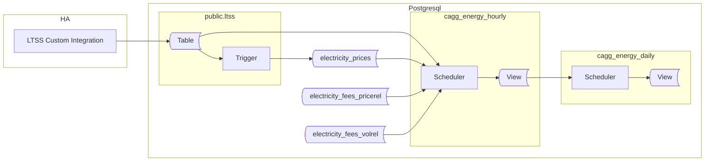

## Preface

This guide walks you through creation of database objects needed to maintain prices, fees and taxes as well as methods of collecting long term energy data and costs.

This article was planned as a small addition to the previous part, adding support for spot prices. Unexpectedly, it uncovered pretty big challanges, growing into final solution farer away from original more than I expected. In fact it replaces big part of the initial proposal.

In future I'm going to join both articles into final one, updating TimescaleDB syntax to most recent one.

> This new method also works well for slow-changing prices. It may be wise to use it from the start.

We'll create all objects in a dedicated schema: `ltss_energy_ote`. This allows both data collection methods (I reffer to previous article) to coexist while remaining physically separated. OTE refers to the spot price operator in the Czech Republic, but you can use any suffix you prefer.

Below is a diagram showing the involved components, created objects, and data flow.



The overall concept is similar to the one from the previous article, but with two key changes:

**1. Handling Fees**  
Handling fees are common when trading on the spot market via a third party (the operator). The two most common billing methods are: a fixed price per energy unit (e.g., 250 CZK per 1 MWh) and a percentage of the energy price (e.g., 15% of the sold energy price). The second one is also applied for deducting taxes.

The solution presented below supports both. Because of different taxation for sold and purchased energy, the energy price should be stored as net value. 

> Note: Prescription of prices and fees must be created in database manually, in advance of incoming energy data. Regardless spot prices, there are many of them which need to be entered manually, since an API for automatic retrieval is unlikely. Spot values will be delivered in automated way.

The above requires quite a changes to prices structure known from previous article, introducing tables for two types of fees. I took this as an opportunity to rename some objects.

**2. CAGGs Calculate and Store Energy Costs**  
Materializing costs in CAGGs improves performance when reading data. Rendering graphs no longer requires lookups to the prices table, which is especially helpful on resource-constrained hardware like a Raspberry Pi. We will aggregate both prices: sale and purchase. On top of that we will store net and upshift values which should enable options for future analysis.

## Prices

When operating on spot, prices are always provided as net value. Deducting tax might or might not happen depending on local regulations. For instance the VAT might be added to the price when buying energy, while not deducted from sold energy price. It leads to conclusion that `electricity_prices` table should contain net energy price.
do we need to separate net and tax for other partials of final price? It all depends on what values you want to materialize and what analysis you are planning to do on collected data. For matter of examples in this article, only energy has to be stored as net value with separated taxes. Also for sake of consistency I would advice to stick with net prices in `electricity_prices` table. Then taxes and fees put into `fees` tables

### Data structures

Let's begin by creating the tables for prices and fees. The script below also sets basic privileges on the schema and tables, granting read access to all connected clients.


```sql
DROP SCHEMA IF EXISTS ltss_energy_ote2 CASCADE;
CREATE SCHEMA ltss_energy_ote2;

CREATE TABLE IF NOT EXISTS ltss_energy_ote2.electricity_prices
(
    trade_type  TEXT NOT NULL,
    price_name  TEXT NOT NULL,
    price_period TSTZRANGE NOT NULL,
    price_value NUMERIC NOT NULL,
    volume_unit  TEXT NOT NULL,
    CONSTRAINT pk_electricitycost PRIMARY KEY (trade_type, price_name, price_period),
    CONSTRAINT xc_electricitycost_unique EXCLUDE USING gist (trade_type WITH =, price_name WITH =, price_period WITH &&)
);


CREATE TABLE IF NOT EXISTS ltss_energy_ote2.electricity_fees_pricerel
(
    trade_type  TEXT NOT NULL,
    price_name  TEXT NOT NULL,
    fee_name    TEXT NOT NULL,
    fee_period  TSTZRANGE NOT NULL,
    fee_value   NUMERIC NOT NULL
    CONSTRAINT pk_electricityfeesrel PRIMARY KEY (trade_type, price_name, fee_name, fee_period),
    CONSTRAINT xc_electricityfeesrel_unique EXCLUDE USING gist (trade_type WITH =, price_name WITH =, fee_period WITH &&)
--    CONSTRAINT fk_electricityfeesrel_prices FOREIGN KEY (trade_type, price_name) REFERENCES ltss_energy_ote2.electricity_prices (trade_type, price_name)
);

CREATE TABLE IF NOT EXISTS ltss_energy_ote2.electricity_fees_volrel
(
    trade_type  TEXT NOT NULL,
    fee_name    TEXT NOT NULL,
    fee_period  TSTZRANGE NOT NULL,
    fee_value   NUMERIC NOT NULL,
    volume_unit    TEXT NOT NULL,
    CONSTRAINT pk_electricityfeesabs PRIMARY KEY (trade_type, fee_name, fee_period),
    CONSTRAINT xc_electricityfeesabs_unique EXCLUDE USING gist (trade_type WITH =, fee_name WITH =, fee_period WITH &&)
);

COMMENT ON TABLE ltss_energy_ote2.electricity_prices IS 'Net values of prices contributing to the electric energy costs';

COMMENT ON TABLE ltss_energy_ote2.electricity_fees_pricerel IS 'Taxes of fees list, to be deducted from the net value';

COMMENT ON TABLE ltss_energy_ote2.electricity_fees_volrel IS 'Fees as absolute value deducted from a unit of energy';

GRANT USAGE ON SCHEMA ltss_energy_ote2 TO public;
GRANT SELECT ON TABLE ltss_energy_ote2.electricity_fees_volrel, ltss_energy_ote2.electricity_fees_pricerel, ltss_energy_ote2.electricity_prices TO public;
```

The structure of `electricity_prices` table has been discussed already. The main change is, that we agreed to store net values only here. On top of that, while there is no constraint proposed, I suggest to stick with 'purchase' and 'sale' values for the `trade_type`. If different, it has to be reflected in code presented later.
Also `energy` as a value of `price_name` will be used multiple times later on. It represents a price of energy, in contrary to other prices like distribution.

Fees deserves more detailed description. There are two kind of prices supported

Volume-based fee is a price for a unit of energy (ie for 1kWh). For example if the fee is 250CZK per 1MWh you will pay 500CZK for 2MWh and so on. The fee value is equal to `fee_value * energy` without any further dependencies.

Price-relative fee relates to net price (could be taxes). For example to calculate a 21% of VAT, you need to know net price for particular amount of energy. This time the math is: `energy * fee_value * price_value`, where `price_value` comes from `electricity_prices` table. This is the reason why `electricity_fees_pricerel` consists relationship with prices table. This relationship is created upon two columns: `trade_type` and `price_name`.

Example below shows configuration of buying and selling for spot prices. On top of that there is a distribution cost and VAT, both for purchased energy. Then a constant fee for exported energy.

**price table**
| trade_type | price_name   | price_period                                                   | price_value |  volume_unit |
|------------|--------------|-------------------------------------------------------------|-------------|-----------|
| purchase   | energy       | ["2025-01-01 00:00:00+01","2026-01-01 00:00:00+01")         | 0.25        | kWh       |
| purchase   | distribution | ["2025-01-01 00:00:00+01","2026-01-01 00:00:00+01")         | 0.8         | kWh       |
| sale       | energy       | ["2025-01-01 00:00:00+01","2026-01-01 01:00:00+01")         | 2.855       | kWh       |
| purchase   | energy       | ["2025-01-01 00:00:00+01","2026-01-01 01:00:00+01")         | 2.855       | kWh       |
| sale       | energy       | ["2025-01-01 01:00:00+01","2025-01-01 02:00:00+01")         | 2.804       | kWh       |
| purchase   | energy       | ["2025-01-01 01:00:00+01","2025-01-01 02:00:00+01")         | 2.804       | kWh       |
| sale       | energy       | ["2025-01-01 02:00:00+01","2025-01-01 03:00:00+01")         | 2.598       | kWh       |
| purchase   | energy       | ["2025-01-01 02:00:00+01","2025-01-01 03:00:00+01")         | 2.598       | kWh       |
| ...        | ...       | ...         | ...          | kWh       |

Notice how sale and purchase prices of the same value are stored for the same period of time. This is how we will handle spot prices. Granted, on spot there is only one price, that can be used for buying, selling or both. Storing the value twice, for each trade type separatelly, is a decission supported by less complex resulting code as well and compatibility with systems where user doesn't operate on spot.

**price-relative fee table**  (value based)

| trade_type | price_name | fee_name |  fee_period                                            | fee_value |
|------------|------------|----------|--------------------------------------------------------|-----------|
| purchase   | energy     |  VAT     | ["2025-01-01 00:00:00+01","2026-01-01 00:00:00+01")    | 0.21      |

in order to "link" the price-related fee with the price, trade_type and price_name have to be filled with related values from the price table.

**volume-relative fee table**
 fee table**

| trade_type | fee_name   | fee_period                                             | fee_value | volume_unit |
|------------|------------|--------------------------------------------------------|-----------|----------|
| sale       | energy     | ["2025-01-01 00:00:00+01","2026-01-01 00:00:00+01")    | 0.25      | kWh      |


> Please note, that contracts often list prices for MWh. Tables above list kWh, however it has only informative purpose. The code proposed bellow doesn't implement recalculation between units. It expects that energy comes in kWh. All my HA energy sensors are ported in kWH. 

> Fees stored in price-relative fee table are units independed

### Feeding with data

While static energy prices can be set once per contract change, operating on the spot requires entering new records continuosly. How you feed prices depends on source of this data and then on available solutions. It might be a custom HA integration, Node-RED, an external script, or even manual SQL queries for rarely changing prices. The key is to ensure prices are inserted into the `electricity_prices` table and available before energy is being aggregated into CAGGs.

Considering HA is the source, a simpliest option is to have a sensor that provides the current price. Such a sensor can be published via LTSS to the database. This approach suffers a major flaw: any outage in HA can result in missing prices resulting in zero costs for that period. I think it's not unacceptable.

A better approach is to store prices in advance, especially these are known way before they are applied. The exact solution will depend on your price provider's API and your data processing method. At this point it is hard to propose the one and only solution. Let me take you through the example.

Assume you have a `sensor.tomorrow_spot_electricity_prices` sensor, containing the next day's prices as a JSON array in the entity's `attributes`:

```json
"data": [
    {"time": "time1", "price": 1.0},
    {"time": "time2", "price": 2.0},
    {"time": "time3", "price": 3.0}
    ...
]
```

Such a sensor has to be published using LTSS component to timescale DB. In order to populate prices with data from JSON structure we need a trigger. Below there is a trigger proposal to process the json structure from above example.

Notice two constraints in the code:
ENTITYID - carries the name of HA entity to process
TRADES - contains array of strings containing `sale` or `purchase` or `bothtrade`. It allows to control which one is going to be operated on spot. If you only sale energy using spot prices, remove purchase from the array.


```sql
CREATE OR REPLACE FUNCTION ltss_energy_ote.tr_ltss_oteprices()
    RETURNS trigger
    LANGUAGE 'plpgsql'
    SECURITY DEFINER
AS $BODY$

DECLARE
    err_msg   TEXT;
    err_code  TEXT;
    ENTITYID CONSTANT TEXT = 'sensor.tomorrow_spot_electricity_prices';
    TRADES   CONSTANT TEXT[] = Array['sale','purchase'];
BEGIN
    -- THIS TRIGGER FUNCTION IS USED on public.ltss table

    IF NEW.entity_id <> ENTITYID THEN
        RETURN NULL;
    END IF;

    INSERT INTO ltss_energy_ote.electricity_prices
    (
        trade_type,
        price_name, 
        price_period,
        price_value,
        price_unit
    )
    SELECT 
        unnest(TRADES),
        'energy',
        tstzrange((j->>'time')::TIMESTAMPTZ, (j->>'time')::TIMESTAMPTZ + '1h'::INTERVAL, '[)'),
        (j->'price')::NUMERIC,
        'kWh'
    FROM jsonb_array_elements(NEW.attributes->'data') AS j
    ON CONFLICT ON CONSTRAINT pk_electricitycost 
    DO UPDATE
    SET price_value = EXCLUDED.price_value
    WHERE price_value <> EXCLUDED.price_value;

    RETURN NULL;

EXCEPTION WHEN others THEN
    GET STACKED DIAGNOSTICS err_msg  = MESSAGE_TEXT,
                            err_code = RETURNED_SQLSTATE;
    RAISE WARNING '[%], %', err_code, err_msg;
    RETURN NULL;
END;
$BODY$;

CREATE OR REPLACE TRIGGER tr_ltss_oteprices
AFTER INSERT
ON public.ltss
FOR EACH ROW
EXECUTE FUNCTION ltss_energy_ote.tr_ltss_oteprices();
```

Note the error handling: by default, any error rolls back the transaction. Here, we prioritize having complete data in the `ltss` table. Any error thrown by the trigger function will be suppressed and logged as warning.

<details>
<summary>For users of the Czech Energy Spot Prices custom integration</summary>
The `Czech Energy Spot Prices` integration provides a `sensor.tomorrow_spot_electricity_hour_order` sensor which have a significant flaw: when prices are set in its attributes, the state is set to `none`, causing LTSS to ignore it. Below is a template sensor that creates new sensor which contains valid state. At the same time it reorganizes prices data into more logical form:

```yaml
template:
  - triggers:
      - trigger: time_pattern
        # This will update every hour
        minutes: 0
    sensor:
      - name: "Tomorrow Spot Electricity Prices"
        state: "{{ now() }}"
        attributes:
          data: >
            
            
              
                
                
               
            
            {{ data.prices }}
```
</details>

### Price Visualization

Once prices are in the table, you can visualize them.


The query for visualization presented in the previous article artifically generates daily data points to satisfy Grafana requirements. The spot prices doesn't require that because they apear in a periodic anyway. Naturally we want to show prices on graph. 
Below I show two ready-to-use in Grafana queries: one for sporadic and irregurally changing prices, and the second for spot prices. It's up to you whether you utilize them in separate or single graphs.


**Query A**
```sql
SELECT time as time, ec.trade_type, ec.price_name, price_value * COALESCE(fee_value,1) AS price_valuea
FROM ltss_energy_ote2.electricity_prices AS ec
JOIN generate_series(to_timestamp($__from/1000)::DATE::TIMESTAMPTZ, to_timestamp($__to/1000)::TIMESTAMPTZ, '1 h'::INTERVAL) AS x(time) ON TRUE
LEFT JOIN ltss_energy_ote2.electricity_fees_pricerel AS efr ON efr.trade_type = ec.trade_type AND efr.price_name = ec.price_name AND ec.price_period <@ efr.fee_period
WHERE x.time <@ price_period
AND (ec.trade_type, ec.price_name) NOT IN (('sale', 'energy'),('purchase', 'energy'))
```

**Query B**
```sql
SELECT LOWER(price_period) AS "Time", ec.trade_type, ec.price_name, price_value * COALESCE(fee_value,1) AS price_valueb
FROM ltss_energy_ote2.electricity_prices AS ec
LEFT JOIN ltss_energy_ote2.electricity_fees_pricerel AS efr ON efr.trade_type = ec.trade_type AND efr.price_name = ec.price_name AND ec.price_period <@ efr.fee_period
WHERE LOWER(price_period) BETWEEN to_timestamp($__from/1000)::DATE::TIMESTAMPTZ AND to_timestamp($__to/1000)::TIMESTAMPTZ
AND (ec.trade_type, ec.price_name) IN (('sale', 'energy'),('purchase', 'energy'))
```

Query A, generates timeseries from infrequent price points. It excludes sale and purchase energy prices since they are assumed to be hourly records representing spot prices.

On the contrary the Qeury B shows spot prices only.

Both queries consist of join to price-related fees to calculate final prices rather then present net ones.

If you are not using spot you may use no B query at all. If you use spot for energy sale only, remove `purchase-energy` from conditions of both queries.

## Utility functions

With prices ready, we can finally start creating Continuous Aggregates. As mentioned earlier, we will aggregate both: energy and the corresponding costs.  With current limitations of CAGG contstruct, it's virtually impossible to write stright SQL query returning our aggregates. So to make it, we need a helper functions calculating net cost and fees: `calculate_cost()` and `calculate_fee()` functions respectively. Both will be called by the first-level CAGG. 

This CAGG will also use the `get_entities_for_cagg_energy()` helper function to select which entities to aggregate. Having such a function is more flexible because unlike CAGG its code can be updated easily.

```sql

CREATE OR REPLACE FUNCTION ltss_energy_ote.calculate_cost
(
    _trade_type TEXT
    _time       TIMESTAMPTZ,
    _value      NUMERIC,
    _exclude    TEXT DEFAULT NULL
    _include    TEXT DEFAULT NULL
)
RETURNS NUMERIC[]
LANGUAGE 'sql'
STABLE
AS $f$

	SELECT
		trim_scale(SUM(_value * price_value)) AS val_total
	FROM ltss_energy_ote.electricity_prices
	WHERE _time <@ price_period
	  AND trade_type = _trade_type
	  AND price_name IS DISTINCT FROM _exclude
      AND price_name = COALESCE(_include, price_name)

$f$;

CREATE OR REPLACE FUNCTION ltss_energy_ote.calculate_fee
(
    _trade_type TEXT,
    _time       TIMESTAMPTZ,
    _value      NUMERIC,
    _exclude    TEXT DEFAULT NULL
)
RETURNS NUMERIC
LANGUAGE 'sql'
STABLE
AS $f$

    WITH
	fee_abs AS
	(
		SELECT trim_scale(SUM(_value * fee_value)) AS val
	    FROM ltss_energy_ote.electricity_fees_volrel
	    WHERE _time <@ fee_period
	      AND trade_type = _trade_type
		  AND fee_kind IS DISTINCT FROM _exclude
	),
	fee_rel AS 
	(
		SELECT trim_scale(SUM(_value * price_value * fee_value)) AS val
		FROM ltss_energy_ote.electricity_prices   AS ep
		JOIN ltss_energy_ote.electricity_fees_pricerel AS ef ON (ep.trade_type, ep.price_name) = (ef.trade_type, ef.price_name)
		WHERE _time <@ ep.price_period
		  AND _time <@ ef.fee_period
		  AND ep.trade_type = _trade_type
		  AND fee_kind IS DISTINCT FROM _exclude
	)
	SELECT COALESCE(fee_abs.val, 0) + COALESCE(fee_rel.val, 0)
	FROM price_net, fee_abs, fee_rel;

$f$;


CREATE OR REPLACE FUNCTION ltss_energy_ote.get_entities_for_cagg_energy()
RETURNS TEXT[]
LANGUAGE 'sql'
IMMUTABLE
AS $f$

   SELECT ARRAY
       [
            -- replace sensor names with your own.
           'sensor.pg_mainhouse_total_energy_energy_hourly', -- consumption
           'sensor.pg_cube_total_energy_energy_hourly',      -- consumption
           'sensor.energy_injected_hourly',                  -- injected to grid
           'sensor.energy_purchased_hourly',                 -- purchased from grid
           'sensor.wattsonic_pv1_input_energy_2_hourly',     -- PV string 1 production
           'sensor.wattsonic_pv2_input_energy_2_hourly',     -- PV string 2 production
           'sensor.energy_discharged_from_battery_hourly',   -- Discharged from battery
           'sensor.energy_charged_to_battery_hourly'         -- Charged to battery
       ];
$f$;
```

The `calculate_cost()` function is as easy as it can be. For given trade type, it multiplies energy by all prices found. Then returns the sum of them.
Its `_exclude` parameter allow to ignore requested price item. We will use it to ignore an *energy*. Similarily, `_include` parameter privide cost of given price entry.

The `calculate_fee` is a tiny bit more complex, calculating cost of both type of fees for given energy. Like previous function, it also allows to not include some price entries to the result.

The functions allow to calculate wide range of different costs within CAGG. Obviosly uou can use them manually ie for testing purposes.

Later on those function will be used within the CAGG to provide values.

* `calculate_cost('purchase')` + `calculate_fee('purchase')` = gross, total cost of energy
* `calculate_cost('purchase' ... _include='energy')`         = net cost of bought energy (spot)
* `calculate_fee('purchase' ... _exclude='energy)` = Trading related costs

Analogically for sale, but notice that fees reduces the price:

* `calculate_cost('purchase')` - `calculate_fee('purchase')` =  net income from energy sold
* `calculate_cost('purchase' ... _include='energy')`         =  net cost of sold energy (spot)
* `calculate_fee(purchase ... _exclude=energy) - `calculate_fee(purchase ... _exclude=energy)`  = Trading related costs


## Aggregates for Energy

Now, create hierarchical CAGGs. The hourly CAGG aggregates data from the `ltss` table, the daily CAGG simply sums the hourly values.
Although calling `calculate_*()` functions multiple times with the same arguments looks weird, it's necessary to overcome CAGG limitation. As a funny fact, it's more performant than using JOINS instead of functions.

What data are provided by CAGGs is up to individual needs and decissions. Supposingly these values might be considered usefull in every setup:

* energy
* its total cost - it's what you pay or what you earn. Remember that taxes and fees might differ for purchasing and sell.

If you plan to compare alternative offers, it's comfortable to have some precalculated values you can use. While they can be calculated from available data on-the-fly, it will be more taxing to the system. To the extend that will be unusable for real-time presentation purposes.

Anyway, let's consider storing following additional data:

* net cost of energy - without distribution, taxes, handling fees etc.
* upshifting price - value of all additional fees added to energy price. This price doesn't count energy taxes in. 

It makes to store 6 cost values. 

* cost_purchase (gross energy value + fees) - total purchase cost of this energy
* cost_purchase_upshift - trading cost when purchasing
* cost_purchase_energy - net cost of the this energy

* cost_sale (gross energy value - fees) - total sale cost of this energy
* cost_sale_upshift - trading cost when saling
* cost_sale_energy - net cost of the sold energy

Not all of them are useful for every measured energy. But we keep all numbers to be used for FVE project efficiency analysis in one place. Price of storing additional although useless data is neglible. Though, for collecting data from house appliances I would use another CAGG.

```sql
    
CREATE MATERIALIZED VIEW ltss_energy_ote.cagg_energy_hourly
WITH (timescaledb.continuous) AS
SELECT
    time_bucket('1h'::INTERVAL, "time", 'Europe/Prague') AS bucket,
    entity_id,
    delta(counter_agg("time", state::DOUBLE PRECISION))::NUMERIC AS value,
    ltss_energy_ote.calculate_cost('purchase', time_bucket('1h'::INTERVAL, "time", 'Europe/Prague'), delta(counter_agg("time", state::DOUBLE PRECISION))::NUMERIC)
	+ltss_energy_ote.calculate_fee('purchase', time_bucket('1h'::INTERVAL, "time", 'Europe/Prague'), delta(counter_agg("time", state::DOUBLE PRECISION))::NUMERIC)
	AS purchase_cost,
	
    ltss_energy_ote.calculate_cost('purchase', time_bucket('1h'::INTERVAL, "time", 'Europe/Prague'), delta(counter_agg("time", state::DOUBLE PRECISION))::NUMERIC, _exclude => 'energy')
	+ltss_energy_ote.calculate_fee('purchase', time_bucket('1h'::INTERVAL, "time", 'Europe/Prague'), delta(counter_agg("time", state::DOUBLE PRECISION))::NUMERIC, _exclude => 'energy')
	AS purchase_trading_cost,
	
	ltss_energy_ote.calculate_cost('purchase', time_bucket('1h'::INTERVAL, "time", 'Europe/Prague'), delta(counter_agg("time", state::DOUBLE PRECISION))::NUMERIC, _price_name => 'energy') 
	AS purchase_energy_cost,
	
    ltss_energy_ote.calculate_cost('sale', time_bucket('1h'::INTERVAL, "time", 'Europe/Prague'), delta(counter_agg("time", state::DOUBLE PRECISION))::NUMERIC)
	-ltss_energy_ote.calculate_fee('sale', time_bucket('1h'::INTERVAL, "time", 'Europe/Prague'), delta(counter_agg("time", state::DOUBLE PRECISION))::NUMERIC)
	AS sale_income, -- net income
	
    ltss_energy_ote.calculate_cost('sale', time_bucket('1h'::INTERVAL, "time", 'Europe/Prague'), delta(counter_agg("time", state::DOUBLE PRECISION))::NUMERIC, _exclude => 'energy')
	+ltss_energy_ote.calculate_fee('sale', time_bucket('1h'::INTERVAL, "time", 'Europe/Prague'), delta(counter_agg("time", state::DOUBLE PRECISION))::NUMERIC, _exclude => 'energy')
	AS sale_trading_cost, -- trading costs
	
	ltss_energy_ote.calculate_cost('sale', time_bucket('1h'::INTERVAL, "time", 'Europe/Prague'), delta(counter_agg("time", state::DOUBLE PRECISION))::NUMERIC, _price_name => 'energy') 
	AS sale_energy_cost, -- net cost of sold energy
	
FROM ltss
WHERE entity_id = ANY (ltss_energy_ote.get_entities_for_cagg_energy())
  AND state NOT IN ('unavailable', 'unknown')
GROUP BY 1, 2
WITH NO DATA;


-- create daily CAGG based on hourly one
CREATE MATERIALIZED VIEW ltss_energy_ote.cagg_energy_daily
WITH (timescaledb.continuous) AS
SELECT
   time_bucket('1d'::INTERVAL, bucket, 'Europe/Prague') AS bucket,
   entity_id,
   SUM(value)                   AS value,
   SUM(purchase_cost)           AS purchase_cost,          -- total cost = spot+fee+tax
   SUM(purchase_trading_cost)   AS purchase_trading_cost,  -- totalcost-(energy*tax)
   SUM(purchase_energy_cost)    AS purchase_energy_cost    -- net cost (ie spot)
   SUM(sale_income)             AS sale_income,            -- total cost = spot-fee (- potential taxes)
   SUM(sale_trading_cost)       AS sale_trading_cost,      -- totalcost-(energy*tax)
   SUM(sale_energy_cost)        AS sale_energy_cost        -- net cost (ie spot)
FROM ltss_energy_ote.cagg_energy_hourly
GROUP BY 1, 2
WITH NO DATA;

-- Grant read access to everyone connected
GRANT SELECT ON TABLE ltss_energy_ote.cagg_energy_hourly, ltss_energy_ote.cagg_energy_daily TO public;

-- make both CAGGs real-time
ALTER MATERIALIZED VIEW ltss_energy_ote.cagg_energy_hourly
SET (timescaledb.materialized_only = FALSE);

ALTER MATERIALIZED VIEW ltss_energy_ote.cagg_energy_daily
SET (timescaledb.materialized_only = FALSE);

-- start CAGGs refreshing automatically
SELECT add_continuous_aggregate_policy
(
   'ltss_energy_ote.cagg_energy_hourly', '4h'::INTERVAL, '5m'::INTERVAL, '15m'::INTERVAL
);
SELECT add_continuous_aggregate_policy
(
   'ltss_energy_ote.cagg_energy_daily', '3d'::INTERVAL, '4h'::INTERVAL, '12h'::INTERVAL
);
```
At this point, all CAGGs are configured to provide real-time updates, automatic refresh policies are in place, and essential access privileges have been granted.

As explained previously, `WITH NO DATA` means CAGGs are not filled at creation. Once aggregate policies are set, they fill CAGGs with new data from `ltss` table.

To populate CAGGs with historical data from the `ltss` table, run the refresh procedures - hourly first, then daily. Avoid overlapping the requested update time range with the scheduled update interval. For example, if the policy interval is `4h to 5m before NOW`, the upper time boundary for the refresh should not exceed NOW()-4h.

```sql
CALL refresh_continuous_aggregate('ltss_energy_ote.cagg_energy_hourly', '2025-01-01 0:0', NOW()-'5h'::INTERVAL, TRUE);
CALL refresh_continuous_aggregate('ltss_energy_ote.cagg_energy_daily', '2025-01-01 0:0', NOW()-'4d'::INTERVAL, TRUE);
```

> :exclamation: **Important:** Do not run `refresh_continuous_aggregate()` on missing data if their aggregated form already exists in CAGGs. Doing so will irreversibly delete them from CAGG!

## Presentation SQL Queries

The SQL queries remain largely the same, but now use the precomputed `sale_income` and `purchase_cost` columns instead of the `calculate_cost()` function.

For example, the following SQL query returns Return On Investment (ROI). ROI is the sum of savings and income from sold energy. Savings are calculated as the price of consumed but not purchased energy (i.e., consumed energy minus purchased energy), using the purchase price.

```sql
SELECT 
    SUM
    (
        CASE
            WHEN entity_id ~ 'injected'         THEN sale_income
            WHEN entity_id ~ 'purchased'        THEN -1 * purchase_cost
            WHEN entity_id ~ 'cube|mainhouse'   THEN purchase_cost
        END
    ) AS value
FROM ltss_energy_ote_cagg_energy_daily
WHERE bucket >= '2024-08-08' -- FVE installation date
  AND $__timeFilter("bucket")
  AND entity_id  IN (
                        'sensor.energy_injected_hourly', 
                        'sensor.energy_purchased_hourly',
                        'sensor.pg_mainhouse_total_energy_energy_hourly',
                        'sensor.pg_cube_total_energy_energy_hourly'
                    )
```

This approach to partial costs is used throughout the cost presentation graphs.  
You can perform calculations in PostgreSQL or Grafana; the performance difference is negligible. Here, we fetch the minimal data by doing the math in the database.

The query below returns evolution of two values: Sold and Avoided. Then Grafana Transformations provides 3rd one, representing sum of both. Don't forget do disable stacking for this summing time series.

```sql
WITH 
src AS
(
    SELECT 
    time_bucket_gapfill
    (
        '$query_granularity'::INTERVAL,      
        "bucket", 'Europe/Prague'
    ) AS time,
    CASE WHEN entity_id ~ 'injected'        THEN 'Sold'
         WHEN entity_id ~ 'purchased'       THEN 'Avoided'
         WHEN entity_id ~ 'cube|mainhouse'  THEN 'Avoided'
         ELSE entity_id
    END AS entityid,
    SUM(CASE
            WHEN bucket < '2024-08-08' THEN 0 -- FVE installation date
            ELSE CASE 
                    WHEN entity_id ~ 'injected'       THEN sale_income
                    WHEN entity_id ~ 'purchased'      THEN -1 * purchase_cost
                    WHEN entity_id ~ 'cube|mainhouse' THEN purchase_cost
                 END
        END) AS value
    FROM ltss_energy_ote.cagg_energy_${cagg_suffix}
    WHERE entity_id IN (
                            'sensor.energy_injected_hourly', 
                            'sensor.energy_purchased_hourly',
                            'sensor.pg_mainhouse_total_energy_energy_hourly',
                            'sensor.pg_cube_total_energy_energy_hourly'
                        )
    AND $__timeFilter("bucket")
    GROUP BY 1, 2
)
SELECT
    time,
    entityid,
    SUM(value) OVER (PARTITION BY entityid ORDER BY time) AS value
FROM src;
```


