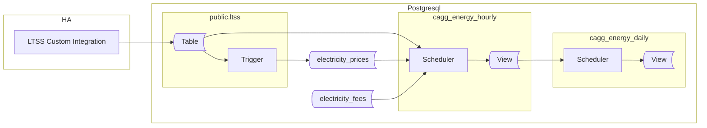

## Preface

The previous section described how to work with static or slow-changing energy prices. However, spot prices—typically updated hourly—require a slightly different approach.

> This new method also works well for slow-changing prices. It may be wise to use it from the start.

This guide walks you through handling spot prices.

We'll create all objects in a dedicated schema: `ltss_energy_ote`. This allows both data collection methods to coexist while remaining physically separated. OTE refers to the spot price operator in the Czech Republic, but you can use any suffix you prefer.

Below is a diagram showing the involved components, created objects, and data flow.



The overall concept is similar to the previous article, but with three key changes:

**1. Handling Fees**  
Handling fees are common when trading on the spot market via a third party (the operator). The two most common billing methods are: a fixed price per energy unit (e.g., 250 CZK per 1 MWh) and a percentage of the energy price (e.g., 15% of the sold energy price). The solution below supports both. Other scenarios may require adjustments.

> Note: Handling fee records must be created manually, in advance of incoming energy data. They are usually contract-specific, so an API for automatic retrieval is unlikely.

**2. CAGGs Calculate and Store Energy Costs**  
Materializing costs in CAGGs improves performance. For example, rendering graphs no longer requires lookups to the prices table, which is especially helpful on resource-constrained hardware like a Raspberry Pi. Both net and gross prices (after deducting handling fees) are stored, enabling future analysis.

**3. Use of Time Range Datatype**  
Since spot prices change hourly, we use the `TSTZRANGE` datatype to store the validity period for each price. This datatype handles timestamp ranges with time zones.

## Prices
Let's begin by creating the tables for prices and fees. The script below also sets basic privileges on the schema and tables, granting read access to all connected clients.

```sql
CREATE SCHEMA ltss_energy_ote;

CREATE TABLE IF NOT EXISTS ltss_energy_ote.electricity_prices
(
    price_type TEXT NOT NULL,
    price_kind TEXT NOT NULL,
    price_range TSTZRANGE NOT NULL,
    price_value NUMERIC NOT NULL,
    price_unit TEXT NOT NULL,
    CONSTRAINT pk_electricitycost PRIMARY KEY (price_type, price_kind, price_range),
    CONSTRAINT xc_electricitycost_costrange EXCLUDE USING gist (price_type WITH =, price_kind WITH =, price_range WITH &&)
);

CREATE TABLE IF NOT EXISTS ltss_energy_ote.electricity_fees
(
    price_type TEXT NOT NULL,
    price_kind TEXT NOT NULL,
    fee_range TSTZRANGE NOT NULL,
    fee_value NUMERIC NOT NULL,
    fee_unit TEXT NOT NULL,
    CONSTRAINT pk_electricityfees PRIMARY KEY (price_type, price_kind, fee_range),
    CONSTRAINT xc_electricityfees_feerange EXCLUDE USING gist (price_type WITH =, price_kind WITH =, fee_range WITH &&)    
);

GRANT USAGE ON SCHEMA ltss_energy_ote TO public;
GRANT SELECT ON TABLE ltss_energy_ote.electricity_fees, ltss_energy_ote.electricity_prices TO public;
```

Next, populate these tables with data. Since the new CAGGs will add costs to each aggregation, prices and fees for a period must be present in their respective tables before the CAGG runs. As mentioned, fees are set manually.

How you feed prices depends on your system. It could be a custom HA integration, Node-RED, an external script, or even manual SQL queries for rarely changing prices. The key is to ensure prices are inserted into the `electricity_prices` table.

A simple option is to use a sensor that provides the current price and publish it via LTSS to the database. However, this approach has a major flaw: any outage in HA can result in missing prices and zero costs for that period, which is unacceptable.

A better approach is to store prices in advance. The exact solution will depend on your price provider's API and your data processing method. Even if processing is done by HA, the result will differ between integrations. The common goal is to store this data in the prices table.

Assume you have a `sensor.tomorrow_spot_electricity_prices` sensor, containing the next day's prices as a JSON array in the entity's `attributes`:

```json
"data": [
    {"time": "time1", "price": 1.0},
    {"time": "time2", "price": 2.0},
    {"time": "time3", "price": 3.0}
    ...
]
```

Here is an example trigger that populates prices from such a sensor, published in the `ltss` table, into the prices table:

```sql
CREATE OR REPLACE FUNCTION ltss_energy_ote.tr_ltss_oteprices()
    RETURNS trigger
    LANGUAGE 'plpgsql'
    SECURITY DEFINER
AS $BODY$

DECLARE
    err_msg   TEXT;
    err_code  TEXT;
    ENTITYID CONSTANT TEXT = 'sensor.tomorrow_spot_electricity_prices';
BEGIN
    -- THIS TRIGGER FUNCTION IS USED on public.ltss table

    IF NEW.entity_id <> ENTITYID THEN
        RETURN NULL;
    END IF;

    INSERT INTO ltss_energy_ote.electricity_prices
    (
        price_type,
        price_kind,
        price_range,
        price_value,
        price_unit
    )
    SELECT 
        'sale',
        'energy',
        tstzrange((j->>'time')::TIMESTAMPTZ, (j->>'time')::TIMESTAMPTZ + '1h'::INTERVAL, '[)'),
        (j->'price')::NUMERIC,
        'kWh'
    FROM jsonb_array_elements(NEW.attributes->'data') AS j
    ON CONFLICT ON CONSTRAINT pk_electricitycost 
    DO UPDATE
    SET price_value = EXCLUDED.price_value
    WHERE price_value <> EXCLUDED.price_value;

    RETURN NULL;

EXCEPTION WHEN others THEN
    GET STACKED DIAGNOSTICS err_msg  = MESSAGE_TEXT,
                            err_code = RETURNED_SQLSTATE;
    RAISE WARNING '[%], %', err_code, err_msg;
    RETURN NULL;
END;
$BODY$;

CREATE OR REPLACE TRIGGER tr_ltss_oteprices
AFTER INSERT
ON public.ltss
FOR EACH ROW
EXECUTE FUNCTION ltss_energy_ote.tr_ltss_oteprices();
```

Note the error handling: by default, any error rolls back the transaction. Here, we prioritize having complete data in the `ltss` table. Errors are suppressed and logged as warnings.

<details>
<summary>For users of the Czech Energy Spot Prices custom integration</summary>
The `Czech Energy Spot Prices` integration provides a `sensor.tomorrow_spot_electricity_hour_order` sensor with a significant flaw: when prices are set in its attributes, the state is set to `none`, causing LTSS to ignore it. Below is a template sensor that resolves this and structures the data as required:

```yaml
template:
  - triggers:
      - trigger: time_pattern
        # This will update every hour
        minutes: 0
    sensor:
      - name: "Tomorrow Spot Electricity Prices"
        state: "{{ now() }}"
        attributes:
          data: >
            
            
              
                
                
               
            
            {{ data.prices }}
```
</details>

## Price Visualization

Once prices are in the table, you can visualize them.


The query from the previous article, which generates daily data points for visualization, is not suitable for hourly prices. At the same time adjusting the period to 1 hour makes the query very slow.

We can however join both queries using UNION: 
* generate datapoints for slow-changing prices (like distribution prices) and . 
* list spot sale prices as recorded, since they are periodic anyway. 

The result is:

```sql
SELECT time, price_type, price_kind, price_value
FROM ltss_energy_ote.electricity_prices AS ec
JOIN generate_series(to_timestamp($__from/1000)::DATE::TIMESTAMPTZ, to_timestamp($__to/1000)::TIMESTAMPTZ, '1 day'::INTERVAL) AS x(time) ON TRUE
WHERE x.time <@ price_range
  AND price_type <> 'sale'

UNION

SELECT LOWER(price_range) AS time, price_type, price_kind, price_value
FROM ltss_energy_ote.electricity_prices AS ec
WHERE LOWER(price_range) BETWEEN to_timestamp($__from/1000)::TIMESTAMPTZ AND to_timestamp($__to/1000)::TIMESTAMPTZ
  AND price_type = 'sale'
```

This change reduces query time from about 1.5 seconds (for a year of data on a Raspberry Pi) to about 30 ms.

Note, purchasing on spot requires slight change to the conditions.

## Aggregates for Energy

With prices ready, we can finally start creating Continuous Aggregates. As mentioned earlier, we will aggregate both energy and the corresponding costs.

We will need a `calculate_costs_arr()` function to turn the enregy into price at a given time. This function returns two values: the cost after deducting handling fees and the net cost. Both will be materialized in the CAGG. The function uses an array to return these values, working around CAGG limitations that prevent subselects or CTEs.

The first-level CAGG also uses the `get_entities_for_cagg_energy()` helper function to select which entities to aggregate.

```sql
CREATE OR REPLACE FUNCTION ltss_energy_ote.calculate_costs_arr
(
    _price_type TEXT,
    _time       TIMESTAMPTZ,
    _value      NUMERIC
)
RETURNS NUMERIC[]
LANGUAGE 'sql'
STABLE
AS $BODY$

    SELECT Array[SUM(sub.cost), SUM(sub.cost_net)]
    FROM
    (
        SELECT
            SUM(_value * (price_value - COALESCE(fee_value, 1))) AS cost,
            SUM(price_value * _value)                            AS cost_net
        FROM ltss_energy_ote.electricity_prices     AS ep
        LEFT JOIN ltss_energy_ote.electricity_fees  AS ef
                    ON (ep.price_type, ep.price_kind) = (ef.price_type, ef.price_kind)
                    AND _time <@ ef.fee_range 
        WHERE _time <@ ep.price_range
          AND ep.price_type = _price_type
    ) AS sub

$BODY$;


CREATE OR REPLACE FUNCTION ltss_energy_ote.get_entities_for_cagg_energy()
RETURNS TEXT[]
LANGUAGE 'sql'
IMMUTABLE
AS $f$

   SELECT ARRAY
       [
            -- replace sensor names with your own.
           'sensor.pg_mainhouse_total_energy_energy_hourly', -- consumption
           'sensor.pg_cube_total_energy_energy_hourly',      -- consumption
           'sensor.energy_injected_hourly',                  -- injected to grid
           'sensor.energy_purchased_hourly',                 -- purchased from grid
           'sensor.wattsonic_pv1_input_energy_2_hourly',     -- PV string 1 production
           'sensor.wattsonic_pv2_input_energy_2_hourly',     -- PV string 2 production
           'sensor.energy_discharged_from_battery_hourly',   -- Discharged from battery
           'sensor.energy_charged_to_battery_hourly'         -- Charged to battery
       ];
$f$;
```

Now, create hierarchical CAGGs. The hourly CAGG aggregates data from the `ltss` table, providing hourly energy and its costs. Although calling `calculate_costs_arr()` twice with the same arguments is not ideal, it's necessary to overcome CAGG limitations.

The daily CAGG simply sums the hourly values.

```sql
CREATE MATERIALIZED VIEW ltss_energy_ote.cagg_energy_hourly
WITH (timescaledb.continuous) AS
SELECT
    time_bucket('1h'::INTERVAL, "time", 'Europe/Prague') AS bucket,
    entity_id,
    delta(counter_agg("time", state::DOUBLE PRECISION))::NUMERIC AS value,
    (ltss_energy_ote.calculate_costs_arr('purchase', time_bucket('1h'::INTERVAL, "time", 'Europe/Prague'), delta(counter_agg("time", state::DOUBLE PRECISION))::NUMERIC))[1] AS cost_purchase,
    (ltss_energy_ote.calculate_costs_arr('purchase', time_bucket('1h'::INTERVAL, "time", 'Europe/Prague'), delta(counter_agg("time", state::DOUBLE PRECISION))::NUMERIC))[2] AS cost_purchase_net,
    (ltss_energy_ote.calculate_costs_arr('sale',     time_bucket('1h'::INTERVAL, "time", 'Europe/Prague'), delta(counter_agg("time", state::DOUBLE PRECISION))::NUMERIC))[1] AS cost_sale,
    (ltss_energy_ote.calculate_costs_arr('sale',     time_bucket('1h'::INTERVAL, "time", 'Europe/Prague'), delta(counter_agg("time", state::DOUBLE PRECISION))::NUMERIC))[2] AS cost_sale_net
FROM ltss
WHERE entity_id = ANY (ltss_energy_ote.get_entities_for_cagg_energy())
  AND state NOT IN ('unavailable', 'unknown')
GROUP BY 1, 2
WITH NO DATA;

-- create daily CAGG based on hourly one
CREATE MATERIALIZED VIEW ltss_energy_ote.cagg_energy_daily
WITH (timescaledb.continuous) AS
SELECT
   time_bucket('1d'::INTERVAL, bucket, 'Europe/Prague') AS bucket,
   entity_id,
   SUM(value)               AS value,
   SUM(cost_purchase)       AS cost_purchase,
   SUM(cost_purchase_net)   AS cost_purchase_net,
   SUM(cost_sale)           AS cost_sale,
   SUM(cost_sale_net)       AS cost_sale_net
FROM ltss_energy_ote.cagg_energy_hourly
GROUP BY 1, 2
WITH NO DATA;

-- Grant read access to everyone connected
GRANT SELECT ON TABLE ltss_energy_ote.cagg_energy_hourly, ltss_energy_ote.cagg_energy_daily TO public;

-- make both CAGGs real-time
ALTER MATERIALIZED VIEW ltss_energy_ote.cagg_energy_hourly
SET (timescaledb.materialized_only = FALSE);

ALTER MATERIALIZED VIEW ltss_energy_ote.cagg_energy_daily
SET (timescaledb.materialized_only = FALSE);

-- start CAGGs refreshing automatically
SELECT add_continuous_aggregate_policy
(
   'ltss_energy_ote.cagg_energy_hourly', '4h'::INTERVAL, '5m'::INTERVAL, '15m'::INTERVAL
);
SELECT add_continuous_aggregate_policy
(
   'ltss_energy_ote.cagg_energy_daily', '3d'::INTERVAL, '4h'::INTERVAL, '12h'::INTERVAL
);
```

At this point, all CAGGs are configured for real-time updates, automatic refresh policies are in place, and essential access privileges have been granted.

As explained previously, `WITH NO DATA` means CAGGs are not filled at creation. Once aggregate policies are set, they fill CAGGs with new data from `ltss` table.

To populate CAGGs with historical data from the `ltss` table, run the refresh procedures—hourly first, then daily. Avoid overlapping the requested update time range with the scheduled update interval. For example, if the interval is `4h to 5m before NOW`, the upper time boundary for the refresh should not exceed NOW()-4h.

```sql
CALL refresh_continuous_aggregate('ltss_energy_ote.cagg_energy_hourly', '2025-01-01 0:0', NOW()-'5h'::INTERVAL, TRUE);
CALL refresh_continuous_aggregate('ltss_energy_ote.cagg_energy_daily', '2025-01-01 0:0', NOW()-'4d'::INTERVAL, TRUE);
```

> :exclamation: **Important:** Do not run `refresh_continuous_aggregate()` on missing data if their aggregated form already exists in CAGGs. Doing so will irreversibly delete them!

## Presentation SQL Queries

The SQL queries remain largely the same, but now use the precomputed `cost_sale` and `cost_purchase` columns instead of the `calculate_cost()` function.

For example, the following SQL query returns Return On Investment (ROI). ROI is the sum of savings and sold energy. Savings are calculated as the price of consumed but not purchased energy (i.e., consumed energy minus purchased energy), using the purchase price.

```sql
SELECT 
    SUM
    (
        CASE
            WHEN entity_id ~ 'injected'         THEN cost_sale
            WHEN entity_id ~ 'purchased'        THEN -1 * cost_purchase
            WHEN entity_id ~ 'cube|mainhouse'   THEN cost_purchase
        END
    ) AS value
FROM ltss_energy_ote_cagg_energy_daily
WHERE bucket >= '2024-08-08' -- FVE installation date
  AND $__timeFilter("bucket")
  AND entity_id  IN (
                        'sensor.energy_injected_hourly', 
                        'sensor.energy_purchased_hourly',
                        'sensor.pg_mainhouse_total_energy_energy_hourly',
                        'sensor.pg_cube_total_energy_energy_hourly'
                    )
```

This approach to partial costs is used throughout the cost presentation graphs.  
You can perform calculations in PostgreSQL or Grafana; the performance difference is negligible. Here, we fetch the minimal data by doing the math in the database.

The query below returns two values: Sold and Avoided. Use Grafana Transformations to create an additional series representing their sum.

```sql
WITH 
src AS
(
    SELECT 
    time_bucket_gapfill
    (
        '$query_granularity'::INTERVAL,      
        "bucket", 'Europe/Prague'
    ) AS time,
    CASE WHEN entity_id ~ 'injected'        THEN 'Sold'
         WHEN entity_id ~ 'purchased'       THEN 'Avoided'
         WHEN entity_id ~ 'cube|mainhouse'  THEN 'Avoided'
         ELSE entity_id
    END AS entityid,
    SUM(CASE
            WHEN bucket < '2024-08-08' THEN 0 -- FVE installation date
            ELSE CASE 
                    WHEN entity_id ~ 'injected'       THEN cost_sale
                    WHEN entity_id ~ 'purchased'      THEN -1 * cost_purchase
                    WHEN entity_id ~ 'cube|mainhouse' THEN cost_purchase
                 END
        END) AS value
    FROM ltss_energy_ote.cagg_energy_${cagg_suffix}
    WHERE entity_id IN (
                            'sensor.energy_injected_hourly', 
                            'sensor.energy_purchased_hourly',
                            'sensor.pg_mainhouse_total_energy_energy_hourly',
                            'sensor.pg_cube_total_energy_energy_hourly'
                        )
    AND $__timeFilter("bucket")
    GROUP BY 1, 2
)
SELECT
    time,
    entityid,
    SUM(value) OVER (PARTITION BY entityid ORDER BY time) AS value
FROM src;
```


