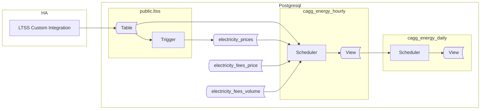

## Preface

This article was planned as a small addition to previous part, adding support for spot prices. Unexpectedly, it uncovered additional needs, turning into pretty serious  challanges. At the end it grown into final solution farer away more from original than I expected.

> This new method also works well for slow-changing prices. It may be wise to use it from the start.

This guide walks you through creation of database needed to maintain prices, fees and taxes as well as methods of collecting long term energy data and costs.

We'll create all objects in a dedicated schema: `ltss_energy_ote`. This allows both data collection methods (I reffer to previous article) to coexist while remaining physically separated. OTE refers to the spot price operator in the Czech Republic, but you can use any suffix you prefer.

Below is a diagram showing the involved components, created objects, and data flow.



The overall concept is similar to the previous article, but with three key changes:

**1. Handling Fees**  
Handling fees are common when trading on the spot market via a third party (the operator). The two most common billing methods are: a fixed price per energy unit (e.g., 250 CZK per 1 MWh) and a percentage of the energy price (e.g., 15% of the sold energy price). The solution below supports both. Other scenarios may require adjustments.

> Note: Handling fee records must be created manually, in advance of incoming energy data. They are usually contract-specific, so an API for automatic retrieval is unlikely.

**2. CAGGs Calculate and Store Energy Costs**  
Materializing costs in CAGGs improves performance. For example, rendering graphs no longer requires lookups to the prices table, which is especially helpful on resource-constrained hardware like a Raspberry Pi. Both net and gross prices (after deducting handling fees) are stored, enabling future analysis.

**3. Use of Time Range Datatype**  
Since spot prices change hourly, we use the `TSTZRANGE` datatype to store the validity period for each price. This datatype handles timestamp ranges with time zones.

## Prices

When operating on spot, prices are always provided as net value. Deducting tax might or might not happen depending on local regulations. For instance the VAT might be added to the price when buying energy, while not deducted from sold energy price. It leads to conclusion that `electricity_prices` table should contain net energy price.
do we need to separate net and tax for other partials of final price? It all depends on what values you want to materialize and what analysis you are planning to do on collected data. For matter of examples in this article, only energy has to be stored as net value with separated taxes. Also for sake of consistency I would advice to stick with net prices in `electricity_prices` table. Then taxes and fees put into `fees` tables

### Data structures

Let's begin by creating the tables for prices and fees. The script below also sets basic privileges on the schema and tables, granting read access to all connected clients.


```sql
CREATE SCHEMA ltss_energy_ote;

CREATE TABLE IF NOT EXISTS ltss_energy_ote.electricity_prices
(
    price_type  TEXT NOT NULL,
    price_name  TEXT NOT NULL,
    price_range TSTZRANGE NOT NULL,
    price_value NUMERIC NOT NULL,
    price_unit  TEXT NOT NULL,
    CONSTRAINT pk_electricitycost PRIMARY KEY (price_type, price_name, price_range),
    CONSTRAINT xc_electricitycost_costrange EXCLUDE USING gist (price_type WITH =, price_name WITH =, price_range WITH &&)
);


CREATE TABLE IF NOT EXISTS ltss_energy_ote.electricity_fees_rel
(
    price_type  TEXT NOT NULL,
    price_name  TEXT NOT NULL,
    fee_name    TEXT NOT NULL,
    fee_range   TSTZRANGE NOT NULL,
    fee_value   NUMERIC NOT NULL,
    fee_unit    TEXT NOT NULL,
    CONSTRAINT pk_electricityfeesrel PRIMARY KEY (price_type, price_name, fee_name, fee_range),
    CONSTRAINT xc_electricityfeesrel_feerange EXCLUDE USING gist (price_type WITH =, price_name WITH =, fee_range WITH &&),
    CONSTRAINT fk_electricityfeesrel_prices FOREIGN KEY (price_type, price_name)
)

CREATE TABLE IF NOT EXISTS ltss_energy_ote.electricity_fees_abs
(
    fee_type    TEXT COLLATE pg_catalog."default" NOT NULL,
    fee_kind    TEXT COLLATE pg_catalog."default" NOT NULL,
    fee_range   TSTZRANGE NOT NULL,
    fee_value   NUMERIC NOT NULL,
    fee_unit    TEXT COLLATE pg_catalog."default" NOT NULL,
    CONSTRAINT pk_electricityfeesabs PRIMARY KEY (fee_type, fee_kind, fee_range),
    CONSTRAINT xc_electricityfeesabs_feerange EXCLUDE USING gist (fee_type WITH =, fee_kind WITH =, fee_range WITH &&)
)

COMMENT ON TABLE ltss_energy_ote.electricity_prices 'Net values of prices contributing to the electric energy cost';

COMMENT ON TABLE ltss_energy_ote.electricity_fees_rel 'Tax of fee deducted as % of net value';

COMMENT ON TABLE ltss_energy_ote.electricity_fees_abs 'Fee as absolute value deducted from a unit of energy';

GRANT USAGE ON SCHEMA ltss_energy_ote TO public;
GRANT SELECT ON TABLE ltss_energy_ote.electricity_fees_abs, ltss_energy_ote.electricity_fees_rel, ltss_energy_ote.electricity_prices TO public;
```

The structure of `electricity_prices` table has been discussed already. The main change is, that we agreed to store net values only here. On top of that, while there is no constraint proposed, I suggest to stick with 'purchase' and 'sale' values for the `price_type`. If changed, it has to be reflected in code presented later.
Also `energy` as a value of `price_name` will be used multiple times later on. It represents a price energy, in contrary to other prices like distribution.

Fees deserves more detailed description.

Absolute fee is a price for a unit of energy (ie for 1kWh). For example if the fee is 250CZK per 1MWh you will pay 500CZK for 2MWh and so on. The fee value is equal to `fee_value * energy` without any further dependencies.

Fees relative to a net price (could be taxes) are relative to particular price. For example to calculate a 21% of VAT, you need to know net price for particular amount of energy. This time the math is: `energy * fee_value * price_value`, where `price_value` comes from `electricity_prices` table. This is the reason why `electricity_fees_rel` consists of a foreign key to prices. This relationship is composite: for type and kind.

The Fee and price type have to use the same values to make possible identification of the direction of operation.

Example below shows configuration of buying and selling for spot prices. On top of that there is a distribution cost and VAT, both for purchased energy. Then a constant fee for exported energy.

**price table**
| trade_type | price_name   | price_period                                                   | price_value |  volume_unit |
|------------|--------------|-------------------------------------------------------------|-------------|-----------|
| purchase   | energy       | ["2025-01-01 00:00:00+01","2026-01-01 00:00:00+01")         | 0.25        | kWh       |
| purchase   | distribution | ["2025-01-01 00:00:00+01","2026-01-01 00:00:00+01")         | 0.8         | kWh       |
| sale       | energy       | ["2025-01-01 00:00:00+01","2026-01-01 00:00:00+01")         | 1           | kWh       |
| sale       | energy       | ["2025-01-01 00:00:00+01","2025-01-01 01:00:00+01")         | 1           | kWh       |
| sale       | energy       | ["2025-01-01 01:00:00+01","2025-01-01 02:00:00+01")         | 1           | kWh       |
| sale       | energy       | ["2025-01-01 02:00:00+01","2025-01-03 02:00:00+01")         | 1           | kWh       |
| sale       | energy       | ...         | ...          | kWh       |


**price-relative fee table**  (value based)

| price_type | price_name | fee_name |  fee_range                                             | fee_value | volume_unit |
|------------|------------|----------|--------------------------------------------------------|-----------|----------|
| purchase   | energy     |  VAT     | ["2025-01-01 00:00:00+01","2026-01-01 00:00:00+01")    | 0.21      | kWh      |

**volume-relative fee table**
 fee table**

| fee_type   | fee_name | fee_range                                              | fee_value | volume_unit |
|------------|------------|--------------------------------------------------------|-----------|----------|
| sale       | energy     | ["2025-01-01 00:00:00+01","2026-01-01 00:00:00+01")    | 0.25      | kWh      |

### Feeding with data

While static energy prices can be set once per contrach change, operating on the spot requires entering new records for *energy sale* every day. How you feed prices depends on source od this data and then on available solutions. It might custom HA integration, Node-RED, an external script, or even manual SQL queries for rarely changing prices. The key is to ensure prices are inserted into the `electricity_prices` table and available before energy is being aggregated into CAGGs.

A simplies option is to have a sensor that provides the current price. Such a sensor can be published via LTSS to the database. However, this approach suffers a major flaw: any outage in HA can result in missing prices resulting in zero costs for that period. I think it's not unacceptable.

A better approach is to store prices in advance. The exact solution will depend on your price provider's API and your data processing method. At this point is hard to propose the one and only solution. Let me take you through the example.

Assume you have a `sensor.tomorrow_spot_electricity_prices` sensor, containing the next day's prices as a JSON array in the entity's `attributes`:

```json
"data": [
    {"time": "time1", "price": 1.0},
    {"time": "time2", "price": 2.0},
    {"time": "time3", "price": 3.0}
    ...
]
```

Such a sensor has to be published using LTSS component to timescale DB. In order to populate prices table with data found in attributes we need a trigger. Here is an example of such a trigger:

```sql
CREATE OR REPLACE FUNCTION ltss_energy_ote.tr_ltss_oteprices()
    RETURNS trigger
    LANGUAGE 'plpgsql'
    SECURITY DEFINER
AS $BODY$

DECLARE
    err_msg   TEXT;
    err_code  TEXT;
    ENTITYID CONSTANT TEXT = 'sensor.tomorrow_spot_electricity_prices';
BEGIN
    -- THIS TRIGGER FUNCTION IS USED on public.ltss table

    IF NEW.entity_id <> ENTITYID THEN
        RETURN NULL;
    END IF;

    INSERT INTO ltss_energy_ote.electricity_prices
    (
        price_type,
        price_name, 
        price_range,
        price_value,
        price_unit
    )
    SELECT 
         ops.name,
        'energy',
        tstzrange((j->>'time')::TIMESTAMPTZ, (j->>'time')::TIMESTAMPTZ + '1h'::INTERVAL, '[)'),
        (j->'price')::NUMERIC,
        'kWh'
    FROM jsonb_array_elements(NEW.attributes->'data') AS j
    JOIN (VALUES ('sale'), ('purchase')) as ops(name) ON TRUE
    ON CONFLICT ON CONSTRAINT pk_electricitycost 
    DO UPDATE
    SET price_value = EXCLUDED.price_value
    WHERE price_value <> EXCLUDED.price_value;

    RETURN NULL;

EXCEPTION WHEN others THEN
    GET STACKED DIAGNOSTICS err_msg  = MESSAGE_TEXT,
                            err_code = RETURNED_SQLSTATE;
    RAISE WARNING '[%], %', err_code, err_msg;
    RETURN NULL;
END;
$BODY$;

CREATE OR REPLACE TRIGGER tr_ltss_oteprices
AFTER INSERT
ON public.ltss
FOR EACH ROW
EXECUTE FUNCTION ltss_energy_ote.tr_ltss_oteprices();
```

Note the error handling: by default, any error rolls back the transaction. Here, we prioritize having complete data in the `ltss` table. Any error thrown by the trigger function will be suppressed and logged as warning.

<details>
<summary>For users of the Czech Energy Spot Prices custom integration</summary>
The `Czech Energy Spot Prices` integration provides a `sensor.tomorrow_spot_electricity_hour_order` sensor with a significant flaw: when prices are set in its attributes, the state is set to `none`, causing LTSS to ignore it. Below is a template sensor that resolves this and structures the data as required:

```yaml
template:
  - triggers:
      - trigger: time_pattern
        # This will update every hour
        minutes: 0
    sensor:
      - name: "Tomorrow Spot Electricity Prices"
        state: "{{ now() }}"
        attributes:
          data: >
            
            
              
                
                
               
            
            {{ data.prices }}
```
</details>

### Price Visualization

Once prices are in the table, you can visualize them.


The query for visualization presented in the previous article artifically generates daily data points making it not suitable for hourly prices. While it's easy to adjust the interval to 1 hour, such a query starts to be really slow when prices table is populated with lot of records. And mainly it's not nececery since spot prices are reported for every hour already.

The solution to this is using both queries using UNION: 
* generate datapoints for slow-changing prices (like distribution prices) and 
* list spot sale prices as recorded

On top of that we probably would like to retrieve final value of price if some tax or handling fee is applied. It requires joining prices with relative fees if available. The resulting query could be looking like this:

```sql

WITH
src AS
(
    SELECT time, price_type, price_name, price_value
    FROM ltss_energy_ote.electricity_prices AS ec
    JOIN generate_series(to_timestamp($__from/1000)::DATE::TIMESTAMPTZ, to_timestamp($__to/1000)::TIMESTAMPTZ, '1 day'::INTERVAL) AS x(time) ON TRUE
    WHERE x.time <@ price_range
    AND (price_type, price_name) <> ('sale', 'energy')

    UNION

    SELECT LOWER(price_range) AS time, price_type, price_name, price_value
    FROM ltss_energy_ote.electricity_prices AS ec
    WHERE LOWER(price_range) BETWEEN to_timestamp($__from/1000)::TIMESTAMPTZ AND to_timestamp($__to/1000)::TIMESTAMPTZ
    AND (price_type, price_name) = ('sale', 'energy')
)
SELECT time, price_type, price_name, prive_value AS net_value, price_value * COALESCE(efr.fee_value,0) AS value
FROM src
LEFT JOIN ltss_energy_ote.electricity_fee_rel AS efr USING (price_type, price_name)
```

This change reduces query time from about 1.5 seconds (for a year of data on a Raspberry Pi) to about 30 ms.

Note, purchasing on spot requires slight change to the conditions.

## Utility functions

With prices ready, we can finally start creating Continuous Aggregates. As mentioned earlier, we will aggregate both energy and the corresponding costs.

We will need a `calculate_cost()` function to turn the enregy into price at a given time. This function returns two values: the cost after deducting handling fees and the net cost. Both will be materialized in the CAGG. The function uses an array to return these values, working around CAGG limitations that prevent subselects or CTEs.

The first-level CAGG also uses the `get_entities_for_cagg_energy()` helper function to select which entities to aggregate.

```sql

CREATE OR REPLACE FUNCTION ltss_energy_ote.calculate_fee
(
    _price_type TEXT,
	_time       TIMESTAMPTZ,
    _value      NUMERIC,
	_excludekind TEXT DEFAULT NULL
)
RETURNS NUMERIC
LANGUAGE 'sql'
STABLE
AS $f$

    WITH
	fee_abs AS
	(
		SELECT trim_scale(SUM(_value * fee_value)) AS val
	    FROM ltss_energy_ote.electricity_fees_abs
	    WHERE _time <@ fee_range
	      AND fee_type = _price_type
		  AND fee_kind IS DISTINCT FROM _excludekind
	),
	fee_rel AS 
	(
		SELECT trim_scale(SUM(_value * price_value*fee_value)) AS val
		FROM ltss_energy_ote.electricity_prices   AS ep
		JOIN ltss_energy_ote.electricity_fees_rel AS ef ON (ep.price_type, ep.price_name) = (ef.price_type, ef.price_name)
		WHERE _time <@ ep.price_range
		  AND _time <@ ef.fee_range
		  AND ep.price_type = _price_type
		  AND fee_kind IS DISTINCT FROM _excludekind
	)
	SELECT COALESCE(fee_abs.val,0) + COALESCE(fee_rel.val,0)
	FROM price_net, fee_abs, fee_rel;

$f$;


CREATE OR REPLACE FUNCTION ltss_energy_ote.calculate_cost
(
    _price_type TEXT
	_time       TIMESTAMPTZ,
    _value      NUMERIC,
	_excludekind TEXT DEFAULT NULL
	_price_name TEXT DEFAULT NULL
)
RETURNS NUMERIC[]
LANGUAGE 'sql'
STABLE
AS $f$

	SELECT
		trim_scale(SUM(_value * price_value)) AS val_total
	FROM ltss_energy_ote.electricity_prices
	WHERE _time <@ price_range
	  AND price_type = _price_type
	  AND price_name IS DISTINCT FROM _excludekind

$f$;

CREATE OR REPLACE FUNCTION ltss_energy_ote.get_entities_for_cagg_energy()
RETURNS TEXT[]
LANGUAGE 'sql'
IMMUTABLE
AS $f$

   SELECT ARRAY
       [
            -- replace sensor names with your own.
           'sensor.pg_mainhouse_total_energy_energy_hourly', -- consumption
           'sensor.pg_cube_total_energy_energy_hourly',      -- consumption
           'sensor.energy_injected_hourly',                  -- injected to grid
           'sensor.energy_purchased_hourly',                 -- purchased from grid
           'sensor.wattsonic_pv1_input_energy_2_hourly',     -- PV string 1 production
           'sensor.wattsonic_pv2_input_energy_2_hourly',     -- PV string 2 production
           'sensor.energy_discharged_from_battery_hourly',   -- Discharged from battery
           'sensor.energy_charged_to_battery_hourly'         -- Charged to battery
       ];
$f$;
```

The `calculate_cost()` turned into a bit more complex. It outputs two values: cost and its net value, which requires to calculate fees. While absolute fee is only about summing the values, percentual fee needs to be deducted from the selected cost (while there might be more costs). This is why percentual cost is joined via pair of type and kind with prices.
Finally those 3 queries contributes to the result.

Fees in tables are stored as non-negavite, so I needed to find a way of determining either fee adds or reduces the net value. I decide to use price_type for that, which is the first place where we mindirectly create constraints in entties names.

The function results a structure (Array) consiting two values: gros and net.

## Aggregates for Energy

Now, create hierarchical CAGGs. The hourly CAGG aggregates data from the ltss`table, the daily CAGG simply sums the hourly values.
Although calling `calculate_cost()` from hourly CAGG multiple times with the same arguments looks weird, it's necessary to overcome CAGG limitation. As a funny fact, it's more performant than using JOINS instead of functions.

What data are provided by CAGGs is up to individual needs and decissions. Supposingly these  values might be considered usefull in every setup:

* energy
* its total cost - calculated for purchase and selling prices, incl taxes and fees. Note that taxes and fees might differ for purchasing and sell.

If a comparison of current values to alternative offers is a case, additional values might be helpful. Without it, calculatio row-by-row will be required. It would be more expensive processing power-wise but still acceptable as long it's one-time activity. 

Anyway, let's consider storing following additional data:

* net cost of energy - without distribution, taxes, handling fees etc.
* upshifting price - value of all additional fees added to energy price. This price doesn't count energy taxes in. 

It makes to store 6 cost values. 

* cost_purchase (gross energy value + fees) - total purchase cost of this energy
* cost_purchase_upshift - cost added on top of energy cost (tax for energy included if applicable)
* cost_purchase_energy - net cost of the this energy

* cost_sale (gross energy value - fees) - total sale cost of this energy
* cost_purchase_upshift - cost added on top of energy cost (tax for energy included if applicable)
* cost_purchase_energy - net cost of the this energy

Not all of them are useful for every measured energy but a cost of storing them is neglible. There is always an option to create dedicated CAGGs for various needs.

```sql
    
CREATE MATERIALIZED VIEW ltss_energy_ote.cagg_energy_hourly
WITH (timescaledb.continuous) AS
SELECT
    time_bucket('1h'::INTERVAL, "time", 'Europe/Prague') AS bucket,
    entity_id,
    delta(counter_agg("time", state::DOUBLE PRECISION))::NUMERIC AS value,
    ltss_energy_ote.calculate_cost('purchase', time_bucket('1h'::INTERVAL, "time", 'Europe/Prague'), delta(counter_agg("time", state::DOUBLE PRECISION))::NUMERIC)
	+ltss_energy_ote.calculate_fee('purchase', time_bucket('1h'::INTERVAL, "time", 'Europe/Prague'), delta(counter_agg("time", state::DOUBLE PRECISION))::NUMERIC)
	AS cost_purchase,
	
    ltss_energy_ote.calculate_cost('purchase', time_bucket('1h'::INTERVAL, "time", 'Europe/Prague'), delta(counter_agg("time", state::DOUBLE PRECISION))::NUMERIC, _excludekind => 'energy')
	+ltss_energy_ote.calculate_fee('purchase', time_bucket('1h'::INTERVAL, "time", 'Europe/Prague'), delta(counter_agg("time", state::DOUBLE PRECISION))::NUMERIC, _excludekind => 'energy')
	AS cost_purchase_upshift,
	
	ltss_energy_ote.calculate_cost('purchase', time_bucket('1h'::INTERVAL, "time", 'Europe/Prague'), delta(counter_agg("time", state::DOUBLE PRECISION))::NUMERIC, _price_name => 'energy') 
	AS cost_purchase_energy,
	
    ltss_energy_ote.calculate_cost('sale', time_bucket('1h'::INTERVAL, "time", 'Europe/Prague'), delta(counter_agg("time", state::DOUBLE PRECISION))::NUMERIC)
	-ltss_energy_ote.calculate_fee('sale', time_bucket('1h'::INTERVAL, "time", 'Europe/Prague'), delta(counter_agg("time", state::DOUBLE PRECISION))::NUMERIC)
	AS cost_sale,
	
    ltss_energy_ote.calculate_cost('sale', time_bucket('1h'::INTERVAL, "time", 'Europe/Prague'), delta(counter_agg("time", state::DOUBLE PRECISION))::NUMERIC, _excludekind => 'energy')
	+ltss_energy_ote.calculate_fee('sale', time_bucket('1h'::INTERVAL, "time", 'Europe/Prague'), delta(counter_agg("time", state::DOUBLE PRECISION))::NUMERIC, _excludekind => 'energy')
	AS cost_sale_upshift,
	
	ltss_energy_ote.calculate_cost('sale', time_bucket('1h'::INTERVAL, "time", 'Europe/Prague'), delta(counter_agg("time", state::DOUBLE PRECISION))::NUMERIC, _price_name => 'energy') 
	AS cost_sale_energy,
	
FROM ltss
WHERE entity_id = ANY (ltss_energy_ote.get_entities_for_cagg_energy())
  AND state NOT IN ('unavailable', 'unknown')
GROUP BY 1, 2
WITH NO DATA;


-- create daily CAGG based on hourly one
CREATE MATERIALIZED VIEW ltss_energy_ote.cagg_energy_daily
WITH (timescaledb.continuous) AS
SELECT
   time_bucket('1d'::INTERVAL, bucket, 'Europe/Prague') AS bucket,
   entity_id,
   SUM(value)                   AS value,
   SUM(cost_purchase)           AS cost_purchase,          -- total cost = spot+fee+tax
   SUM(cost_purchase_upshift)   AS cost_purchase_upshift,  -- totalcost-(energy*tax)
   SUM(cost_purchase_energy)    AS cost_purchase_energy    -- net cost (ie spot)
   SUM(cost_sale)               AS cost_sale,              -- total cost = spot-fee (- potential taxes)
   SUM(cost_sale_upshift)       AS cost_sale_upshift,      -- totalcost-(energy*tax)
   SUM(cost_sale_energy)        AS cost_sale_energy        -- net cost (ie spot)
FROM ltss_energy_ote.cagg_energy_hourly
GROUP BY 1, 2
WITH NO DATA;

-- Grant read access to everyone connected
GRANT SELECT ON TABLE ltss_energy_ote.cagg_energy_hourly, ltss_energy_ote.cagg_energy_daily TO public;

-- make both CAGGs real-time
ALTER MATERIALIZED VIEW ltss_energy_ote.cagg_energy_hourly
SET (timescaledb.materialized_only = FALSE);

ALTER MATERIALIZED VIEW ltss_energy_ote.cagg_energy_daily
SET (timescaledb.materialized_only = FALSE);

-- start CAGGs refreshing automatically
SELECT add_continuous_aggregate_policy
(
   'ltss_energy_ote.cagg_energy_hourly', '4h'::INTERVAL, '5m'::INTERVAL, '15m'::INTERVAL
);
SELECT add_continuous_aggregate_policy
(
   'ltss_energy_ote.cagg_energy_daily', '3d'::INTERVAL, '4h'::INTERVAL, '12h'::INTERVAL
);
```
>
At this point, all CAGGs are configured for real-time updates, automatic refresh policies are in place, and essential access privileges have been granted.

As explained previously, `WITH NO DATA` means CAGGs are not filled at creation. Once aggregate policies are set, they fill CAGGs with new data from `ltss` table.

To populate CAGGs with historical data from the `ltss` table, run the refresh procedures—hourly first, then daily. Avoid overlapping the requested update time range with the scheduled update interval. For example, if the interval is `4h to 5m before NOW`, the upper time boundary for the refresh should not exceed NOW()-4h.

```sql
CALL refresh_continuous_aggregate('ltss_energy_ote.cagg_energy_hourly', '2025-01-01 0:0', NOW()-'5h'::INTERVAL, TRUE);
CALL refresh_continuous_aggregate('ltss_energy_ote.cagg_energy_daily', '2025-01-01 0:0', NOW()-'4d'::INTERVAL, TRUE);
```

> :exclamation: **Important:** Do not run `refresh_continuous_aggregate()` on missing data if their aggregated form already exists in CAGGs. Doing so will irreversibly delete them!

## Presentation SQL Queries

The SQL queries remain largely the same, but now use the precomputed `cost_sale` and `cost_purchase` columns instead of the `calculate_cost()` function.

For example, the following SQL query returns Return On Investment (ROI). ROI is the sum of savings and sold energy. Savings are calculated as the price of consumed but not purchased energy (i.e., consumed energy minus purchased energy), using the purchase price.

```sql
SELECT 
    SUM
    (
        CASE
            WHEN entity_id ~ 'injected'         THEN cost_sale
            WHEN entity_id ~ 'purchased'        THEN -1 * cost_purchase
            WHEN entity_id ~ 'cube|mainhouse'   THEN cost_purchase
        END
    ) AS value
FROM ltss_energy_ote_cagg_energy_daily
WHERE bucket >= '2024-08-08' -- FVE installation date
  AND $__timeFilter("bucket")
  AND entity_id  IN (
                        'sensor.energy_injected_hourly', 
                        'sensor.energy_purchased_hourly',
                        'sensor.pg_mainhouse_total_energy_energy_hourly',
                        'sensor.pg_cube_total_energy_energy_hourly'
                    )
```

This approach to partial costs is used throughout the cost presentation graphs.  
You can perform calculations in PostgreSQL or Grafana; the performance difference is negligible. Here, we fetch the minimal data by doing the math in the database.

The query below returns two values: Sold and Avoided. Use Grafana Transformations to create an additional series representing their sum.

```sql
WITH 
src AS
(
    SELECT 
    time_bucket_gapfill
    (
        '$query_granularity'::INTERVAL,      
        "bucket", 'Europe/Prague'
    ) AS time,
    CASE WHEN entity_id ~ 'injected'        THEN 'Sold'
         WHEN entity_id ~ 'purchased'       THEN 'Avoided'
         WHEN entity_id ~ 'cube|mainhouse'  THEN 'Avoided'
         ELSE entity_id
    END AS entityid,
    SUM(CASE
            WHEN bucket < '2024-08-08' THEN 0 -- FVE installation date
            ELSE CASE 
                    WHEN entity_id ~ 'injected'       THEN cost_sale
                    WHEN entity_id ~ 'purchased'      THEN -1 * cost_purchase
                    WHEN entity_id ~ 'cube|mainhouse' THEN cost_purchase
                 END
        END) AS value
    FROM ltss_energy_ote.cagg_energy_${cagg_suffix}
    WHERE entity_id IN (
                            'sensor.energy_injected_hourly', 
                            'sensor.energy_purchased_hourly',
                            'sensor.pg_mainhouse_total_energy_energy_hourly',
                            'sensor.pg_cube_total_energy_energy_hourly'
                        )
    AND $__timeFilter("bucket")
    GROUP BY 1, 2
)
SELECT
    time,
    entityid,
    SUM(value) OVER (PARTITION BY entityid ORDER BY time) AS value
FROM src;
```


