# Introduction

The previous article was about collecting and presenting data stored cumulatively, such as energy consumption within a timespan. A different approach is needed when visualizing continuous data like temperature or CPU usage. While we still use TimescaleDB features to prepare data, the key difference lies in understanding the nature of the data and how to process it for visualization.

During these exercises, we generally encounter two categories of data: rarely and frequently changing.

The first category might include, for example, free disk space. Depending on the data collection method and storage utilization, there might be only a few samples per day. Although disk space can theoretically change every second, in the Home Assistant environment changes tend to be infrequent. Another example is temperature data from battery-powered sensors.

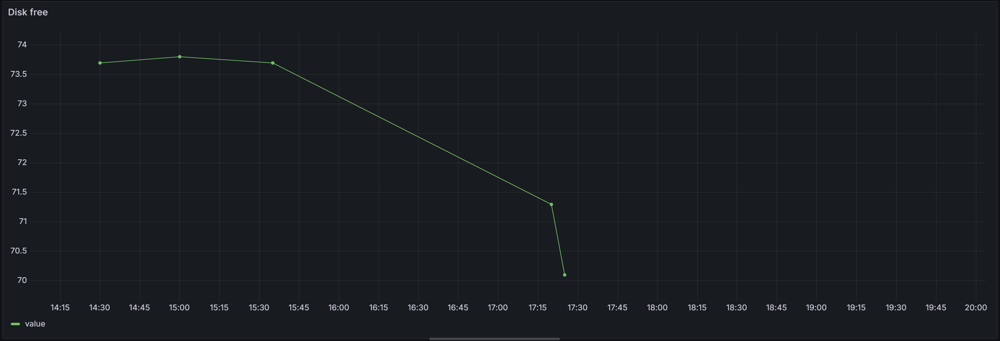   

As shown in the image above, rarely updated data leads to gaps in the graph, especially at the boundaries of the visualization window. When visualizing a specific range, the graph generator lacks data points before and after the range, preventing smooth line generation toward the graph's edges.

Conversely, when the system provides very dense data (e.g., one sample per second), this problem typically doesn't occur unless the user zooms in extremely. However, performance issues may arise due to the volume of data stored and processed for visualization.

Both cases require a common solution: data resampling sometimes enhanced with interpolation to fill the gaps.

How do we achieve that?

1. Plan data resolution and downsampling.
1. Create TimescaleDB hierarchical continuous aggregates.
1. Add policies for data retention.
1. Create Grafana visualizations based on the prepared data.

# Requirements

The configuration requirements were detailed in the previous article. Here's a summary:

1. Home Assistant
1. TimescaleDB (e.g., as a Home Assistant add-on)
1. LTSS - a custom Home Assistant component publishing data to TimescaleDB
1. Glances - Home Assistant add-on providing system metrics
1. Grafana (e.g., as a Home Assistant add-on)

Since we commited to visualize HA hardware metrics, we need to ensure LTSS publishes required sensors to the TimescaleDB. My config looks like this:

```yaml
ltss:
  db_url: postgresql://ha:ha@77b2833f-timescaledb/ha_timescale
  chunk_time_interval: 2592000000000
  include:
    entities:
      - sensor.glances_cpu_load
      - sensor.glances_cpu_used
      - sensor.glances_cpu_percent
      - sensor.glances_cpu_thermal_0_temperature
      - sensor.glances_ram_free
      - sensor.glances_ram_used
      - sensor.glances_ram_used_percent
      - sensor.glances_swap_free
      - sensor.glances_swap_used
      - sensor.glances_data_free
      - sensor.glances_swap_used
      - sensor.glances_data_used_percent
      - sensor.localhost_sda_disk_read
      - sensor.localhost_sda_disk_write
    entity_globs:
      - sensor.*memory_percent
      - sensor.*cpu_percent
```

Most sensors are provided by Glances. The glob patterns capture CPU and memory sensors for each HA add-on. These sensors are often disabled by default, waiting for you to enable them.

With this data in place, we can build dashboards like this:
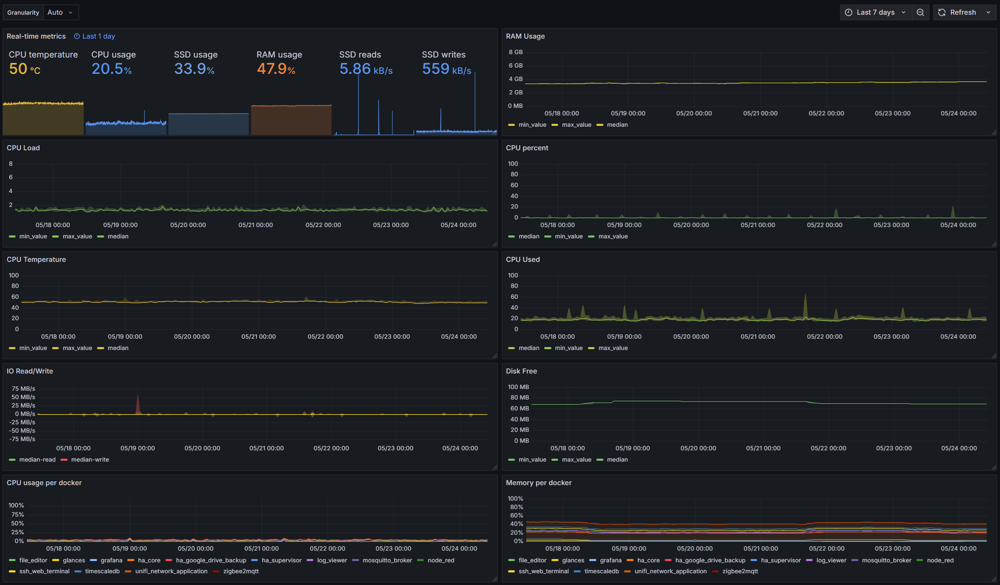   

# Plan data resolution

Collecting high-frequency data can consume significant disk space and system resources, especially on mini-computers like the Raspberry Pi.

Generally, only recent data needs to be high resolution. Historical data is usually used for trend analysis. 
To balance storage and performance, we downsample data over time using TimescaleDB's features. Before applying data retention, finalize a downsampling plan. 

> :warning: Retention is only safe after confirming that your resolution plan works well.

**Proposed Downsampling Plan**

```
      drop old data           compressed data     -30d
ltss        ─ ─ ─ ─ ─ ┴◆◆◆◆◆◆◆◆◆◆◆◆◆◆┴────────────────────────────────────────┬───>
                                                                                          -5min
5min CAGG   ─ ─ ─ ─ ◆◆◆◆◆◆◆◆◆◆◆◆────────────────────────────────────────────────┴···>
                                                                                     -15min
15min CAGG  ◆◆◆◆◆◆◆◆◆◆◆◆────────────────────────────────────────────────────┴·······>
                                                                                -1h
1h CAGG     ◆◆◆◆─────────────────────────────────────────────────────────────┴-·············>
                                                                  -1d        
1day CAGG   ◆─────────────────────────────────────────────────────┴···························┼> time
                                                                                              now
Legend:
─────── materialized data
······· data accessible via real-time CAGG view
◆◆◆◆compressed data
─ ─ ─ ─ dropped data
```

**[ToDo: make an image]**
1. Store original data for 1 month.
1. Downsample by 5 minutes — keep for 1 month.
1. Downsample by 15 minutes — keep for 2 months.
1. Downsample by 1 hour — keep for 1 year.
1. Downsample by 1 day — keep for 3 years.

This plan provides high-resolution recent data while reducing resource usage for older data.

> :bulb: The one-month original data retention is determined by the chunk size, which LTSS sets during table creation. You can change this (e.g., to 2 weeks), but only new partitions will be affected.

# Prepare Database Objects

Let's remind: all data published by LTSS component, lands in `public.ltss` hypertable.

Let's start with new schema dedicated for our aggregates. Every newly created schema has access limited only to its creator. With subsequent GRANT command, we enable access to objects within the schema to every logged user:

```sql
CREATE SCHEMA ltss_ha_metrics;
GRANT USAGE ON SCHEMA ltss_ha_metrics TO public;
```

CAGGs will process only selected number of sensors. Because CAGG code, once deployed, cannot be modified, it's good to have a list of sensors stored in a way which gives option for further changes. Because of that, let's create a helper function:

**ToDo: propose better name**

```sql
CREATE OR REPLACE FUNCTION ltss_ha_metrics.get_entities_for_cagg_hametrics(entityid text)
 RETURNS BOOLEAN
 LANGUAGE SQL
 IMMUTABLE
AS $function$
   SELECT ARRAY[entityid] && ARRAY
          [
            -- replace sensor names with your ones.
          'sensor.glances_cpu_thermal_0_temperature',
          'sensor.localhost_sda_disk_read',
          'sensor.localhost_sda_disk_write'
          ]
          OR entityid ~ E'^sensor\.glances_[a-z]+_(load|free|used)$';
          OR entityid ~ E'^sensor\..*(cpu|memory|ram_used|data_used)_percent$';
$function$;
```

The function gets entity identifier, matching it against fixed array of predefined names and then regular expression. The function returns BOOLEAN (`TRUE` or `FALSE`) depending if requested `entity_id` has to be processed or not. This way once we will want to add or remove entity, it's enough to edit this function. Note this function is IMMUTABLE which allows Postgresql to execute it in more performant way.

Now we are ready to create CAGGs, that will downsample data to 5 minute, 15 minute, hourly and daily slices. 

Notice what data the CAGGs provides. Besides obvious `bucket` (time) and `entity_id` it will store
* minimum value found within 5 minute range
* maximum value found within 5 minute range
* perc_agg - meta data providing a way to chose percentile later on, ie at time of visualization

Having this one, let's create hierarchy of CAGGs:

<details>
<summary>SQL script creating CAGGs</summary>

```sql
CREATE MATERIALIZED VIEW ltss_ha_metrics.cagg_hametrics_5mins
WITH (timescaledb.continuous) AS
SELECT
    time_bucket('5min'::INTERVAL, "time", 'Europe/Prague') AS bucket,
    entity_id,
    MIN(state)::DOUBLE PRECISION AS min_value,
    MAX(state)::DOUBLE PRECISION AS max_value,
    percentile_agg(state::DOUBLE PRECISION) AS perc_agg
FROM public.ltss
WHERE ltss_ha_metrics.get_entities_for_cagg_hametrics(entity_id)
  AND state NOT IN ('unavailable', 'unknown')
GROUP BY bucket, entity_id
WITH NO DATA;

CREATE MATERIALIZED VIEW ltss_ha_metrics.cagg_hametrics_15mins
WITH (timescaledb.continuous) AS
SELECT
    time_bucket('15min'::INTERVAL, bucket, 'Europe/Prague') AS bucket,
    entity_id,
    MIN(min_value) AS min_value,
    MAX(max_value) AS max_value,
    ROLLUP(perc_agg) AS perc_agg
FROM ltss_ha_metrics.cagg_hametrics_5mins
GROUP BY 1, 2
WITH NO DATA;

CREATE MATERIALIZED VIEW ltss_ha_metrics.cagg_hametrics_1h
WITH (timescaledb.continuous) AS
SELECT
    time_bucket('1h'::INTERVAL, bucket, 'Europe/Prague') AS bucket,
    entity_id,
    MIN(min_value) AS min_value,
    MAX(max_value) AS max_value,
    ROLLUP(perc_agg) AS perc_agg
FROM ltss_ha_metrics.cagg_hametrics_15mins
GROUP BY 1, 2
WITH NO DATA;

CREATE MATERIALIZED VIEW ltss_ha_metrics.cagg_hametrics_1d
WITH (timescaledb.continuous) AS
SELECT
    time_bucket('1d'::INTERVAL, bucket, 'Europe/Prague') AS bucket,
    entity_id,
    MIN(min_value) AS min_value,
    MAX(max_value) AS max_value,
    ROLLUP(perc_agg) AS perc_agg
FROM ltss_ha_metrics.cagg_hametrics_hourly
GROUP BY 1, 2
WITH NO DATA;


-- Make accessible for read to any connected user
GRANT SELECT ON TABLE ltss_ha_metrics.cagg_hametrics_5mins TO public;
GRANT SELECT ON TABLE ltss_ha_metrics.cagg_hametrics_15mins TO public;
GRANT SELECT ON TABLE ltss_ha_metrics.cagg_hametrics_1h TO public;
GRANT SELECT ON TABLE ltss_ha_metrics.cagg_hametrics_1d TO public;

-- Setup aggregation refresh policy
SELECT add_continuous_aggregate_policy(
   continuous_aggregate => 'ltss_ha_metrics.cagg_hametrics_5mins',
   start_offset         => '15 mins'::INTERVAL,
   end_offset           => '5 minutes'::INTERVAL,
   schedule_interval    => '2.5 minutes'::INTERVAL
);

SELECT add_continuous_aggregate_policy(
   continuous_aggregate => 'ltss_ha_metrics.cagg_hametrics_15mins',
   start_offset         => '45 minutes'::INTERVAL,
   end_offset           => '10 minutes'::INTERVAL,
   schedule_interval    => '15 minutes'::INTERVAL
);

SELECT add_continuous_aggregate_policy(
   continuous_aggregate => 'ltss_ha_metrics.cagg_hametrics_1h',
   start_offset         => '3 hours'::INTERVAL,
   end_offset           => '30 minutes'::INTERVAL,
   schedule_interval    => '30 minutes'::INTERVAL
);

SELECT add_continuous_aggregate_policy(
   continuous_aggregate => 'ltss_ha_metrics.cagg_hametrics_1d',
   start_offset         => '72 hours'::INTERVAL,
   end_offset           => '11 hours'::INTERVAL,
   schedule_interval    => '8 hours'::INTERVAL
);

-- Make CAGG present data up to current moment, regardless the refresh policy
ALTER MATERIALIZED VIEW ltss_ha_metrics.cagg_hametrics_5mins
SET (timescaledb.materialized_only = false);

ALTER MATERIALIZED VIEW ltss_ha_metrics.cagg_hametrics_15mins
SET (timescaledb.materialized_only = false);

ALTER MATERIALIZED VIEW ltss_ha_metrics.cagg_hametrics_hourly
SET (timescaledb.materialized_only = false);

ALTER MATERIALIZED VIEW ltss_ha_metrics.cagg_hametrics_daily
SET (timescaledb.materialized_only = false);

```

</details>


_ToDo: Review time windows_

Note that all CAGGs are have been created with NO DATA option. It creates them empty, while filled with new data thanks to added refresh policies. If you already have data in `ltss` table wanting them to be aggregated, then run commands below. The commands have to be run one by one, from more detailed up to less detailed, since latter are based on former ones. Depending on amount of data it might takes minutes.

```sql
CALL refresh_continuous_aggregate('ltss_energy.cagg_hametrics_5mins', NULL, NOW()-'10m'::INTERVAL);
CALL refresh_continuous_aggregate('ltss_energy.cagg_hametrics_15mins', NULL, NOW()-'1h'::INTERVAL);
CALL refresh_continuous_aggregate('ltss_energy.cagg_hametrics_1h', NULL, NOW()-'2h'::INTERVAL);
CALL refresh_continuous_aggregate('ltss_energy.cagg_hametrics_1d', NULL, NOW()-'2h'::INTERVAL);
```

# Grafana visualizations

## Real-time overview

Let's start with visualization showing last know state of selected metrics, and their evalution within fixed short period of time. Saying fixed I mean, the displayed range will be not dependant on dashboard time selection. This view will use real-time data from `ltss` hypertable.

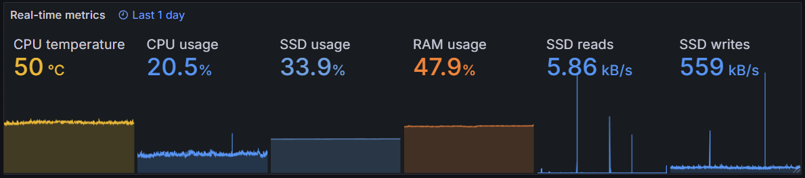 

Let's create new panel, selecting `stat` as visualization type.
Then put following query into:
  
```sql
SELECT 
    time,
    CASE entity_id
      WHEN 'sensor.glances_cpu_thermal_0_temperature' THEN 'CPU temperature'
      WHEN 'sensor.glances_ram_used_percent' THEN 'RAM usage'
      WHEN 'sensor.glances_cpu_used' THEN 'CPU usage'
      WHEN 'sensor.glances_data_used_percent' THEN 'SSD usage'
      WHEN 'sensor.localhost_sda_disk_read' THEN 'SSD reads'
      WHEN 'sensor.localhost_sda_disk_write' THEN 'SSD writes'
    END as entity_id,
    state::NUMERIC AS value 
FROM ltss
  WHERE entity_id = ANY(Array['sensor.glances_ram_used_percent', 'sensor.glances_cpu_used', 
   'sensor.glances_cpu_thermal_0_temperature', 'sensor.glances_data_used_percent',
   'sensor.localhost_sda_disk_read', 'sensor.localhost_sda_disk_write'])
  AND state NOT IN ('unavalilable', 'unknown')
  AND time > NOW()-'1d'::INTERVAL
  ```

To split the query result into multiple graphs, we need to partition the data by `entity_id` field. Since we renamed sensors already during querying database, the only thing remained is to get rid of "value" string added by Grafana. All those operations can be achieved with use of transformations:
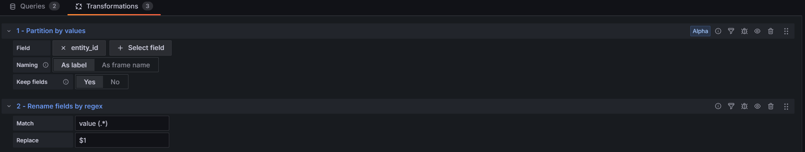

There are plenty of settings to be up to user preferences. Just to help with units: our sensors have different units, we need to set them separately. We will use override feature of Grafana which can match regular expression against data series names:

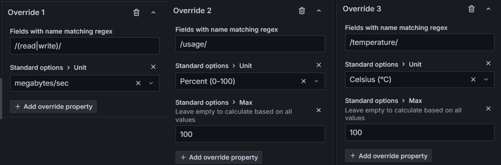

This way we set units and expected ranges of values.

**Surprise**

The query, as expected, retrieves selected sensors recorded within recent 24 hours. This query while seems to work correctly should immediatelly unveil a shortcoming: gaps on the boundaries of some graphs.

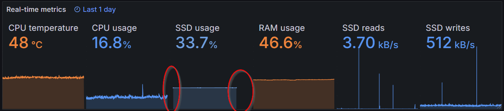 

The reason behind is, that some sensors report changes very rarelly. In our case, Usage of SSD space is not reported frequently enough to provide datapoints from from edge to edge.

This is very important fact, we will cope with everytime while creating data series visualization.

To overcome this, let's use intepolation abilities provided by TimescaleDB. The `interpolate()` function together with `time_bucket_gapfill()` are ways to go.

See the query rewriten to use mentioned functions. 


```sql
WITH 
entities AS
(
  SELECT *
  FROM ltss
  WHERE entity_id = ANY(Array['sensor.glances_ram_used_percent', 'sensor.glances_cpu_used', 
   'sensor.glances_cpu_thermal_0_temperature', 'sensor.glances_data_used_percent',
   'sensor.localhost_sda_disk_read', 'sensor.localhost_sda_disk_write'])
  AND state NOT IN ('unavailable', 'unknown')
  AND time BETWEEN NOW()-'1d'::INTERVAL AND NOW()
),
data AS
(
    SELECT 
        time_bucket_gapfill('5m', "time", NOW()-'1d'::INTERVAL, NOW()) as bucket, 
        CASE entity_id
          WHEN 'sensor.glances_cpu_thermal_0_temperature' THEN 'CPU temperature'
          WHEN 'sensor.glances_ram_used_percent'          THEN 'RAM usage'
          WHEN 'sensor.glances_cpu_used'                  THEN 'CPU usage'
          WHEN 'sensor.glances_data_used_percent'         THEN 'SSD usage'
          WHEN 'sensor.localhost_sda_disk_read'           THEN 'SSD reads'
          WHEN 'sensor.localhost_sda_disk_write'          THEN 'SSD writes'
        END as entity_id,
        interpolate(max(state::DOUBLE PrECISION), 
          (
            SELECT (time, state::DOUBLE PrECISION)
            FROM ltss AS e
            WHERE e.entity_id = entities.entity_id
            AND state NOT IN ('unavalilable', 'unknown')
            ORDER BY time LIMIT 1
          ),
          (
            SELECT (time, state::DOUBLE PrECISION)
            FROM ltss AS e
            WHERE e.entity_id = entities.entity_id
            AND state NOT IN ('unavalilable', 'unknown')
            ORDER BY time DESC LIMIT 1
          )      
        ) AS value 
    FROM entities
    GROUP BY entity_id, bucket
),
bounds AS 
(
    SELECT
        MIN(bucket) AS t1,
        MAX(bucket) AS t2
    FROM data
)
SELECT 
    to_timestamp($__from/1000) + (d.bucket - b.t1) * (EXTRACT(EPOCH FROM to_timestamp($__to/1000 - $__from/1000)) / EXTRACT(EPOCH FROM (b.t2 - b.t1))) AS time,
    d.entity_id,
    d.value
FROM data AS d, bounds AS b
ORDER BY time desc
```

Let me explain the final query. Some information will be reused as we proceed in this article.

I make use of CTE (Common Table Expression) for clarity even though it can be written using simple SELECT query too. The consequence of CTE is a need to pass requested time range to `time_bucket_gapfill()` function. Ussually that function can infer this condition from WHERE expression. Otherwise the time boundaries have to be passed to the the 3rd and 4th arguments.

The query creates series of 5-minute samples, filling gaps in missing data by interpolating values between the points in linear way. 5-minute aggregation is chosen artitraly and can be changed up to your will. The Glances reports most of those sensors with about 1 minute frequency. However with such small graph showing last 24 hours, such amount of data points might be considered as wasting resources. 5 minute sample supported by maximum value within this interval should be sufficient to get overview about what was happening to the system recenty. 

Because the method above requires grouping, thus `interpolate()` function might get more datapoints for single time bucket, we need to use grouping function, deciding which value to use. I chosen maximum value as most suitable to monitor the system health. But you can chose other available options like MIN, AVG, Percentiles etc. BTW Percentiles and Median will be touched in next parts of this article.

The last remarkable things to note are "subselects" called as the 2nd and 3rd arguments of `interpolate()` function. They provide two additional datapoints from outside of requested time range, allowing the function "to draw" lines up to graph edges.

## Preparations for Time Series

In previous paragraph we learned how to approach and on-the-fly resample data with interpolation. This knowledge is applicable to next task. With the difference we will read from continuos aggregates (CAGGs) instead of source table.

Let's make it even more fancy. Have you noticed that our CAGGs aggregates minimum, maximum values as well as data for percentile? Let's create the visualization showing all series as single graph.

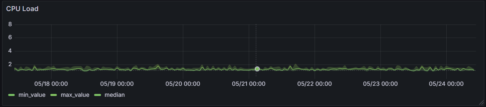

Since there are 3 values involved, we need to create 3 time series with interpolation on their ends. It turns out not complicated but long SQL query nobody wants to enter to Grafana. This is why I offer ready to use function. `ltss_ha_metrics.get_super_aggregates()` which takes following arguments:

|argument name | data type | description |
| ------------ | --------- | ----------- |
|_from | TIMESTAMPTZ | lower time boundary |
|_to   | TIMESTAMPTZ | upper time bounadry |
|_caggsuffix | TEXT  | suffix of CAGG to fetch data from |
|_granularity | INTERVAL | granularity of resulted data |
|_entities | TEXT[] | Array of entity names |

and returns recordset with following columns

|column name | data type |
| ------------ | --------- |
|bucket | TIMESTAMPTZ |
|entity_id   | TEXT |
|min_value | DOUBLE PRECISION  |
|max_value | DOUBLE PRECISION |
|median | DOUBLE PRECISION |

Here is a source code of this function:
```sql
CREATE OR REPLACE FUNCTION ltss_ha_metrics.get_super_aggregates(_from timestamp with time zone, _to timestamp with time zone, _caggsuffix text, _granularity interval, _entities text[])
 RETURNS TABLE(bucket timestamp with time zone, entity_id text, min_value double precision, max_value double precision, median double precision)
 LANGUAGE plpgsql
AS $function$
BEGIN

    RETURN QUERY
    EXECUTE format($$
    WITH 
    entities AS
    (
      SELECT *, approx_percentile(0.5,perc_agg) AS median
      FROM ltss_ha_metrics.cagg_hametrics_%3$s
      WHERE entity_id = ANY(%5$L)
        AND bucket BETWEEN %1$L AND %2$L
    )
    SELECT 
        time_bucket_gapfill(%4$L, "bucket", current_setting('TIMEZONE'), %1$L, %2$L) as timeb, 
        entity_id::TEXT,
        interpolate
        (
            min(min_value::DOUBLE PRECISION), 
            (
            SELECT (bucket, min_value::DOUBLE PRECISION)
            FROM entities AS e
                WHERE e.entity_id = entities.entity_id
            ORDER BY bucket LIMIT 1
            ),
            (
              SELECT (bucket, min_value::DOUBLE PRECISION)
              FROM entities AS e
                  WHERE e.entity_id = entities.entity_id
              ORDER BY bucket DESC LIMIT 1
            )
        ) AS min_value,
        interpolate
        (
            max(max_value::DOUBLE PRECISION), 
            (
              SELECT (bucket, max_value::DOUBLE PRECISION)
              FROM entities AS e
                  WHERE e.entity_id = entities.entity_id
              ORDER BY bucket LIMIT 1
            ),
            (
              SELECT (bucket, max_value::DOUBLE PRECISION)
              FROM entities AS e
                  WHERE e.entity_id = entities.entity_id
              ORDER BY bucket DESC LIMIT 1
            )
        ) AS max_value,
        interpolate
        (
            avg(median::DOUBLE PRECISION), 
            (
              SELECT (bucket, median::DOUBLE PRECISION)
              FROM entities AS e
                  WHERE e.entity_id = entities.entity_id
              ORDER BY bucket LIMIT 1
            ),
            (
              SELECT (bucket, median::DOUBLE PRECISION)
              FROM entities AS e
                  WHERE e.entity_id = entities.entity_id
              ORDER BY bucket DESC LIMIT 1
            )
        ) AS median 
    FROM entities
    GROUP BY entity_id, timeb
    $$, _from, _to, _caggsuffix, _granularity, _entities);

END;
$function$
;
```

## Median surrounded by Min-Max Graph

With ready to use tools, let's create our first visuzalization.


Create panel in Grafana, chose visualisation as Time Series.
Enter following query:

```sql
SELECT bucket, entity_id, min_value, max_value, median
FROM ltss_ha_metrics.get_super_aggregates
(
    to_timestamp($__from/1000),
    to_timestamp($__to/1000), 
    '${cagg_suffix}', 
    '$query_granularity', 
    Array['sensor.glances_cpu_load']
)
```

Notice how simple the query looks thanks to calling our pre-prepared function.
The `cagg_suffix` and `query_granularity` are provided by grafana variables. $__from and $__to are grafana macros providing time boundaries (in microseconds) from timerange picker.

There is multiple ways how to achieve the look as on screenshot, with median line in the middle and semitransparent area around, limited by minimum and maximum values. My takes is:
* globally - setup lines of all series to 0px
* globally - setup opacity of all series to 0
* using override - set up `median` line width to 1px
* using override - set opacity of `max_value` series to desired value as well as limit it to `min_value`

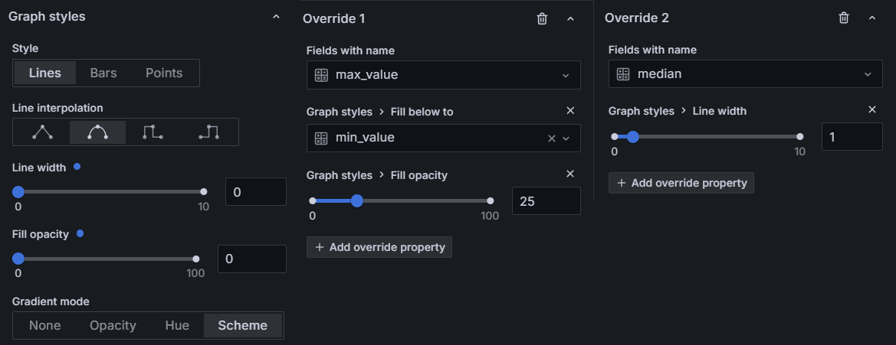

Having this graph working, achieving visualization for other sensors is a matter of duplicate panel and replacing sensor to display.

## Symetric graphs

Depending on needs, one would want to visualize two different measurements on the same graph, on opposite sides of X axis. It might be read and write thruput on storage.

In general, we can clone previous panel and just replace SQL, providing two sensor names:

```sql
SELECT bucket, entity_id, median, min_value, max_value
FROM ltss_ha_metrics.get_super_aggregates
(
    to_timestamp($__from/1000),
    to_timestamp($__to/1000), 
    '${cagg_suffix}', 
    '$query_granularity', 
    Array['sensor.localhost_sda_disk_read', 'sensor.localhost_sda_disk_write']
)
```

Such query needs to be partitioned by `entity_id`, resulting in six time-series, named like `median sensor.localhost_sda_disk_read` or `max_value sensor.localhost_sda_disk_read` etc

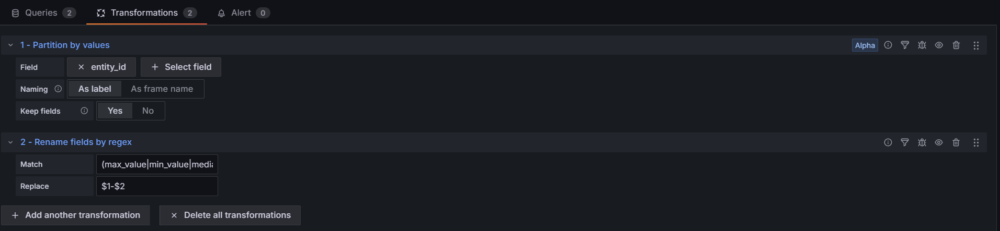

The second transformation turns names into shorter, nicer form. Regular expression `(max_value|min_value|median).*(write|read)` finds 2 segments in matched strings, allowing merging them back.

On top of settings borroted from previous graph, like drawing background of max_value until min_value, we have to:
* make all series having `write` in their names flipped upside-down.
* make min_value-write background be visible up to reaching max value (see the reversed order, because we flipped this data series)
* 

**TBD**

## Stacked graphs

While setting up sensors to be stored by CAGGs, we use regular expression to match all sensors representing cpu and memory usage for each docker. It allows to visualise them all at once in single graph, representing total usage of a resource.

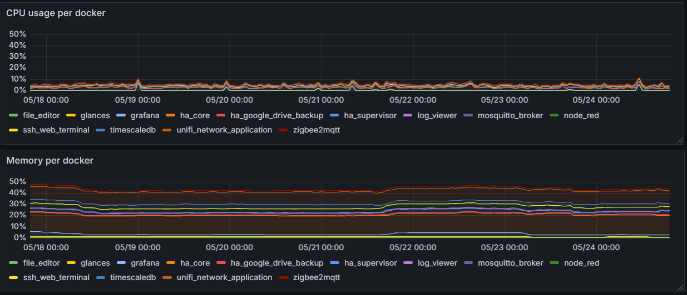

Again, we save a lot of time using our utility funcion, replacing sensors :

```sql
SELECT bucket, entity_id, median, min_value, max_value
FROM ltss_ha_metrics.get_super_aggregates
(
    to_timestamp($__from/1000),
    to_timestamp($__to/1000), 
    '${cagg_suffix}', 
    '$query_granularity', 
    Array['sensor.file_editor_cpu_percent','sensor.glances_cpu_percent',
          'sensor.grafana_cpu_percent','sensor.home_assistant_core_cpu_percent',
          'sensor.home_assistant_google_drive_backup_cpu_percent',
          'sensor.home_assistant_supervisor_cpu_percent','sensor.log_viewer_cpu_percent','sensor.mosquitto_broker_cpu_percent', 'sensor.node_red_cpu_percent',
          'sensor.ssh_web_terminal_cpu_percent','sensor.studio_code_server_cpu_percent',
          'sensor.timescaledb_cpu_percent','sensor.unifi_network_application_cpu_percent',
          'sensor.zigbee2mqtt_cpu_percent']
)
```

To clean-up, shorten names, we use transformations. It can be done in SQL too.
In our example the first rename extractes name from data series name. Second rename just shorten home_assistant to ha. 

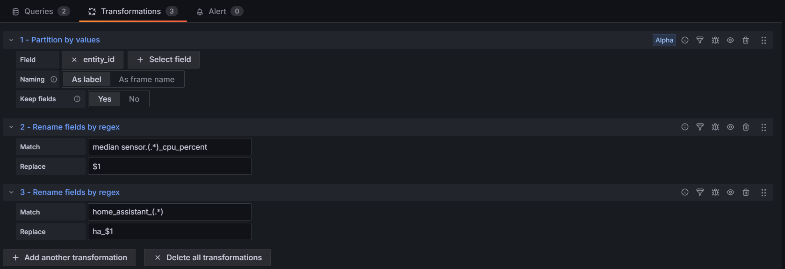

To achieve stacked series, find `Stack series` option and set it to `normal`. 
Line width set to your liking, for example 1 and 10 respectively.
Units to `Percent (0-100)`.
Possibly Soft max to 50, just to zoom in the graph if not exceeds 50%.
Done. 

Clone this panel replacing cpu sensors with memory ones, to get the same graph but for memory usage.


